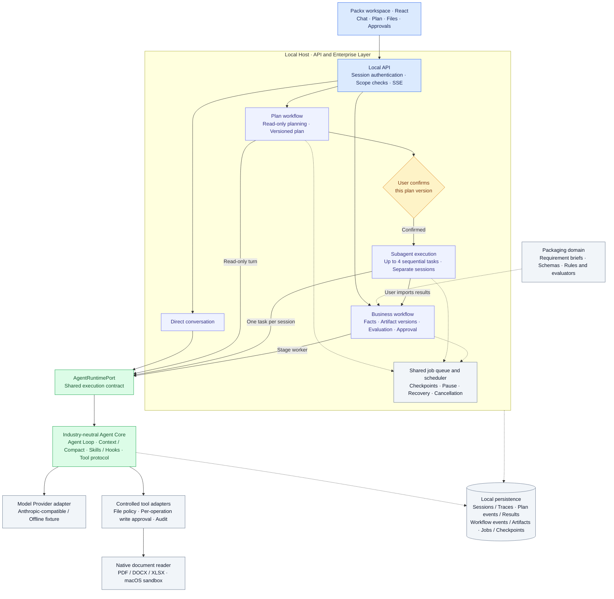

# Packx

[English](README.md) · [简体中文](README.zh-CN.md)

[Documentation map](docs/README.md) (Chinese)

Packx is a local Agent workspace for **packaging presales and order follow-up**. It combines a self-built, industry-neutral Agent Core with a workflow layer that manages sourced facts, versioned requirement briefs, approvals, and recovery.

The project is an engineering prototype you can run and inspect locally. An unsigned macOS local release is available; it is not a production SaaS or a signed desktop installer. The current product focuses on packaging; the `print` domain identifier is retained for compatibility.

Packx was previously named Blackx. The interface and package name now use Packx; existing `BLACKX_*` environment variables, `.blackx-data/` storage and internal protocol identifiers remain compatible without migration. The GitHub repository is still `B1ackB/Blackx`. Historical ADRs and evidence retain their original names.

See the [developer participation guide](docs/developer-community-guide.md) (Chinese) for positioning, demo design, contribution paths and a four-week execution plan. Recruitment, issues, demos and community setup described there are planned work, not shipped capabilities.

## What you can do

- Switch to Plan mode, review a versioned plan, and explicitly confirm it before up to four isolated subagents execute in sequence. Pause and resume from the workspace. See the [Plan mode guide](docs/plan-mode.md) (Chinese).
- Create and delete conversations; receive streamed replies; stop and retry a turn.
- Switch the interface between Chinese and English. Existing messages and source documents retain their original language.
- Attach documents and images. Read PDF, DOCX, and XLSX text through a sandboxed local parser on macOS.
- Browse local directories and preview files in the right panel. Ask the Agent to create, edit, or delete text files, with approval for each write or deletion.
- Inspect the configured model, request outcomes, latency, token usage, and reported cache usage in the same panel.
- Build a packaging requirement brief from source material, review facts, create versions, and approve or export a delivery.
- Inspect persisted workflow events, background jobs, and bounded schedules through the implementation and local workspace.

## Requirements

| Requirement | Supported baseline |
| --- | --- |
| Node.js | **24.14.0**, recorded in `.nvmrc`; package engines target Node 24 |
| Package manager | npm; use the committed `package-lock.json` with `npm ci` |
| Full local workflow | macOS with Apple Command Line Tools (`xcode-select --install`) |
| Browser | A modern browser connecting to `127.0.0.1` |
| Real model access | An authorized Anthropic Messages-compatible endpoint, model ID, and API key |

The native document reader uses Swift and macOS Seatbelt. Other platforms do not silently fall back to an unsandboxed parser. Cross-platform support for the complete product has not been validated. Node 24 is required by the project baseline, including its use of built-in SQLite.

## Install

```bash
git clone https://github.com/B1ackB/Blackx.git Packx
cd Packx
# If you use nvm:
nvm install
nvm use
npm ci
```

If you already have a checkout, run the commands from its root. `nvm` is optional: an existing Node 24.14.0 installation is sufficient. Repository access may require your GitHub credentials.

Choose one of the following startup paths.

### 1. Explore without an API key

```bash
npm run dev:fixture
```

Wait for the startup result, then open **http://127.0.0.1:5178**. This command compiles the native reader, prepares temporary example documents, and starts the workspace against a local provider with **fixed responses**. No external model is called; the replies demonstrate integration behavior rather than general model reasoning. The initial checks can take a little time.

Use `Ctrl+C` to stop it. The fixture's temporary workspace is removed on normal shutdown; do not use it to store work you want to keep. Local file writes and deletions still require approval.

For a persistent workspace without a model, `npm run dev` defaults to `fake` mode at **http://127.0.0.1:5173**. You can manage conversations, but sending chat messages is intentionally disabled in this mode.

### 2. Connect a real model

```bash
cp .env.example .env
```

Edit `.env` locally:

```dotenv
BLACKX_RUNTIME_MODE=anthropic
BLACKX_PORT=5173
ANTHROPIC_BASE_URL=https://api.anthropic.com
ANTHROPIC_MODEL=your-provider-supported-model-id
ANTHROPIC_API_KEY=your-private-api-key
```

Replace the example values with your provider's configuration, then run:

```bash
npm run dev
```

Open **http://127.0.0.1:5173**. This single command builds the native reader and runs the API host with the Vite UI. A separate frontend terminal is not needed.

`npm run dev` automatically reads `.env`; existing shell environment variables take precedence. `.env` is ignored by Git. Keep keys server-side and never put them in messages, committed files, or `VITE_` variables. This startup script injects `.env` into the server process; online evaluation scripts expect exported provider variables.

The provider adapter uses Anthropic Messages, including streaming and tools; the full runtime also uses token counting. `ANTHROPIC_BASE_URL` is the service root: Packx appends `/v1/messages` and `/v1/messages/count_tokens`. An OpenAI Chat Completions endpoint is not interchangeable. A “configured” status does not prove the endpoint supports every required capability. See the [configuration guide](docs/api-configuration.md) and [compatibility notes](docs/anthropic-compatibility.md) (currently Chinese).

Real requests can incur provider charges. Selected document contents and model inputs may be sent to the configured provider; local parsing does not make real-model operation fully offline.

## First useful workflow

1. Create a conversation and describe a packaging request. Attach a text PDF, DOCX, or XLSX if useful.
2. Ask the Agent to read the document and identify missing requirements. Use the right panel to inspect files and model requests.
3. Create a requirement brief, review the source-backed facts, and explicitly confirm the values you know. Model suggestions remain unverified until confirmed.
4. Review the resulting version and its validation status. Approve and export when the workflow allows it; changing upstream facts makes affected outputs stale.
5. To save a text file locally, ask for a specific location. Review the proposed absolute path and content in the approval request, then approve or reject it.

The no-key fixture has a scripted response sequence; use a real provider for arbitrary conversations. No approved requirement brief should be treated as a production-ready print file.

## Project architecture

The diagram follows the current local implementation. Solid arrows show requests and execution; dotted arrows show domain rules and shared infrastructure. Return paths are omitted for readability.



The Host owns plan confirmation, subagent dispatch, permissions, workflow transitions, validation, and completion. All execution paths reuse the same runtime; packaging rules stay outside the Core. Subagents have separate contexts and share the parent conversation's file permission scope. Plan confirmation does not approve file writes or business deliveries. A model finishing its reply does not itself complete a business workflow.

See the [Plan mode guide](docs/plan-mode.md) and [ADR-0015](docs/adr/0015-confirmed-plans-and-bounded-subagents.md) for execution limits and recovery behavior.

See [error handling and recovery](docs/reliability-recovery.md) for error classification, retry budgets, cancellation, uncertain side effects, and reconciliation. The [fault-injection report](docs/harness-error-handling-tests.md) records tests and verification results. Both documents are in Chinese.

| Location | Responsibility |
| --- | --- |
| `src/App.tsx`, `src/components/`, `src/i18n.ts` | React workspace, multifunction panel, bilingual UI |
| `src/agent/` | Industry-neutral loop, context, tools, hooks, sessions, and compaction |
| `src/enterprise/`, `server/enterprise/` | Workflow contracts, events, persistence, and recovery |
| `src/manufacturing/`, `server/manufacturing/` | Packaging requirement workflow and delivery |
| `src/print/` | Existing print domain capabilities and regression assets |
| `server/index.ts`, `server/runtime/` | Local API, runtime adapters, file policy, approvals, and telemetry |
| `server/anthropic/` | Anthropic protocol client and stream parsing |
| `native/` | Swift document/asset readers executed under macOS isolation |
| `eval/`, `server/testing/` | Repeatable evaluations, local fixtures, and failure cases |
| `docs/` | Architecture decisions, evidence, configuration, and roadmap |

Start with [architecture principles](docs/architecture/principles.md), then follow a feature from the UI through the local API and runtime. Read [AGENTS.md](AGENTS.md) before changing architecture or implementation. Most deeper design documents are currently Chinese; both READMEs cover the complete onboarding path.

Local product work is tracked in the [completion work sheet](docs/local-product-completion.md) (Chinese). See [local operations](docs/local-operations.md) for startup diagnostics, backup and restore; try the clearly labelled [synthetic coffee-pouch task](examples/coffee-pouch-intake.md). Real-user validation remains pending.

The [packaging evidence retrieval slice](docs/knowledge/README.md) adds governed imports, keyword/vector/RRF baselines, and evidence lineage into Plan and requirement briefs. Run `npm run demo:knowledge` without model credentials. The [real experiment](docs/knowledge/real-experiment.md) uses 5 CC BY research papers and a pinned local E5 model; supplier specifications, expert gold labels and PostgreSQL deployment remain unvalidated.

## Verification commands

| Command | Purpose | External model needed? |
| --- | --- | --- |
| `npm run check` | Unit/integration suite, TypeScript checks, frontend build | No |
| `npm run eval:offline` | Fixed offline Harness evaluation | No |
| `npm run eval:m1` | M1 workflow evaluation | No |
| `npm run eval:m2` | Packaging requirement-brief evaluation | No |
| `npm run eval:plan` | Fixed Plan confirmation and subagent baseline | No |
| `npm run build:native` | Compile the macOS reader | No |
| `npm run test:native` | Real macOS sandbox and document tests | No |
| `npm run eval:product` | Local provider/API/workflow smoke test; cleans up afterward | No |
| `npm run check:local` | All the above checks in sequence; full macOS baseline | No |
| `npm run eval:anthropic-contract` | Validate a configured provider contract | Yes; may incur charges |

For online evaluation, inject provider variables into the terminal environment as described in the [configuration guide](docs/api-configuration.md). It is not required for installation or the no-key fixture.

`npm run dev:web` starts only Vite and does not provide the API host. `npm run build` produces the frontend build and type-checks the project; it does not package a standalone server or desktop installer. Serving `dist/` alone is not a complete deployment.

## Data, permissions, and current limits

- **Local storage:** normal runs persist state under `.blackx-data/` by default. It contains conversations, events, attachments, artifacts, backups, and model request records. Keep this directory private; it is excluded from Git. Generated native tools live in `.blackx-tools/`.
- **File access:** safe local paths can be read under Host policy. `BLACKX_WORKSPACE_ROOT` sets the default workspace location; it is not a blanket authorization or a guarantee that all reads are confined there. Hidden/system/internal paths and symlinks are restricted. Every new text file, modification, and deletion needs a specific approval. Hash/version checks reject stale operations. Text writes are limited to 128 KiB; Office/PDF write-back is not implemented.
- **Deletion:** deleting a conversation removes access through the workspace and stops its associated work. Historical data remains for audit; this is not secure erasure. Local file deletion removes the original file after approval and retains a managed backup.
- **Documents:** PDF text extraction has no OCR. DOCX supports paragraphs, tables, and footnotes/endnotes; XLSX reads sheet/cell values and cached formula results without recalculation. Legacy `.doc`/`.xls` and encrypted documents are unsupported. Current parser limits include 10 MiB per input, a 1,000,000 Swift-character text budget, and up to 1,000 PDF pages or XLSX sheets; archive/resource limits also apply. Truncation is marked, and tool responses require bounded continuation reads. See [context management](docs/context-management.md).
- **Observability:** token/cache statistics reflect fields actually returned by the provider, with retention and coverage limits. Missing data is not invented. Fixture numbers are not performance or billing evidence.
- **Deployment:** the host binds to loopback and uses local session/Host/Origin checks. This is not a multi-user login system or proof of production tenant isolation. Fixed parsers have resource budgets and crash cleanup; arbitrary-code isolation and enterprise deployment remain unverified.
- **Evidence:** offline, native, and local product checks are separate from real-provider and real-user validation. See the [2026-09-07 feature evidence](docs/evidence/streaming-bilingual-documents-2026-09-07.md), [streaming/document ADR](docs/adr/0014-streaming-and-document-sources.md), and [roadmap](docs/roadmap.md) for scope and remaining work.

## Troubleshooting

| Symptom | Next step |
| --- | --- |
| Unsupported Node / SQLite or env-file errors | Check `node --version`; switch to Node 24.14.0, then run `npm ci` again |
| `xcrun` / Swift compilation fails | Install Apple Command Line Tools, then run `npm run build:native` |
| Chat sending is disabled | `fake` mode intentionally rejects sends; use `dev:fixture` or configure a real provider |
| Configuration changes have no effect | Restart the host; check whether existing shell variables override `.env` |
| Port already in use | Stop the process you own, or set another `BLACKX_PORT` for `npm run dev`; fixture mode uses 5178 |
| API returns 403 | Open the local UI and refresh after a host restart; bare API requests lack the local session token |
| Provider fails after appearing configured | Check base URL, model ID, credentials, and Messages/streaming/tool/token-count compatibility |
| A scanned PDF has no text | Provide a text PDF or extract the text separately; OCR is not included |

## License

[MIT](LICENSE). Third-party dependencies and their review are documented in [docs/dependencies.md](docs/dependencies.md). Reference repositories are not production source dependencies.

### Local release and settings

Run `npm run release` to produce a macOS directory, archive and checksum under `releases/`. Open `Packx.command` inside the directory; Node 24.14+ (24.x) is required, and the first launch installs pinned dependencies. Use **Configure model** in the sidebar, save the connection, then restart. Task names and Plan objectives are searchable in the sidebar. See the [release guide](docs/release-start.md) and [local operations](docs/local-operations.md). This local release is unsigned; clean-device and enterprise deployment validation remain open.

The [retrieval optimization report](docs/knowledge/optimization.md) adds development ablations, an observed 64-question regression, structured evidence-gap checks, and reproducible `npm run eval:knowledge-optimize` comparisons. Reported recall measures provisional source anchors, not answer correctness or independent generalization.

The [source-bound comparison report](docs/knowledge/comparison.md) covers explicit parameter pairs in the UI and controlled Tool, condition-specific follow-up questions, 40 fixed rule cases and unchanged 64-question retrieval rankings. Run `npm run eval:knowledge-compare`; industrial correctness and expert review remain unverified.
