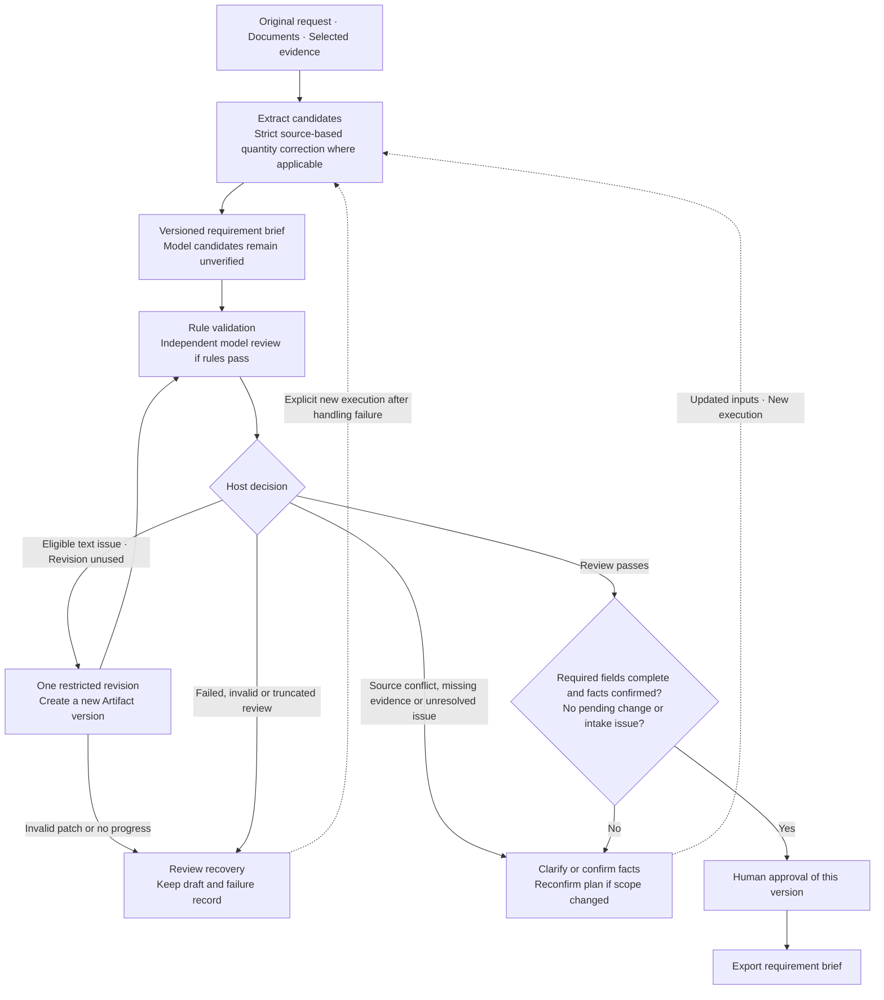
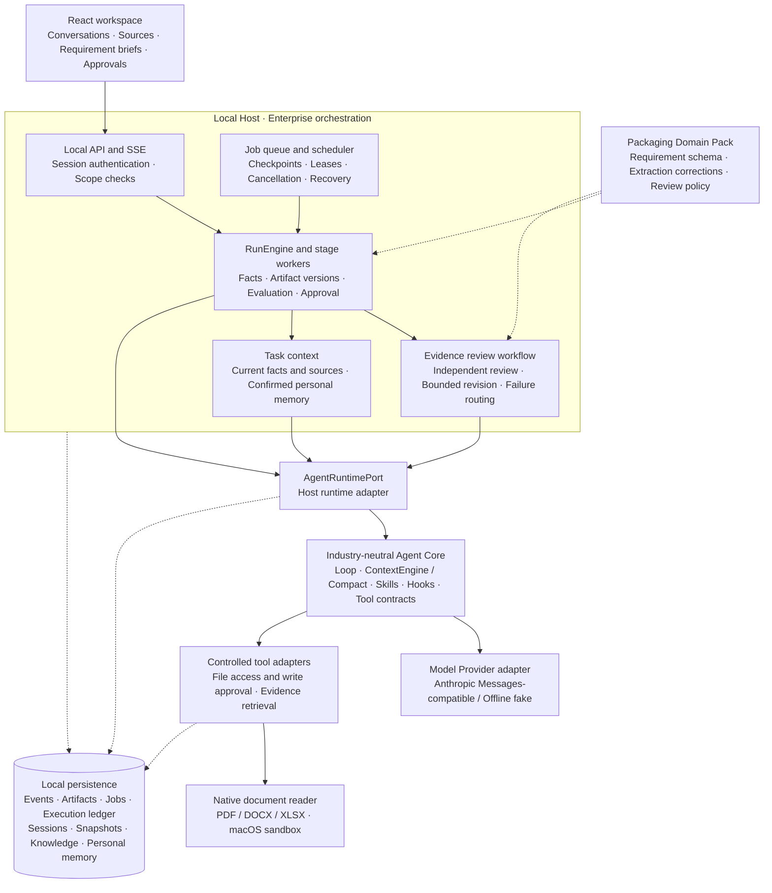

# Packx

[English](README.md) · [简体中文](README.zh-CN.md) · [Documentation map](docs/README.md)

**Turn scattered customer inquiries into packaging requirement briefs with traceable sources, review, and approval.** Packx is a local Agent workspace for packaging presales and order follow-up, built around source extraction, fact confirmation, handoff, and recovery after interruption.

A brief preserves candidate facts and their sources, missing information, conflicts, and proposed changes, alongside artifact versions, review results, and approvals. Business state is stored separately from chat, so a user can trace where a quantity came from and which version remains eligible for delivery after a change.

This is a runnable engineering prototype with an unsigned macOS release. Real-user value, production multi-user deployment, and signed installers remain unvalidated or unfinished. The product focuses on packaging. Previously named Blackx, it retains `BLACKX_*` environment variables, `.blackx-data/` storage, and internal compatibility identifiers such as `print`.

[Business workflow](#from-inquiry-to-requirement-brief) · [Architecture](#architecture) · [Quick start](#install) · [Evidence](#validation-status)

## Current capabilities

- **Requirement handoff:** extract candidate facts, expose missing or conflicting inputs, preserve immutable versions, confirm, approve, and export.
- **Evidence review and revision:** validate rules before independently reviewing source material; revise eligible issues once while retaining the old draft, evidence, and unresolved issues.
- **Documents and knowledge:** read PDF, DOCX, and XLSX text; retrieve and select versioned packaging evidence. Retrieval results do not automatically become order facts.
- **Durable execution:** persist jobs, checkpoints, and execution records for pause, cancellation, and controlled recovery. Confirmed personal preferences can be reused across conversations in the same workspace.
- **Workspace tools:** bilingual UI, streamed chat, file previews, per-operation approval for text writes, model/token records, and confirmed Plan execution.

## From inquiry to requirement brief

1. Add the customer's request and source documents, then create a packaging requirement brief. A [synthetic coffee-pouch example](examples/coffee-pouch-intake.md) provides a walkthrough.
2. Inspect candidate facts alongside their sources, missing fields, conflicts, and proposed changes. Model-extracted values remain unverified.
3. Let the workflow validate and review the draft. Supported text errors can receive one restricted revision; genuine source conflicts require clarification. Review failures retain the draft and show a separate recovery action.
4. Confirm the facts you can verify, generate and review the resulting version, then approve that specific version for export. Changes to upstream facts invalidate affected output and approval eligibility.

The following is a simplified decision flow for a requirement-generation execution. It omits storage and queue transitions; every new candidate version is validated again.


```mermaid
flowchart TB
	SOURCE["Original request · Documents · Selected evidence"] --> EXTRACT["Extract candidates<br/>Strict source-based quantity correction where applicable"]
	EXTRACT --> BRIEF["Versioned requirement brief<br/>Model candidates remain unverified"]
	BRIEF --> REVIEW["Rule validation<br/>Independent model review if rules pass"]
	REVIEW --> DECISION{"Host decision"}
	DECISION -->|"Eligible text issue · Revision unused"| PATCH["One restricted revision<br/>Create a new Artifact version"]
	PATCH --> REVIEW
	PATCH -->|"Invalid patch or no progress"| RECOVER["Review recovery<br/>Keep draft and failure record"]
	DECISION -->|"Failed, invalid or truncated review"| RECOVER
	DECISION -->|"Source conflict, missing evidence or unresolved issue"| INPUT["Clarify or confirm facts<br/>Reconfirm plan if scope changed"]
	DECISION -->|"Review passes"| READY{"Required fields complete and facts confirmed?<br/>No pending change or intake issue?"}
	READY -->|"No"| INPUT
	READY -->|"Yes"| APPROVAL["Human approval of this version"]
	APPROVAL --> EXPORT["Export requirement brief"]
	INPUT -.->|"Updated inputs · New execution"| EXTRACT
	RECOVER -.->|"Explicit new execution after handling failure"| EXTRACT
```

Current policy (`packaging-requirement-evidence.v2.6`) permits at most **one revision and two reviews per execution**. Model patches are limited to eligible parts of `title`, `customerGoal`, and `assumptions`. Separate deterministic quantity correction requires a complete source with an unambiguous integer piece count and matching units; the corrected candidate still needs confirmation. Existing confirmed facts and manual entries cannot be silently overwritten. Other unresolved issues remain blocking even when a safe text issue is repaired.

For example, if a source explicitly prohibits PVC but the draft says it is allowed, the draft wording can be revised and reviewed again. If sources disagree about whether PVC is allowed, the workflow requests clarification. A timeout or output truncation is a system recovery issue. See [evidence-review behavior](docs/requirement-evidence-review.md) and [ADR-0029](docs/adr/0029-controlled-requirement-corrections.md) for exact boundaries.

An approved requirement brief supports handoff; it is not a production-ready print file. Dimensions, dielines, barcodes, color profiles, and preflight still require authoritative inputs and deterministic production tools.

## Architecture

Packx currently runs as a local application: a React workspace, a Node.js Host, local stores, and macOS document readers. The boxes below are responsibility boundaries, not separately deployed services. Solid arrows show execution or data flow; dotted arrows show policy and persistence connections.


```mermaid
flowchart TB
	UI["React workspace<br/>Conversations · Sources · Requirement briefs · Approvals"]
	DOMAIN["Packaging Domain Pack<br/>Requirement schema · Extraction corrections · Review policy"]

	subgraph HOST["Local Host · Enterprise orchestration"]
		API["Local API and SSE<br/>Session authentication · Scope checks"]
		WORKFLOW["RunEngine and stage workers<br/>Facts · Artifact versions · Evaluation · Approval"]
		REVIEW["Evidence review workflow<br/>Independent review · Bounded revision · Failure routing"]
		JOBS["Job queue and scheduler<br/>Checkpoints · Leases · Cancellation · Recovery"]
		CONTEXT["Task context<br/>Current facts and sources · Confirmed personal memory"]
		API --> WORKFLOW
		WORKFLOW --> REVIEW
		JOBS --> WORKFLOW
		WORKFLOW --> CONTEXT
	end

	PORT["AgentRuntimePort<br/>Host runtime adapter"]
	CORE["Industry-neutral Agent Core<br/>Loop · ContextEngine / Compact · Skills · Hooks · Tool contracts"]
	PROVIDER["Model Provider adapter<br/>Anthropic Messages-compatible / Offline fake"]
	TOOLS["Controlled tool adapters<br/>File access and write approval · Evidence retrieval"]
	NATIVE["Native document reader<br/>PDF / DOCX / XLSX · macOS sandbox"]
	STORE[("Local persistence<br/>Events · Artifacts · Jobs · Execution ledger<br/>Sessions · Snapshots · Knowledge · Personal memory")]

	UI --> API
	DOMAIN -.-> WORKFLOW
	DOMAIN -.-> REVIEW
	WORKFLOW --> PORT
	REVIEW --> PORT
	CONTEXT --> PORT
	PORT --> CORE
	CORE --> PROVIDER
	CORE --> TOOLS
	TOOLS --> NATIVE
	HOST -.-> STORE
	PORT -.-> STORE
	TOOLS -.-> STORE
```

The Host decides stage transitions, allowed tools, budgets, approvals, and completion. The Core executes within those limits; packaging rules stay in the domain layer. Review and revision reuse the runtime with tools disabled. A model reply alone cannot complete a workflow or confirm a Fact.

Direct chat and confirmed Plan tasks also use this runtime; they are omitted to keep the main packaging path visible. Plan mode supports up to four sequential tasks with separate sessions. Confirming a plan does not approve file writes or business delivery. See [Plan mode](docs/plan-mode.md), [context management](docs/context-management.md), [personal memory](docs/memory-system.md), and [recovery](docs/reliability-recovery.md).

| Location | Responsibility |
| --- | --- |
| `src/App.tsx`, `src/components/`, `src/i18n.ts` | React workspace and bilingual UI |
| `src/agent/` | Industry-neutral loop, context, tools, hooks, sessions, and compaction |
| `src/runtime/contracts.ts`, `server/runtime/` | Runtime port and Host adapters, controlled tools, telemetry |
| `src/enterprise/`, `server/enterprise/` | Workflow state, evidence-review orchestration, events, jobs, recovery, personal memory |
| `src/manufacturing/`, `server/manufacturing/` | Packaging schema, source handling, candidate correction, review policy, delivery |
| `server/knowledge/` | Knowledge storage, retrieval, embeddings, and reranking |
| `src/print/` | Existing print domain capabilities and regression assets |
| `server/index.ts`, `server/anthropic/` | Host composition and API routes; Anthropic protocol client |
| `native/` | Swift document/asset readers executed under macOS isolation |
| `eval/`, `server/testing/` | Repeatable evaluations, local fixtures, and failure cases |

Start with [architecture principles](docs/architecture/principles.md) and [AGENTS.md](AGENTS.md). For an implementation path, follow [RequirementBriefWorker](server/manufacturing/requirementBriefWorker.ts) → [EvidenceReviewWorkflow](server/enterprise/evidenceReviewWorkflow.ts) → [packaging policy](server/manufacturing/requirementEvidencePolicy.ts). Most detailed design documents are currently Chinese.

## Validation status

The following records are dated evidence, not a claim that every model or customer task succeeds.

| Evidence | What it establishes | What remains unproven |
| --- | --- | --- |
| [Controlled corrections · 2026-09-29](docs/evidence/requirement-controlled-corrections-2026-09-29.md) | Offline rule, permission, recovery, and local API regression checks; replay of 5 PVC reports and 4 quantity errors | Text patches were scripted; no new real-model calls validated the v2.6 policy |
| [Reliability repairs · 2026-09-29](docs/evidence/requirement-reliability-2026-09-29.md) | Current-output contract checks and replay of archived attempts/checkpoints | Diagnostic replay is not a new end-to-end success rate |
| [Review output-budget experiment · 2026-09-29](docs/evidence/review-output-budget-2026-09-29.md) | A real-provider comparison of 8192/16384 output budgets using the archived v2.2 policy | Adoption criteria were not met; the default budget was not raised |
| [Practitioner trial protocol](docs/user-validation-template.md) | A prepared protocol for source checking, handoff usability, critical errors, review time, and rework | Real-user time savings and handoff value still need validation |

Additional capabilities have their own evidence: [knowledge retrieval](docs/knowledge/README.md), [retrieval optimization](docs/knowledge/optimization.md), [source-bound comparison](docs/knowledge/comparison.md), and [personal memory](docs/memory-system.md). Retrieval scores use provisional labels; they do not establish industrial correctness. Confirmed personal memory is soft context, not authority for order facts or permissions.

See the [documentation map](docs/README.md), [local completion record](docs/local-product-completion.md), and [roadmap](docs/roadmap.md). The [developer participation guide](docs/developer-community-guide.md) contains contribution and demo plans; its planned activities are not shipped features.

## Requirements

| Requirement | Supported baseline |
| --- | --- |
| Node.js | **24.14.0**, recorded in `.nvmrc`; package engines target Node 24 |
| Package manager | npm; use the committed `package-lock.json` with `npm ci` |
| Full local workflow | macOS with Apple Command Line Tools (`xcode-select --install`) |
| Browser | A modern browser connecting to `127.0.0.1` |
| Real model access | An authorized Anthropic Messages-compatible endpoint, model ID, and API key |

The native document reader uses Swift and macOS Seatbelt. Other platforms do not silently fall back to an unsandboxed parser. Cross-platform support for the complete product has not been validated. Node 24 is required by the project baseline, including its use of built-in SQLite.

## Install

```bash
git clone https://github.com/B1ackB/Packx.git
cd Packx
# If you use nvm:
nvm install
nvm use
npm ci
```

If you already have a checkout, run the commands from its root. `nvm` is optional: an existing Node 24.14.0 installation is sufficient. Repository access may require your GitHub credentials.

Choose one of the following startup paths.

### 1. Explore without an API key

```bash
npm run dev:fixture
```

Wait for the startup result, then open **http://127.0.0.1:5178**. This command compiles the native reader, prepares temporary example documents, and starts the workspace against a local provider with **fixed responses**. No external model is called; the replies demonstrate integration behavior rather than general model reasoning. The initial checks can take a little time.

Use `Ctrl+C` to stop it. The fixture's temporary workspace is removed on normal shutdown; do not use it to store work you want to keep. Local file writes and deletions still require approval.

For a persistent workspace without a model, `npm run dev` defaults to `fake` mode at **http://127.0.0.1:5173**. You can manage conversations, but sending chat messages is intentionally disabled in this mode.

### 2. Connect a real model

```bash
cp .env.example .env
```

Edit `.env` locally:

```dotenv
BLACKX_RUNTIME_MODE=anthropic
BLACKX_PORT=5173
ANTHROPIC_BASE_URL=https://api.anthropic.com
ANTHROPIC_MODEL=your-provider-supported-model-id
ANTHROPIC_API_KEY=your-private-api-key
```

Replace the example values with your provider's configuration, then run:

```bash
npm run dev
```

Open **http://127.0.0.1:5173**. This single command builds the native reader and runs the API host with the Vite UI. A separate frontend terminal is not needed.

`npm run dev` automatically reads `.env`; existing shell environment variables take precedence. `.env` is ignored by Git. Keep keys server-side and never put them in messages, committed files, or `VITE_` variables. Environment loading differs between evaluation commands; check the corresponding `package.json` script and configuration guide before running one.

The provider adapter uses Anthropic Messages, including streaming and tools; the full runtime also uses token counting. `ANTHROPIC_BASE_URL` is the service root: Packx appends `/v1/messages` and `/v1/messages/count_tokens`. An OpenAI Chat Completions endpoint is not interchangeable. A “configured” status does not prove the endpoint supports every required capability. See the [configuration guide](docs/api-configuration.md) and [compatibility notes](docs/anthropic-compatibility.md) (currently Chinese).

Real requests can incur provider charges. Selected document contents and model inputs may be sent to the configured provider; local parsing does not make real-model operation fully offline.

### Local release and settings

Run `npm run release` to produce a macOS directory, archive and checksum under `releases/`. Open `Packx.command` inside the directory; Node 24.14+ (24.x) is required, and the first launch installs pinned dependencies. Use **Configure model** in the sidebar, save the connection, then restart. Task names and Plan objectives are searchable in the sidebar. See the [release guide](docs/release-start.md) and [local operations](docs/local-operations.md). This local release is unsigned; clean-device and enterprise deployment validation remain open.

## Verification commands

| Command | Purpose | External model needed? |
| --- | --- | --- |
| `npm run check` | Unit/integration suite, TypeScript checks, frontend build | No |
| `npm run eval:offline` | Fixed offline Harness evaluation | No |
| `npm run eval:m2` | Packaging requirement-brief evaluation | No |
| `npm run eval:reliability-repairs` | Output-contract regression and archived-failure replay | No |
| `npm run eval:recovery` | Recovery and uncertain-side-effect boundaries | No |
| `npm run eval:context`, `npm run eval:memory` | Context and personal-memory mechanism checks | No |
| `npm run eval:plan` | Fixed Plan confirmation and subagent baseline | No |
| `npm run build:native` | Compile the macOS reader | No |
| `npm run test:native` | Real macOS sandbox and document tests | No |
| `npm run eval:product` | Local provider/API/workflow smoke test; cleans up afterward | No |
| `npm run check:local` | macOS baseline including M1, loop guards, and product checks; run reliability-repairs separately | No |
| `npm run eval:anthropic-contract` | Validate a configured provider contract | Yes; may incur charges |

Start with `npm run check`, then choose targeted evaluations for the changed behavior. `eval:anthropic-contract` requires exported provider variables as described in the [configuration guide](docs/api-configuration.md); some other online commands load `.env`. Online evaluation can incur charges and is not required for installation or the no-key fixture.

`npm run dev:web` starts only Vite and does not provide the API host. `npm run build` produces the frontend build and type-checks the project; it does not package a standalone server or desktop installer. Serving `dist/` alone is not a complete deployment.

## Data, permissions, and current limits

- **Local storage:** normal runs persist state under `.blackx-data/` by default. It contains conversations, events, attachments, artifacts, backups, and model request records. Keep this directory private; it is excluded from Git. Generated native tools live in `.blackx-tools/`.
- **File access:** safe local paths can be read under Host policy. `BLACKX_WORKSPACE_ROOT` sets the default workspace location; it is not a blanket authorization or a guarantee that all reads are confined there. Hidden/system/internal paths and symlinks are restricted. Every new text file, modification, and deletion needs a specific approval. Hash/version checks reject stale operations. Text writes are limited to 128 KiB; Office/PDF write-back is not implemented.
- **Deletion:** deleting a conversation removes access through the workspace and stops its associated work. Historical data remains for audit; this is not secure erasure. Local file deletion removes the original file after approval and retains a managed backup.
- **Documents:** PDF text extraction has no OCR. DOCX supports paragraphs, tables, and footnotes/endnotes; XLSX reads sheet/cell values and cached formula results without recalculation. Legacy `.doc`/`.xls` and encrypted documents are unsupported. Current parser limits include 10 MiB per input, a 1,000,000 Swift-character text budget, and up to 1,000 PDF pages or XLSX sheets; archive/resource limits also apply. Truncation is marked, and tool responses require bounded continuation reads. See [context management](docs/context-management.md).
- **Observability:** token/cache statistics reflect fields actually returned by the provider, with retention and coverage limits. Missing data is not invented. Fixture numbers are not performance or billing evidence.
- **Deployment:** the host binds to loopback and uses local session/Host/Origin checks. This is not a multi-user login system or proof of production tenant isolation. Fixed parsers have resource budgets and crash cleanup; arbitrary-code isolation and enterprise deployment remain unverified.
- **Evidence:** offline, native, and local product checks are separate from real-provider and real-user validation. Use the evidence table above for current entry points. Historical reports retain their original dates, policies, and scores; they are not current-version success rates.

## Troubleshooting

| Symptom | Next step |
| --- | --- |
| Unsupported Node / SQLite or env-file errors | Check `node --version`; switch to Node 24.14.0, then run `npm ci` again |
| `xcrun` / Swift compilation fails | Install Apple Command Line Tools, then run `npm run build:native` |
| Chat sending is disabled | `fake` mode intentionally rejects sends; use `dev:fixture` or configure a real provider |
| Configuration changes have no effect | Restart the host; check whether existing shell variables override `.env` |
| Port already in use | Stop the process you own, or set another `BLACKX_PORT` for `npm run dev`; fixture mode uses 5178 |
| API returns 403 | Open the local UI and refresh after a host restart; bare API requests lack the local session token |
| Provider fails after appearing configured | Check base URL, model ID, credentials, and Messages/streaming/tool/token-count compatibility |
| Review is waiting for recovery | Inspect the failure, address budget or configuration problems, then explicitly start a new execution; the draft is retained and approval cannot bypass the failure |
| A corrected draft still needs attention | Check unconfirmed facts, source conflicts, scope changes, and pending amendments; a local text repair does not clear other blockers |
| A scanned PDF has no text | Provide a text PDF or extract the text separately; OCR is not included |

## License

[MIT](LICENSE). Third-party dependencies and their review are documented in [docs/dependencies.md](docs/dependencies.md). Reference repositories are not production source dependencies.
