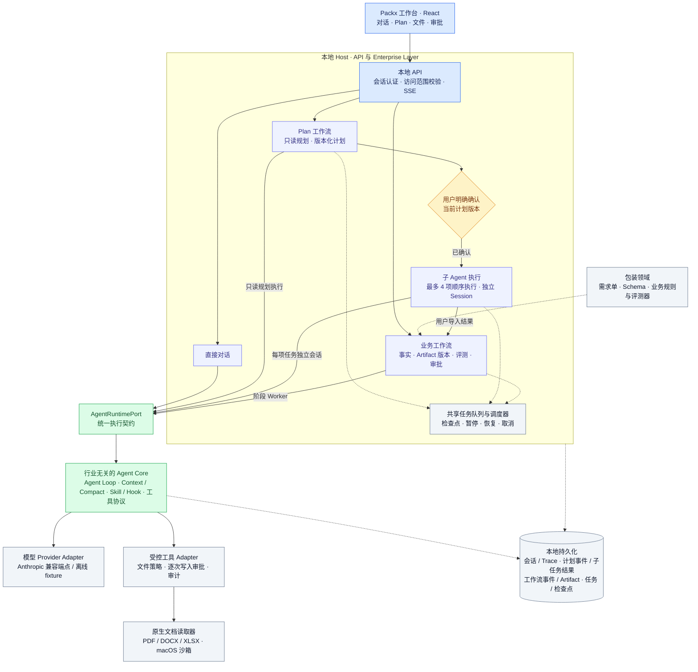

# Packx

[English](README.md) · [简体中文](README.zh-CN.md)

[文档导航](docs/README.md) · [面试资料：架构、上下文、记忆与恢复](docs/interview/README.md)

Packx 是面向**包装企业售前与跟单人员**的本地 Agent 工作台。项目使用自研、行业无关的 Agent Core，通过工作流层管理有来源的事实、版本化需求单、审批和中断恢复。

当前是可以在本机运行、阅读实现的工程原型，提供未签名的 macOS 本地发行目录，尚未达到生产 SaaS 或签名桌面安装包的交付阶段。产品范围仅限包装行业，代码中的 `print` 标识为兼容已有数据而保留。

Packx 原名 Blackx。界面和项目名称已更新；现有 `BLACKX_*` 环境变量、`.blackx-data/` 数据目录及内部协议标识继续沿用，已有配置无需迁移。GitHub 仓库地址目前仍为 `B1ackB/Blackx`，历史 ADR 和验证记录保留当时名称。

面向开发者的定位、演示设计、贡献入口与四周执行计划见[开发者参与指南](docs/developer-community-guide.md)。其中的招募、Issue、演示与社区建设事项是待执行计划，不代表已上线能力。

## 可以做什么

- 切换 Plan 模式，先生成版本化计划，明确确认后由最多 4 个独立子 Agent 顺序执行；支持暂停和恢复。详见 [Plan 模式指南](docs/plan-mode.md)。
- 新建和删除会话，接收流式回复，停止或重试当前执行。
- 切换中英文界面；已有消息和原始资料保留原文。
- 上传文档与图片，在 macOS 隔离环境中提取 PDF、DOCX、XLSX 文字。
- 在右侧面板浏览本地目录、预览文件，让 Agent 新建、修改或删除文本文件；每次写入和删除都需要审批。
- 在同一个面板查看当前模型、调用结果、延迟、Token 用量及上游报告的缓存使用情况。
- 基于来源资料生成包装需求单，核对事实、创建新版本、审批并导出交付物。
- 通过实现与本地工作区查看持久化的工作流事件、后台任务和有次数上限的定时任务。

## 运行要求

| 项目 | 当前支持基线 |
| --- | --- |
| Node.js | **24.14.0**，记录在 `.nvmrc` 中；package engines 限定 Node 24 |
| 包管理器 | npm；使用已提交的 `package-lock.json` 和 `npm ci` |
| 完整本地流程 | macOS，并安装 Apple Command Line Tools（`xcode-select --install`） |
| 浏览器 | 能访问 `127.0.0.1` 的现代浏览器 |
| 真实模型 | 合法可用的 Anthropic Messages 兼容端点、模型 ID 和 API Key |

原生文档读取依赖 Swift 和 macOS Seatbelt。其他平台不会静默降级为无沙箱解析，完整产品的跨平台运行尚未验证。项目采用 Node 24 基线，运行时也使用其内置 SQLite 能力。

## 安装

```bash
git clone https://github.com/B1ackB/Blackx.git Packx
cd Packx
# 如果使用 nvm：
nvm install
nvm use
npm ci
```

已有代码时直接在仓库根目录执行即可。`nvm` 不是必需工具，已安装 Node 24.14.0 时可以跳过相关两行。访问仓库可能需要你的 GitHub 身份凭据。

安装后选择以下一种启动方式。

### 1. 不配置 API Key，先体验工作台

```bash
npm run dev:fixture
```

等待启动结果后，打开 **http://127.0.0.1:5178**。此命令会编译原生读取器、准备临时示例资料，并连接本地**固定回复**的 Provider。它不会调用外部模型，用来体验集成流程，不代表通用模型的推理能力。启动前的检查需要一点时间。

按 `Ctrl+C` 停止。正常退出时会清理 fixture 的临时工作区，请勿在这里保存需要长期保留的成果。本地文件写入、删除仍然需要审批。

如果需要没有模型的持久化工作区，可以直接运行 `npm run dev`，默认以 `fake` 模式启动在 **http://127.0.0.1:5173**。该模式可以管理会话，但会有意关闭聊天发送。

### 2. 连接真实模型

```bash
cp .env.example .env
```

在本地编辑 `.env`：

```dotenv
BLACKX_RUNTIME_MODE=anthropic
BLACKX_PORT=5173
ANTHROPIC_BASE_URL=https://api.anthropic.com
ANTHROPIC_MODEL=your-provider-supported-model-id
ANTHROPIC_API_KEY=your-private-api-key
```

将示例值替换为实际服务配置，然后执行：

```bash
npm run dev
```

打开 **http://127.0.0.1:5173**。这一条命令会编译原生读取器，同时启动 API Host 和 Vite 界面，不需要另开终端启动前端。

`npm run dev` 自动读取 `.env`，已有终端环境变量优先。`.env` 已被 Git 忽略。密钥只能放在服务端配置中，不要放进消息、提交到仓库或写入 `VITE_` 变量。此启动脚本向服务端进程加载 `.env`；在线评测脚本仍需通过终端环境注入 Provider 变量。

当前 Adapter 使用 Anthropic Messages 协议，包括流式输出和工具调用；完整 Runtime 也会调用 Token Count。`ANTHROPIC_BASE_URL` 填服务根地址，Packx 会追加 `/v1/messages` 和 `/v1/messages/count_tokens`，不能直接替换成 OpenAI Chat Completions 端点。“模型已配置”只表示配置已加载，不代表端点已经通过所有能力验证。详见 [API 配置指南](docs/api-configuration.md) 与 [兼容性说明](docs/anthropic-compatibility.md)。

真实请求可能产生模型服务费用。选中文档的内容及模型输入可能被发送给配置的 Provider；本地解析不等于连接真实模型时仍然完全离线。

## 第一次使用

1. 新建会话，描述包装需求；可以附上文字 PDF、DOCX 或 XLSX。
2. 让 Agent 读取资料并整理缺失信息。在右侧面板查看文件内容与模型调用情况。
3. 创建需求单，核对带来源的事实，并明确确认你掌握的数值。模型建议在确认前保持未验证状态。
4. 检查生成版本和校验结果，在工作流允许时审批并导出；上游事实变化会使受影响的输出失效、等待重新验证。
5. 如需保存本地文本文件，告诉 Agent 具体位置。在审批卡片中核对绝对路径和内容，再批准或拒绝。

免密钥 fixture 使用固定回复序列，任意聊天需要真实 Provider。已审批的需求单也不等于可直接提交生产的印刷文件。

## 项目架构

下图对应当前本地实现。实线表示请求与执行方向，虚线表示领域规则和共享基础设施；为便于阅读，省略结果返回路径。



Host 负责计划确认、子 Agent 派发、权限、工作流状态转换、验证和完成判定。各条执行路径复用同一个 Runtime，包装规则保留在 Core 之外。子 Agent 上下文独立，文件权限范围沿用父会话；确认计划不会同时批准文件写入或业务交付。模型结束回复并不代表业务流程完成。

执行限制与恢复行为见 [Plan 模式指南](docs/plan-mode.md) 和 [ADR-0015](docs/adr/0015-confirmed-plans-and-bounded-subagents.md)。

当前错误分类、重试额度、取消、未决副作用与对账方法见 [错误处理与可靠性恢复](docs/reliability-recovery.md)，故障注入和复验结果见 [错误处理测试报告](docs/harness-error-handling-tests.md)。

| 位置 | 职责 |
| --- | --- |
| `src/App.tsx`、`src/components/`、`src/i18n.ts` | React 工作台、多功能面板、中英文界面 |
| `src/agent/` | 行业无关的循环、上下文、工具、Hook、会话与压缩 |
| `src/enterprise/`、`server/enterprise/` | 工作流契约、事件、持久化与恢复 |
| `src/manufacturing/`、`server/manufacturing/` | 包装需求工作流与交付 |
| `src/print/` | 已有印刷领域能力与回归资产 |
| `server/index.ts`、`server/runtime/` | 本地 API、Runtime Adapter、文件策略、审批和可观测性 |
| `server/anthropic/` | Anthropic 协议客户端与流式解析 |
| `native/` | 在 macOS 隔离环境中执行的 Swift 文档/素材读取器 |
| `eval/`、`server/testing/` | 可重复评测、本地 fixture 和失败案例 |
| `docs/` | 架构决策、验证证据、配置和路线图 |

建议先读[架构原则](docs/architecture/principles.md)，再沿一个功能从 UI 跟到 API 和 Runtime。修改实现或架构前阅读 [AGENTS.md](AGENTS.md)。深入设计文档目前主要为中文，两份 README 均覆盖完整上手流程。

本次补全范围与状态见[本地产品工作单](docs/local-product-completion.md)。启动诊断、备份和恢复见[本地操作指南](docs/local-operations.md)，可从明确标注的[模拟咖啡袋任务](examples/coffee-pouch-intake.md)体验交接流程；真实用户验证仍待补。

[包装数据与证据检索切片](docs/knowledge/README.md)提供资料版本治理、关键词/向量/RRF 基线，并将选中证据接入 Plan 和需求单来源链。无需模型 Key 即可运行 `npm run demo:knowledge`。见[数据源登记](docs/knowledge/sources.md)和[验证记录及简历证据](docs/knowledge/evidence.md)：另有 [5 篇 CC BY 真实研究全文与本地 E5 实验](docs/knowledge/real-experiment.md)，含 64 道暂定标注题及拆问对照。供应商资料、专家黄金标签和 PostgreSQL 部署仍待验证。

[最新检索优化报告](docs/knowledge/optimization.md)提供开发消融、64 题已观察回归、逐字段缺口提示及 `npm run eval:knowledge-optimize` 复现入口。召回指标衡量暂定出处锚点，不等于回答正确率或独立泛化成绩。

[来源绑定的参数比较报告](docs/knowledge/comparison.md)记录显式参数选择、UI 与受控 Tool、逐项测试条件追问、40 个固定规则案例及 64 题排序回归。可运行 `npm run eval:knowledge-compare` 复现，工业正确性及专家审核仍待验证。

## 验证命令

| 命令 | 用途 | 需要外部模型？ |
| --- | --- | --- |
| `npm run check` | 单元/集成测试、TypeScript 检查、前端构建 | 否 |
| `npm run eval:offline` | 固定离线 Harness 评测 | 否 |
| `npm run eval:m1` | M1 工作流评测 | 否 |
| `npm run eval:m2` | 包装需求单评测 | 否 |
| `npm run eval:plan` | 固定 Plan 确认与子 Agent 基线 | 否 |
| `npm run build:native` | 编译 macOS 读取器 | 否 |
| `npm run test:native` | 真实 macOS 沙箱与文档测试 | 否 |
| `npm run eval:product` | 本地 Provider/API/工作流冒烟检查，结束后自动清理 | 否 |
| `npm run check:local` | 顺序运行以上全部检查，面向完整 macOS 基线 | 否 |
| `npm run eval:anthropic-contract` | 验证配置端点的 Provider 契约 | 是，可能计费 |

在线评测须按 [API 配置指南](docs/api-configuration.md) 向终端环境注入 Provider 变量。安装和免密钥体验不要求先运行在线评测。

`npm run dev:web` 只启动 Vite，不包含 API Host。`npm run build` 生成前端产物并检查类型，不会生成独立服务端或桌面安装包；只托管 `dist/` 不能运行完整产品。

## 数据、权限与当前边界

- **本地存储：**正常运行默认在 `.blackx-data/` 保存会话、事件、附件、Artifact、备份与模型请求记录。请妥善保管；该目录已被 Git 忽略。生成的原生工具位于 `.blackx-tools/`。
- **文件访问：**Host 策略允许读取安全的本地路径。`BLACKX_WORKSPACE_ROOT` 设置默认工作位置，不是整目录授权，也不意味着所有读取都限定在该目录。隐藏、系统、内部路径和符号链接受到限制。新建文本文件、修改、删除均需逐次审批，哈希/版本检查拒绝过期操作。文本写入最大 128 KiB，未实现 Office/PDF 原格式写回。
- **删除语义：**删除会话会取消工作区访问并停止关联任务，历史数据保留用于审计，不是安全擦除。删除本地文件会在审批后移除原文件，并保留受管理的备份。
- **文档能力：**PDF 只提取现有文字，不含 OCR；DOCX 读取段落、表格及脚注/尾注；XLSX 读取工作表、单元格及缓存公式值，不重新计算公式。不支持旧 `.doc`/`.xls` 或加密文档。当前解析上限包括单文件 10 MiB、提取文本预算 1,000,000 个 Swift 字符、PDF 最多 1,000 页、XLSX 最多 1,000 个工作表，另有归档和资源限制；截断会明确标记，工具结果仍需按预算分页续读。详见[上下文管理](docs/context-management.md)。
- **可观测性：**Token/缓存统计来自 Provider 实际返回的字段，有保留窗口和覆盖率限制，不补造缺失数据。fixture 数值不能当作性能或账单证据。
- **部署边界：**Host 监听回环地址，使用本地会话和 Host/Origin 检查；尚未提供多用户登录系统，也不能证明生产多租户隔离。固定解析器已有资源预算和崩溃清理；任意代码通用隔离与企业部署加固仍待验证。
- **验证边界：**离线测试、原生沙箱检查、本地产品验证分别记录，不等于真实 Provider 或真实用户验收。已实现范围和待完成事项见 [2026-09-07 功能证据](docs/evidence/streaming-bilingual-documents-2026-09-07.md)、[流式与文档 ADR](docs/adr/0014-streaming-and-document-sources.md) 及[路线图](docs/roadmap.md)。

## 常见问题

| 现象 | 处理方式 |
| --- | --- |
| Node 版本不支持、SQLite 或 env-file 报错 | 查看 `node --version`，切换至 Node 24.14.0 后重新 `npm ci` |
| `xcrun` 或 Swift 编译失败 | 安装 Apple Command Line Tools，再运行 `npm run build:native` |
| 无法发送聊天 | `fake` 模式有意拒绝发送；改用 `dev:fixture` 或配置真实 Provider |
| 修改配置后没有生效 | 重启 Host，并检查终端环境是否覆盖了 `.env` |
| 端口被占用 | 停止自己启动的占用进程，或为 `npm run dev` 修改 `BLACKX_PORT`；fixture 使用 5178 |
| API 返回 403 | 打开本地 UI；Host 重启后刷新。直接请求 API 没有本地会话 Token |
| 显示已配置但模型调用失败 | 检查根地址、模型 ID、密钥，以及 Messages/流式/工具/Token Count 兼容性 |
| 扫描 PDF 没有提取出文字 | 提供文字 PDF 或先单独提取文字；当前未接入 OCR |

## 许可证

[MIT](LICENSE)。第三方依赖及其审计见 [docs/dependencies.md](docs/dependencies.md)。参考仓库不作为生产源码依赖。

### 本地发行与配置

执行 `npm run release`，在 `releases/` 生成 macOS 发行目录、压缩包和摘要。打开目录中的 `Packx.command`；需要 Node 24.14+（24.x），首次启动安装锁定依赖。侧栏点击**配置模型**，保存连接后重启；任务可以重命名，并按名称和 Plan 目标搜索。详见[发行指南](docs/release-start.md)和[本地操作](docs/local-operations.md)。当前发行物未签名，干净设备和企业部署验证保持待补。
