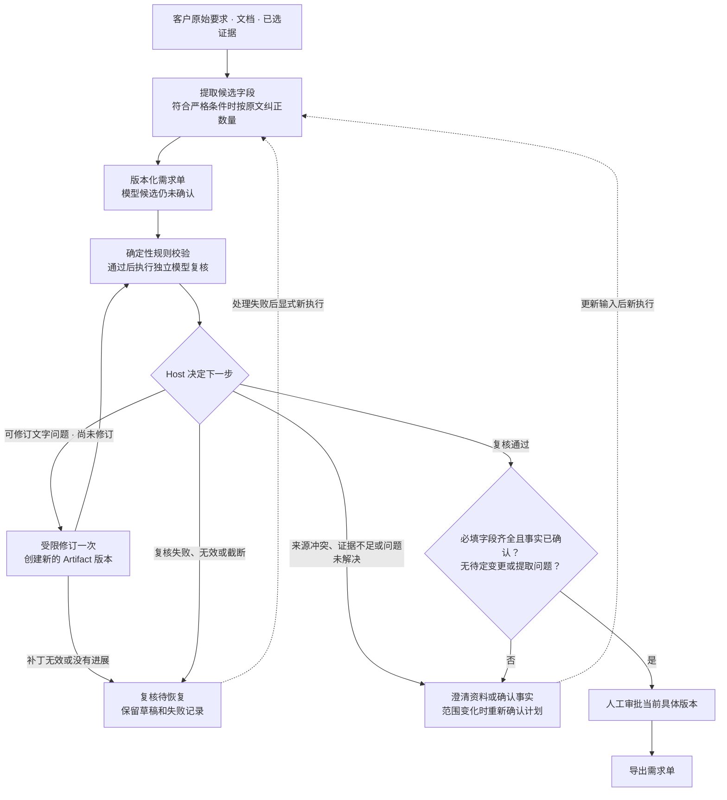
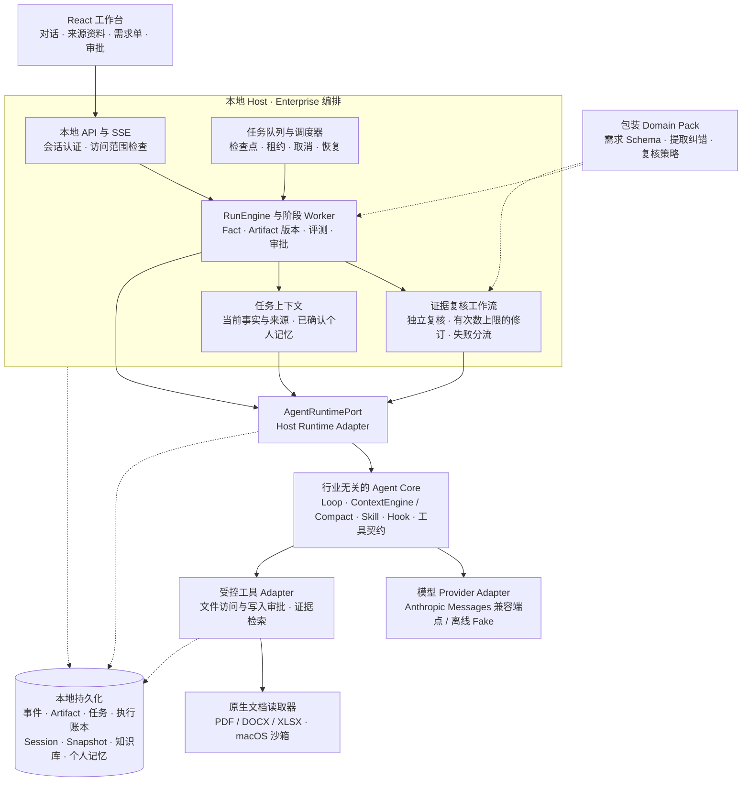

# Packx

[English](README.md) · [简体中文](README.zh-CN.md) · [文档导航](docs/README.md)

**把客户零散的询价要求整理成有来源、可核对、可审批的包装需求单。** Packx 是面向包装企业售前与跟单人员的本地 Agent 工作台，围绕资料提取、事实确认、需求单交接和中断恢复构建。

一份需求单保留候选事实及来源、缺失信息、矛盾与变更提议，并记录生成版本、复核结果和审批。业务状态独立于聊天记录保存，便于回看“这个数量从哪里来”“修改后哪个版本还能交付”。

当前为可在本机运行的工程原型，提供未签名的 macOS 发行目录；真实用户价值验证、生产多用户部署和签名安装包仍待完成。产品范围仅限包装行业。Packx 原名 Blackx，现有 `BLACKX_*` 环境变量、`.blackx-data/` 数据目录及 `print` 等内部兼容标识继续保留。

[业务流程](#从询价到需求单) · [架构图](#项目架构) · [快速启动](#安装) · [验证证据](#验证到了哪一步)

## 当前能力

- **需求单交接：**从资料提取候选事实，定位缺失与矛盾，保存不可变版本，确认、审批并导出。
- **证据复核与修订：**先做规则校验，再独立复核原文；对获准的问题修订一次，保留旧稿、来源和未解决问题。
- **资料与知识：**读取 PDF、DOCX、XLSX 文字，检索并选取有版本的包装证据；检索结果不自动成为订单事实。
- **持续执行：**记录任务、检查点和执行账本，支持暂停、取消和受控恢复；确认的个人偏好可在同一工作区内跨会话使用。
- **工作台：**中英文界面、流式对话、文件预览、逐次审批的文本写入、调用与 Token 记录，以及需确认的 Plan 模式。

## 从询价到需求单

1. 导入客户要求与来源文档，创建包装需求单。可从明确标注的[模拟咖啡袋任务](examples/coffee-pouch-intake.md)体验流程。
2. 对照原文检查候选事实、缺失字段、矛盾及变更提议。模型提取的数值保持未确认状态。
3. 工作流校验并独立复核草稿。支持范围内的文字错误可自动修订一次；真实来源冲突需要澄清。复核失败保留草稿，并显示单独的恢复入口。
4. 明确确认能够核实的事实，生成并检查相应新版本，再审批该具体版本并导出。上游事实变化会使受影响的输出和审批资格失效。

下图概括一次需求单生成执行的业务分流，省略存储和队列状态转换；每个新候选版本都要重新校验。


```mermaid
flowchart TB
	SOURCE["客户原始要求 · 文档 · 已选证据"] --> EXTRACT["提取候选字段<br/>符合严格条件时按原文纠正数量"]
	EXTRACT --> BRIEF["版本化需求单<br/>模型候选仍未确认"]
	BRIEF --> REVIEW["确定性规则校验<br/>通过后执行独立模型复核"]
	REVIEW --> DECISION{"Host 决定下一步"}
	DECISION -->|"可修订文字问题 · 尚未修订"| PATCH["受限修订一次<br/>创建新的 Artifact 版本"]
	PATCH --> REVIEW
	PATCH -->|"补丁无效或没有进展"| RECOVER["复核待恢复<br/>保留草稿和失败记录"]
	DECISION -->|"复核失败、无效或截断"| RECOVER
	DECISION -->|"来源冲突、证据不足或问题未解决"| INPUT["澄清资料或确认事实<br/>范围变化时重新确认计划"]
	DECISION -->|"复核通过"| READY{"必填字段齐全且事实已确认？<br/>无待定变更或提取问题？"}
	READY -->|"否"| INPUT
	READY -->|"是"| APPROVAL["人工审批当前具体版本"]
	APPROVAL --> EXPORT["导出需求单"]
	INPUT -.->|"更新输入后新执行"| EXTRACT
	RECOVER -.->|"处理失败后显式新执行"| EXTRACT
```

当前策略（`packaging-requirement-evidence.v2.6`）每次执行最多**修订一次、复核两次**。模型补丁只允许修改 `title`、`customerGoal`、`assumptions` 中获准的部分。独立的数量纠错规则要求完整原文中的整数件数明确、单位一致，纠正后仍待确认。已确认事实与人工录入值不能被静默覆盖；修好一处文字错误也不会解除其他未解决问题的阻断。

例如，原文明确“禁止 PVC”，草稿却写成“允许 PVC”，可以修正文案后再次复核；两份原始资料对 PVC 要求相反，则需要澄清。超时或输出截断归入系统复核恢复。完整边界见[需求单证据复核](docs/requirement-evidence-review.md)与 [ADR-0029](docs/adr/0029-controlled-requirement-corrections.md)。

审批后的需求单用于业务交接，不代表生产就绪印刷文件。尺寸、刀模、条码、色彩配置和印前检查仍需要权威输入与确定性生产工具。

## 项目架构

当前以本地应用运行：React 工作台、Node.js Host、本地存储和 macOS 文档读取器。图中的方框表示职责边界，并非独立部署的服务。实线表示执行或数据流，虚线表示策略与持久化连接。


```mermaid
flowchart TB
	UI["React 工作台<br/>对话 · 来源资料 · 需求单 · 审批"]
	DOMAIN["包装 Domain Pack<br/>需求 Schema · 提取纠错 · 复核策略"]

	subgraph HOST["本地 Host · Enterprise 编排"]
		API["本地 API 与 SSE<br/>会话认证 · 访问范围检查"]
		WORKFLOW["RunEngine 与阶段 Worker<br/>Fact · Artifact 版本 · 评测 · 审批"]
		REVIEW["证据复核工作流<br/>独立复核 · 有次数上限的修订 · 失败分流"]
		JOBS["任务队列与调度器<br/>检查点 · 租约 · 取消 · 恢复"]
		CONTEXT["任务上下文<br/>当前事实与来源 · 已确认个人记忆"]
		API --> WORKFLOW
		WORKFLOW --> REVIEW
		JOBS --> WORKFLOW
		WORKFLOW --> CONTEXT
	end

	PORT["AgentRuntimePort<br/>Host Runtime Adapter"]
	CORE["行业无关的 Agent Core<br/>Loop · ContextEngine / Compact · Skill · Hook · 工具契约"]
	PROVIDER["模型 Provider Adapter<br/>Anthropic Messages 兼容端点 / 离线 Fake"]
	TOOLS["受控工具 Adapter<br/>文件访问与写入审批 · 证据检索"]
	NATIVE["原生文档读取器<br/>PDF / DOCX / XLSX · macOS 沙箱"]
	STORE[("本地持久化<br/>事件 · Artifact · 任务 · 执行账本<br/>Session · Snapshot · 知识库 · 个人记忆")]

	UI --> API
	DOMAIN -.-> WORKFLOW
	DOMAIN -.-> REVIEW
	WORKFLOW --> PORT
	REVIEW --> PORT
	CONTEXT --> PORT
	PORT --> CORE
	CORE --> PROVIDER
	CORE --> TOOLS
	TOOLS --> NATIVE
	HOST -.-> STORE
	PORT -.-> STORE
	TOOLS -.-> STORE
```

Host 决定阶段转换、工具范围、预算、审批和完成条件；Core 在这些边界内执行，包装规则留在领域层。复核与修订复用 Runtime，但禁用工具。模型结束回复不代表工作流完成，也不能把候选 Fact 变成已确认事实。

普通对话与确认后的 Plan 任务也复用该 Runtime，图中省略这两条支线以突出包装主流程。Plan 支持最多四项顺序执行的独立会话任务；确认计划不同时批准文件写入或业务交付。详见 [Plan 模式](docs/plan-mode.md)、[上下文管理](docs/context-management.md)、[个人记忆](docs/memory-system.md)与[可靠性恢复](docs/reliability-recovery.md)。

| 位置 | 职责 |
| --- | --- |
| `src/App.tsx`、`src/components/`、`src/i18n.ts` | React 工作台与中英文界面 |
| `src/agent/` | 行业无关的循环、上下文、工具、Hook、会话与压缩 |
| `src/runtime/contracts.ts`、`server/runtime/` | Runtime Port 与 Host Adapter、受控工具、可观测性 |
| `src/enterprise/`、`server/enterprise/` | 工作流状态、证据复核编排、事件、任务、恢复、个人记忆 |
| `src/manufacturing/`、`server/manufacturing/` | 包装 Schema、来源处理、候选纠错、复核策略、交付 |
| `server/knowledge/` | 知识存储、检索、Embedding 与重排 |
| `src/print/` | 已有印刷领域能力与回归资产 |
| `server/index.ts`、`server/anthropic/` | Host 组装与 API 路由；Anthropic 协议客户端 |
| `native/` | 在 macOS 隔离环境中执行的 Swift 文档／素材读取器 |
| `eval/`、`server/testing/` | 可重复评测、本地 fixture 和失败案例 |

建议先读[架构原则](docs/architecture/principles.md)与 [AGENTS.md](AGENTS.md)。跟读实现可沿 [RequirementBriefWorker](server/manufacturing/requirementBriefWorker.ts) → [EvidenceReviewWorkflow](server/enterprise/evidenceReviewWorkflow.ts) → [包装复核策略](server/manufacturing/requirementEvidencePolicy.ts)。深入设计文档目前主要为中文。

## 验证到了哪一步

以下记录是注明日期的证据，不代表所有模型或客户任务都能成功。

| 证据 | 已验证内容 | 尚不能证明什么 |
| --- | --- | --- |
| [受限修订与提取纠错 · 2026-09-29](docs/evidence/requirement-controlled-corrections-2026-09-29.md) | 离线规则、权限、恢复与本地 API 回归；5 份 PVC 报告和 4 份数量错误回放 | 文案补丁来自脚本，v2.6 新策略尚未通过新增真实模型调用验证 |
| [可靠性修复 · 2026-09-29](docs/evidence/requirement-reliability-2026-09-29.md) | 当前输出合同校验及历史尝试／检查点回放 | 诊断回放不等于新的端到端成功率 |
| [复核输出预算实验 · 2026-09-29](docs/evidence/review-output-budget-2026-09-29.md) | 使用归档 v2.2 策略进行真实 Provider 的 8192／16384 输出预算对照 | 未达到采用门槛，未因此提高默认预算 |
| [从业者试用协议](docs/user-validation-template.md) | 已准备来源核对、交接可用性、关键错误、审核耗时和返工记录方式 | 真实用户的节省时间与交接价值仍待验证 |

其他能力分别保留[知识检索](docs/knowledge/README.md)、[检索优化](docs/knowledge/optimization.md)、[来源绑定比较](docs/knowledge/comparison.md)和[个人记忆](docs/memory-system.md)的证据。检索分数使用暂定标签，不能代表工业正确性；已确认个人记忆只作为软上下文，不赋予订单事实或操作权限。

完整入口见[文档导航](docs/README.md)、[本地产品工作单](docs/local-product-completion.md)与[路线图](docs/roadmap.md)。[开发者参与指南](docs/developer-community-guide.md)中的贡献和演示事项属于计划，不代表已上线能力。

## 运行要求

| 项目 | 当前支持基线 |
| --- | --- |
| Node.js | **24.14.0**，记录在 `.nvmrc` 中；package engines 限定 Node 24 |
| 包管理器 | npm；使用已提交的 `package-lock.json` 和 `npm ci` |
| 完整本地流程 | macOS，并安装 Apple Command Line Tools（`xcode-select --install`） |
| 浏览器 | 能访问 `127.0.0.1` 的现代浏览器 |
| 真实模型 | 合法可用的 Anthropic Messages 兼容端点、模型 ID 和 API Key |

原生文档读取依赖 Swift 和 macOS Seatbelt。其他平台不会静默降级为无沙箱解析，完整产品的跨平台运行尚未验证。项目采用 Node 24 基线，运行时也使用其内置 SQLite 能力。

## 安装

```bash
git clone https://github.com/B1ackB/Packx.git
cd Packx
# 如果使用 nvm：
nvm install
nvm use
npm ci
```

已有代码时直接在仓库根目录执行即可。`nvm` 不是必需工具，已安装 Node 24.14.0 时可以跳过相关两行。访问仓库可能需要你的 GitHub 身份凭据。

安装后选择以下一种启动方式。

### 1. 不配置 API Key，先体验工作台

```bash
npm run dev:fixture
```

等待启动结果后，打开 **http://127.0.0.1:5178**。此命令会编译原生读取器、准备临时示例资料，并连接本地**固定回复**的 Provider。它不会调用外部模型，用来体验集成流程，不代表通用模型的推理能力。启动前的检查需要一点时间。

按 `Ctrl+C` 停止。正常退出时会清理 fixture 的临时工作区，请勿在这里保存需要长期保留的成果。本地文件写入、删除仍然需要审批。

如果需要没有模型的持久化工作区，可以直接运行 `npm run dev`，默认以 `fake` 模式启动在 **http://127.0.0.1:5173**。该模式可以管理会话，但会有意关闭聊天发送。

### 2. 连接真实模型

```bash
cp .env.example .env
```

在本地编辑 `.env`：

```dotenv
BLACKX_RUNTIME_MODE=anthropic
BLACKX_PORT=5173
ANTHROPIC_BASE_URL=https://api.anthropic.com
ANTHROPIC_MODEL=your-provider-supported-model-id
ANTHROPIC_API_KEY=your-private-api-key
```

将示例值替换为实际服务配置，然后执行：

```bash
npm run dev
```

打开 **http://127.0.0.1:5173**。这一条命令会编译原生读取器，同时启动 API Host 和 Vite 界面，不需要另开终端启动前端。

`npm run dev` 自动读取 `.env`，已有终端环境变量优先。`.env` 已被 Git 忽略。密钥只能放在服务端配置中，不要放进消息、提交到仓库或写入 `VITE_` 变量。各评测命令是否加载 `.env` 取决于对应脚本；运行前查看 `package.json` 与配置指南。

当前 Adapter 使用 Anthropic Messages 协议，包括流式输出和工具调用；完整 Runtime 也会调用 Token Count。`ANTHROPIC_BASE_URL` 填服务根地址，Packx 会追加 `/v1/messages` 和 `/v1/messages/count_tokens`，不能直接替换成 OpenAI Chat Completions 端点。“模型已配置”只表示配置已加载，不代表端点已经通过所有能力验证。详见 [API 配置指南](docs/api-configuration.md) 与 [兼容性说明](docs/anthropic-compatibility.md)。

真实请求可能产生模型服务费用。选中文档的内容及模型输入可能被发送给配置的 Provider；本地解析不等于连接真实模型时仍然完全离线。

### 本地发行与配置

执行 `npm run release`，在 `releases/` 生成 macOS 发行目录、压缩包和摘要。打开目录中的 `Packx.command`；需要 Node 24.14+（24.x），首次启动安装锁定依赖。侧栏点击**配置模型**，保存连接后重启；任务可以重命名，并按名称和 Plan 目标搜索。详见[发行指南](docs/release-start.md)和[本地操作](docs/local-operations.md)。当前发行物未签名，干净设备和企业部署验证保持待补。

## 验证命令

| 命令 | 用途 | 需要外部模型？ |
| --- | --- | --- |
| `npm run check` | 单元/集成测试、TypeScript 检查、前端构建 | 否 |
| `npm run eval:offline` | 固定离线 Harness 评测 | 否 |
| `npm run eval:m2` | 包装需求单评测 | 否 |
| `npm run eval:reliability-repairs` | 输出合同回归与历史失败诊断回放 | 否 |
| `npm run eval:recovery` | 恢复与未决副作用边界 | 否 |
| `npm run eval:context`、`npm run eval:memory` | 上下文与个人记忆机制评测 | 否 |
| `npm run eval:plan` | 固定 Plan 确认与子 Agent 基线 | 否 |
| `npm run build:native` | 编译 macOS 读取器 | 否 |
| `npm run test:native` | 真实 macOS 沙箱与文档测试 | 否 |
| `npm run eval:product` | 本地 Provider/API/工作流冒烟检查，结束后自动清理 | 否 |
| `npm run check:local` | macOS 综合基线，含 M1、停止保护及产品检查；不含 reliability-repairs，需单独运行 | 否 |
| `npm run eval:anthropic-contract` | 验证配置端点的 Provider 契约 | 是，可能计费 |

先运行 `npm run check`，再按修改范围选择专项评测。`eval:anthropic-contract` 需要按 [API 配置指南](docs/api-configuration.md) 导出 Provider 环境变量；部分其他在线命令会加载 `.env`。在线评测可能计费，安装和免密钥体验不要求运行它们。

`npm run dev:web` 只启动 Vite，不包含 API Host。`npm run build` 生成前端产物并检查类型，不会生成独立服务端或桌面安装包；只托管 `dist/` 不能运行完整产品。

## 数据、权限与当前边界

- **本地存储：**正常运行默认在 `.blackx-data/` 保存会话、事件、附件、Artifact、备份与模型请求记录。请妥善保管；该目录已被 Git 忽略。生成的原生工具位于 `.blackx-tools/`。
- **文件访问：**Host 策略允许读取安全的本地路径。`BLACKX_WORKSPACE_ROOT` 设置默认工作位置，不是整目录授权，也不意味着所有读取都限定在该目录。隐藏、系统、内部路径和符号链接受到限制。新建文本文件、修改、删除均需逐次审批，哈希/版本检查拒绝过期操作。文本写入最大 128 KiB，未实现 Office/PDF 原格式写回。
- **删除语义：**删除会话会取消工作区访问并停止关联任务，历史数据保留用于审计，不是安全擦除。删除本地文件会在审批后移除原文件，并保留受管理的备份。
- **用户交付模板：**在需求单预览上传自己的 DOCX/XLSX，以占位符映射、核对填充值后保存新文件。保留原模板和需求/审批版本；不支持任意空白表单自动识别，完整格式限制见[使用说明](docs/document-import-and-templates.md)。
- **文档能力：**PDF 支持文字层与 macOS 本机分批 OCR，保留页码、识别警告和续读入口；DOCX 读取段落、表格、页眉页脚及脚注/尾注；XLSX 读取工作表、单元格及缓存公式值，不重新计算公式。不支持旧 `.doc`/`.xls` 或加密文档。当前解析上限包括单文件 10 MiB、提取文本预算 1,000,000 个 Swift 字符、PDF 最多 1,000 页、XLSX 最多 1,000 个工作表，另有归档和资源限制；截断会明确标记，工具结果仍需按预算分页续读。详见[资料导入与用户模板](docs/document-import-and-templates.md)及[上下文管理](docs/context-management.md)。
- **可观测性：**Token/缓存统计来自 Provider 实际返回的字段，有保留窗口和覆盖率限制，不补造缺失数据。fixture 数值不能当作性能或账单证据。
- **部署边界：**Host 监听回环地址，使用本地会话和 Host/Origin 检查；尚未提供多用户登录系统，也不能证明生产多租户隔离。固定解析器已有资源预算和崩溃清理；任意代码通用隔离与企业部署加固仍待验证。
- **验证边界：**离线测试、原生沙箱检查、本地产品验证分别记录，不等于真实 Provider 或真实用户验收。当前验证入口见上方证据表；历史报告保留原日期、策略和评分，不能直接当作当前版本成功率。

## 常见问题

| 现象 | 处理方式 |
| --- | --- |
| Node 版本不支持、SQLite 或 env-file 报错 | 查看 `node --version`，切换至 Node 24.14.0 后重新 `npm ci` |
| `xcrun` 或 Swift 编译失败 | 安装 Apple Command Line Tools，再运行 `npm run build:native` |
| 无法发送聊天 | `fake` 模式有意拒绝发送；改用 `dev:fixture` 或配置真实 Provider |
| 修改配置后没有生效 | 重启 Host，并检查终端环境是否覆盖了 `.env` |
| 端口被占用 | 停止自己启动的占用进程，或为 `npm run dev` 修改 `BLACKX_PORT`；fixture 使用 5178 |
| API 返回 403 | 打开本地 UI；Host 重启后刷新。直接请求 API 没有本地会话 Token |
| 显示已配置但模型调用失败 | 检查根地址、模型 ID、密钥，以及 Messages/流式/工具/Token Count 兼容性 |
| 显示“复核待恢复” | 查看失败原因，处理输出预算或配置等问题后显式发起新执行；已有草稿保留，不能通过审批绕过失败 |
| 草稿已纠正但仍需处理 | 检查尚未确认的事实、来源冲突、范围变更和待定修改；局部修订不解除其他阻断 |
| 扫描 PDF 未完整识别 | 展开附件「导入正文 / OCR 预览」，继续下一批 OCR；识别失败或低质量内容请对照原件核对 |

## 许可证

[MIT](LICENSE)。第三方依赖及其审计见 [docs/dependencies.md](docs/dependencies.md)。参考仓库不作为生产源码依赖。
