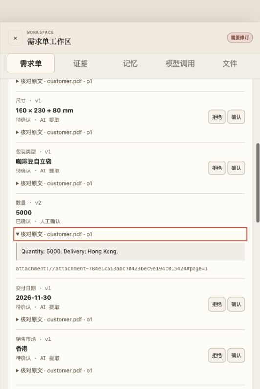

# 需求单核对与独立试用准备

日期：2026-09-26。范围：包装售前／跟单的需求核对。**本轮未调用真实模型，未执行真实用户试用，不能报告节省比例或新的任务成功率。** 基于已有未提交实现继续修改；历史在线证据保留原值。

## 已交付行为

1. 字段确认旁可查看会话、文本附件、已解析 PDF 页与知识证据的摘录；无法读取、已撤回的资料不会假装存在正文。确认后沿 Fact 历史保留原始引用。可读来源只表示能展开，不证明该来源支持当前值。
2. 确认请求必须携带用户看到的 Fact 版本和任务版本。过时确认返回冲突，不能把更新后的值意外确认；最终事件提交仍使用该预期版本做并发检查。现有调用方与 HTTP 冒烟测试已同步。
3. 已确认值的新提议单独保存在 Host 生成的 `pendingChanges` 中，展示旧值／提议／来源，提示旧交付需核对；不能直接覆盖已确认值。填入修改表仍需录入和确认。叙述修订不能删除 Host 生成的变更提醒。
4. 对初次生成和后续叙述修订增加数字缺失检查：数字在本次来源序列化文本中完全不存在时，阻止审批并保留失败输出。测试覆盖错误数字 6085；这只是保守词面检查，不能证明单位、数值角色或引用语义正确，也可能误拦需要进一步澄清的数字。尚未测量线上误拦率。
5. 手动计时、修正字段数、发现的关键错误数、核对者验收结果保存为不可变试用 Artifact。绑定需求单版本、任务版本和操作者，重试复用同一编号；保存不会确认业务事实。窗口失焦暂停计时。JSON 可下载或直接查看；草稿不跨任务保存。
6. 界面将原“候选确认准确率”改为“原样确认比例”，“来源覆盖”改为“引用填写率”，并解释它们与准确率的区别。Runtime 在上下文、模型响应及工具边界重新检查截止时间；任务返回过期租约时提示等待恢复检查。

落点是现有需求单 Domain、Workspace API、ArtifactContentStore 与 Runtime Adapter；未新增依赖、通用 Core 抽象或执行策略。

## 验证

| 验证 | 结果与口径 |
| --- | --- |
| 全量 Vitest | 87 文件，725 通过、21 跳过；跳过项不计通过 |
| macOS 原生隔离／PDF／文档专门回归 | 3 文件，30 通过；与全量部分重叠，不相加宣传 |
| TypeScript 与生产构建 | `npm run build` 通过 |
| 固定离线 Harness / Loop / Context / M2 / recovery | 原有命令通过；Fake 模型，不代表语义质量 |
| 本地 HTTP 产品冒烟 | 通过；涵盖身份边界、PDF 解析、确认／审批／导出，并新增原文与试用记录的持久化、幂等及身份校验 |
| 浏览器键盘流程 | 展开 PDF 数量原文 → 确认 5000 → 旧交付标记失效 → 计时、填写结果、保存成功 |
| 下载事件 | 应用内浏览器下载事件等待超时，未确认下载文件落地；服务端原始记录已核对，另提供页面内 JSON 查看 |
| 真实进程故障 | 三个 `SIGKILL` 案例，见下表；并非模型质量或远程工具恢复实验 |

HTTP 冒烟中原有 Plan 模拟响应使用了不存在的 `runtime:fixture#page=1` 引用，被现有来源校验正确拦下；本轮将无附件情形改用实际 `customer-brief` 引用，没有放宽生产来源校验。

### 实际进程终止

命令：`npm run eval:process-recovery`。本地文件工具走真实审批、写入、持久化与对账路径；模型为 Fake。

| 强制终止窗口 | 重启前变化 | 结果 | 重复写入 |
| --- | --- | --- | --- |
| 文件已写，文件回执尚未保存 | 无 | 按已持久化意图和文件最终内容对账成功 | 0 |
| 文件回执已保存，执行账本仍为 started | 无 | 从回执恢复成功状态 | 0 |
| 文件已写，文件回执尚未保存 | 外部修改文件 | 保持未决状态，要求处理，不重新写文件 | 0 |

原始数据：[进程故障记录](process-recovery-2026-09-26.json)。这不是电源故障／fsync 测试，不能扩大解释为所有 Worker、所有远程副作用或模型请求都能恢复。

### 界面证据

[浏览器保存的原始记录](requirement-review-ui-observation-2026-09-26.json) 使用 `UI-SYN-001`、`automated-ui-check`，明确标为自动化界面验收。约 6 秒的计时仅用于检查链路，不进入人效统计。记录来自服务端不可变 Artifact；没有把浏览器下载事件超时误报为导出成功。

## 尚未得到的结果

- 未开展新一轮在线评测；2026-09-25 Trial C 的 9/12 是历史开发案例结果，不能当作本轮改动后的成绩。
- RI-01 对“可选规格缺失”的语义处理尚未重新验证。RI-09 增加了变更结构与数值拦截，但整体任务质量仍需在线重测；拦住输出不等于成功完成任务。
- 截止时间回归模拟了延迟定时器，但没有确认 RI-14 历史租约丢失的根因。未决模型请求仍不能自动重放。
- 仍缺独立参与者、获授权订单、人工基线、跨模型与重复运行结果。下一批按[已冻结试用协议](../user-validation-template.md)收集，包含失败和放弃样本。

代码与原始证据哈希见 [manifest](requirement-review-2026-09-26.manifest.json)。不覆盖历史在线报告，也不把本地演示升级为生产效果声明。
