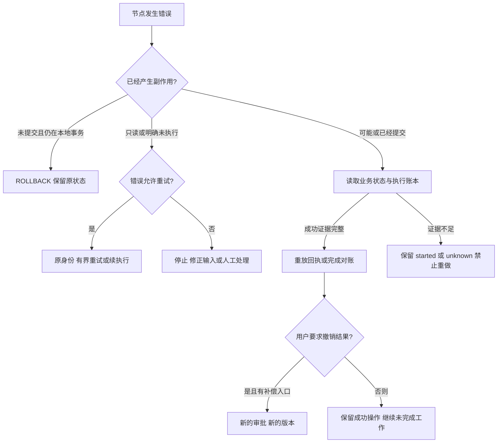

# Packx 逐节点故障、回滚与恢复审计

核查日期：2026-09-21。基准代码：`4df7f4d0b86fdd047cb051d76cc35db84b1e07f8`，以及本次后台续执行、错误分类和 Plan 调度修复。范围为当前本地 Host 的实际产品调用链，包括普通会话、个人记忆、知识库、Plan／子任务、需求单、文件操作和后台调度；历史 Proposal 使用的共用基础设施一并核对。**这是代码与离线故障验证记录，不是“所有故障均可自动回滚”的承诺。**

后续追加的独立测试及修复见 [Harness 错误处理测试闭环](harness-error-handling-tests.md)：新增 86 项，覆盖 Provider、Runtime、Worker／队列及知识取消。本表 G1、G3 与 R4 已同步后续修复，文末原审计的测试计数保留其历史范围。

依据：[AGENTS.md](../AGENTS.md)、[ADR-0003](adr/0003-durable-context-and-execution-slices.md)、[ADR-0004](adr/0004-leased-stage-job-scheduler.md)、[ADR-0005](adr/0005-transactional-outbox-and-queue-operations.md)、[ADR-0017](adr/0017-local-release-settings-and-native-supervision.md)、[ADR-0025](adr/0025-evidence-bound-recovery-and-explicit-degradation.md)、[ADR-0026](adr/0026-confirmed-personal-memory-and-context-dependency.md)。本次修复位于 Enterprise 调度与 API 适配处，沿用既有 `paused`、租约、预算与错误契约，没有修改 Core 状态契约或新增事务框架。

## 结论与术语

当前具有事务回滚、幂等重试、检查点续执行、文件结果对账、审批后文件补偿、检索降级和停机备份恢复。**没有跨整个任务的全局 rollback，也没有全部工具通用的自动补偿。**取消表示停止后续执行，不会撤销已经成功的操作；模型超时也不能撤销 Provider 已发生的计算或费用。

| 处理方式 | 精确含义 | 当前例子 |
| --- | --- | --- |
| 事务回滚 | 尚未提交的同一事务全部撤销 | SQLite 中个人记忆正文／状态与命令事件；知识块、索引状态与索引事件 |
| 原子文件替换 | 读者看到替换前或替换后的完整文件 | Session、Event Store、Artifact；不是跨文件事务，也不等于已验证断电持久性 |
| 幂等重试／续执行 | 使用原身份核查结果，继续未完成步骤 | 消息 ID、commandId、Job、Session checkpoint |
| 对账 | 根据权威执行证据补齐内部成功记录 | 已审批的文件写入／删除，禁止重新写用户文件 |
| 补偿 | 创建一项新的、受审批约束的反向业务操作 | 用不可变历史版本发起新 `file_write` |
| 降级 | 返回明示能力缺失的较弱结果 | hybrid embedding 暂时失败后关键词检索；重排失败后返回原候选 |
| 安全停止／人工介入 | 无法证明安全时阻止继续 | 权限、失效来源、未知副作用、必留上下文超预算 |

即使使用原子替换，`rename` 后的权限设置、解锁、另一个文件写入仍可能失败。因此“API 报错”不等于“没有提交”；恢复必须先按原身份读取状态。不得清空幂等账本、换一个 ID 重试未知写入，或恢复旧数据库后直接重做外部操作。



## 节点矩阵

表中“证据”表示列出的测试实际覆盖相应机制；不表示已经在该节点的每条语句注入过断电、磁盘损坏或网络分区。“缺口 G…”见后文。所有路径均以当前 tenant、workspace、run 和必要的 actor 为边界。

### 输入与上下文

| 节点 | 代码入口 | 出错后的现有处理 | rollback／人工处理与限制 | 验证证据 |
| --- | --- | --- | --- | --- |
| N01 Host 配置、认证与请求校验 | [localAccess](../server/localAccess.ts)、[index](../server/index.ts)、[modelSettings](../server/modelSettings.ts) | 不合法身份、Origin、请求体、路径或配置拒绝；设置采用临时文件替换 | 请求被拒绝不执行业务；配置生效后不能自动回到上一个可用 Provider，需修正设置并重启 | [localAccess.test](../server/localAccess.test.ts)、[modelSettings.test](../server/modelSettings.test.ts)；未做真实端点故障切换 |
| N02 创建会话、提交用户消息 | [conversationApi.send](../server/runtime/conversationApi.ts)、[FileAgentStateStore.save](../server/runtime/fileAgentStateStore.ts) | 稳定 messageId、同内容重复返回已有结果；输入冲突／并发轮次返回 409；先保留用户原话再执行 | 模型失败不删除用户消息；使用 retry 或原 messageId。创建会话本身没有 requestId 去重，响应丢失可能留下空会话 | [conversationApi.test](../server/runtime/conversationApi.test.ts)、[contextLifecycle.test](../server/runtime/contextLifecycle.test.ts) |
| N03 上传附件 | [conversationAttachments](../server/runtime/conversationAttachments.ts) | requestId 绑定确定性 ID 和内容哈希；校验类型、数量、大小，读取重验哈希 | 二进制先写、元数据后写，可能留未引用文件；原请求重试可补齐，未提供自动孤儿清理。不能用新内容冒充原附件 | [conversationAttachments.test](../server/runtime/conversationAttachments.test.ts)；跨文件崩溃穷举未做，G4／G5 |
| N04 加载 Skill 与允许工具 | [skills](../src/agent/skills.ts)、[AgentLoop.run](../src/agent/loop.ts) | Host 配置引用未知 Skill／Tool 时停止；模型请求未允许工具时拒绝该工具并返回结构化结果，不必然终止整个 turn；权限不能由文本改变 | 修正 Host 注册／allowlist；无业务写入需要撤销，不通过放宽权限降级 | [runtime.contract.test](../server/runtime/runtime.contract.test.ts)、[sandboxedToolExecutor.contract.test](../server/runtime/sandboxedToolExecutor.contract.test.ts) |
| N05 结构化任务上下文 | [buildTaskContext](../server/enterprise/taskContext.ts)、[agentRuntime](../server/runtime/agentRuntime.ts) | 当前 Fact、阶段、Artifact、来源版本来自存储；冲突、未确认项分开；超预算或绑定变化拒绝 | 修正输入、确认当前版本或重建任务；不恢复旧事实来让任务通过 | [contextLifecycle.test](../server/runtime/contextLifecycle.test.ts)、[planRequirementSource.test](../server/manufacturing/planRequirementSource.test.ts) |
| N06 个人记忆召回 | [personalMemoryService.context](../server/enterprise/personalMemoryService.ts)、[PersonalMemoryStore.recall](../server/enterprise/personalMemoryStore.ts) | 只召回当前主体的有效确认版本；过期／失效来源排除；存储损坏明确 context_failure | 存储故障不静默当成“没有记忆”；先修存储。记忆变化使旧工作上下文失效，原 UI 历史保留 | [personalMemory.test](../server/enterprise/personalMemory.test.ts)、`eval:memory` |
| N07 恢复快照、文档／图片引用 | [agentRuntime.validateSources](../server/runtime/agentRuntime.ts)、[contextRead](../server/runtime/contextRead.ts) | 同轮 checkpoint 比较绑定；递归回读依赖重验权限、来源、哈希；旧记忆绑定拒绝 | 当前来源不可读就停止，不能由模型补造历史或忽略失效内容；无全库自动重建 | [contextLifecycle.test](../server/runtime/contextLifecycle.test.ts)、[personalMemory.test](../server/enterprise/personalMemory.test.ts) |
| N08 Token 计数与输入预算 | [tokenBudget](../src/agent/tokenBudget.ts)、[AgentLoop.countTokens](../src/agent/loop.ts) | 有 Provider count 时优先使用；未提供才回退估算；已配置 count 请求失败则失败；压缩后再计数 | 必留策略、状态和完整工具组仍超预算就拒绝；不删除约束换取可调用。默认容量是应用策略，需核对配置模型 | [contextLifecycle.test](../server/runtime/contextLifecycle.test.ts)；真实 tokenizer 误差未测 |
| N09 外置、清理与压缩 | [context](../src/agent/context.ts)、[AgentLoop.compact](../src/agent/loop.ts) | 外置正文、清理可回读旧工具结果、成组保留 tool call/result；被摘要原文先存快照 | 原文归档失败则停止；已提交 transcript 不回写成摘要。不是完整工作会话的事务回滚 | [contextLifecycle.test](../server/runtime/contextLifecycle.test.ts)、`eval:context` |
| N10 摘要模型调用 | [summarizer](../src/agent/summarizer.ts)、[modelTelemetry](../server/runtime/modelTelemetry.ts) | 按完整消息分批；默认最多 4 次生成、单次 6000 输入／512 输出、总分配 26048 Token，并受当前任务限制；覆盖不足保留引用及 INCOMPLETE | Core 将摘要失败包装为 context_failure；Runtime 识别 Provider cause 后仍可映射为认证、限流、输出或预算错误。保留历史／源快照，无备用付费模型；预算不表示费用可退款 | [contextLifecycle.test](../server/runtime/contextLifecycle.test.ts)：失败快照、超长输出与计数失败；语义质量未测 |

### 模型与工具执行

| 节点 | 代码入口 | 出错后的现有处理 | rollback／人工处理与限制 | 验证证据 |
| --- | --- | --- | --- | --- |
| N11 模型生成／流式响应 | [anthropic/client](../server/anthropic/client.ts)、[anthropicModelProvider](../server/runtime/anthropicModelProvider.ts)、[agentRuntime](../server/runtime/agentRuntime.ts) | 分类认证、限流、输出、模型、超时和取消；普通会话执行片 120 秒；上下文窗口拒绝最多强制压缩再试一次 | 前台不无限自动重试；后台按错误和额度重试。Provider 已计算、返回未落盘的费用不可回滚，也无 exactly-once 计费保证 | [anthropicModelProvider.test](../server/runtime/anthropicModelProvider.test.ts)、[runtime.contract.test](../server/runtime/runtime.contract.test.ts)；G3 |
| N12 Loop Guard 与预算停止 | [loopGuard](../server/runtime/loopGuard.ts)、[AgentLoop](../src/agent/loop.ts) | 重复动作、连续工具失败、模型／工具额度阻止继续；合法执行片到边界返回 paused | Guard 停止不能靠同一任务重试清空；需要用户修正目标或输入。暂停不等于完成，已成功操作保留 | [loopGuard.test](../server/runtime/loopGuard.test.ts)、`eval:loop-safety`、[backgroundTaskApi.test](../server/workers/backgroundTaskApi.test.ts) |
| N13 前端进度／SSE 断连 | [index](../server/index.ts)、[runtimeActivity](../server/runtime/runtimeActivity.ts)、[App](../src/App.tsx) | 活动流断开清理订阅和 timer；最终 UI 重新读 Session；显式 stop 才向会话发送取消 | 断网／关页面不等于撤销后台任务，也不证明模型未执行；先刷新历史与任务状态再重试 | [runtimeActivity.test](../server/runtime/runtimeActivity.test.ts)、`eval:product`；浏览器断网操作未实测 |
| N14 工具参数、权限、审批 | [AgentLoop](../src/agent/loop.ts)、[conversationFiles](../server/runtime/conversationFiles.ts) | Schema／allowlist／sandbox／审批检查；拒绝产生结构化失败；文件等待审批受总执行片取消控制 | 拒绝后不能改路径或换工具绕过；审批只绑定原输入和目标版本；已执行操作另走补偿 | [conversationFiles.test](../server/runtime/conversationFiles.test.ts)、[localFileAccess.test](../server/runtime/localFileAccess.test.ts) |
| N15 副作用 claim 与执行账本 | [AgentLoop](../src/agent/loop.ts)、[fileAgentStateStore](../server/runtime/fileAgentStateStore.ts) | 执行前 claim；成功重放回执；started／unknown 拒绝重复；输入摘要冲突拒绝 | claim 失败不能执行；工具或 complete 写入失败可能保留未决；无证据不得强改成功。仅文件接入业务结果恢复，G2 | [executionRecovery.test](../server/runtime/executionRecovery.test.ts)、[fileAgentStateStore.test](../server/runtime/fileAgentStateStore.test.ts) |
| N16 原生解析／沙箱 | [assetInspection](../server/runtime/assetInspection.ts)、[macOsSeatbeltSandboxedToolExecutor](../server/runtime/macOsSeatbeltSandboxedToolExecutor.ts) | document_read 单次 15 秒、受监督进程资源限制；超时／取消终止子进程组；输入副本按 owner 清理；解析状态明确 | 只读解析无需业务 rollback；缓存失败允许重做解析。needs_ocr／unsupported 不能假装已解析；同步 Host 工作不是硬件可抢占任务 | [documentRead.test](../server/runtime/documentRead.test.ts)、[assetInspection.test](../server/runtime/assetInspection.test.ts)；原生条件测试见验证范围 |
| N17 大工具结果与续读 | [contextRead.pageUnits](../server/runtime/contextRead.ts)、[assetInspection](../server/runtime/assetInspection.ts)、[knowledge/service](../server/knowledge/service.ts) | 完整 JSON 外置，行／表格参数分页；返回 cursor、hash、truncated；每次重新查权限／来源 | 单个完整单元超过上限则明确无法返回，不切坏单位／JSON；解析器源上限不能靠分页找回未解析内容 | [contextContinuation.test](../server/knowledge/contextContinuation.test.ts)、[contextLifecycle.test](../server/runtime/contextLifecycle.test.ts) |
| N18 文件写入／删除 | [conversationFiles](../server/runtime/conversationFiles.ts)、[localFileAccess](../server/runtime/localFileAccess.ts) | 原审批、expectedSha256／expectedVersion；操作前备份及保存计划结果；完成后不可变版本和回执 | 外部文件与内部索引不在同一事务。写后报错先对账，不能直接重做；不因后续模型失败自动撤销 | [executionRecovery.test](../server/runtime/executionRecovery.test.ts)、[conversationFiles.test](../server/runtime/conversationFiles.test.ts) |
| N19 文件结果对账 | [agentRuntime](../server/runtime/agentRuntime.ts)、[conversationFiles.reconcile](../server/runtime/conversationFiles.ts) | 下一执行片模型前核查最多 32 条；单条证据核查最多 5 秒且不超过工具原超时，受执行片总 signal 约束；之后账本写入受总 signal 约束，可核验才修复 | 只补内部回执，不重放文件操作；无证据／外部修改／超时保留未决；没有独立后台对账队列 | [executionRecovery.test](../server/runtime/executionRecovery.test.ts)、`eval:recovery`；G2 |
| N20 恢复旧文件 | [conversationFiles](../server/runtime/conversationFiles.ts)、[ConversationFiles](../src/components/ConversationFiles.tsx) | sourceVersion 读取历史正文、校验哈希与当前目标，经过新审批创建新版本 | 有业务补偿入口；不是撤销审计或恢复整项任务。旧审批不能授权新写入 | [executionRecovery.test](../server/runtime/executionRecovery.test.ts)：删除后恢复、并发修改拒绝 |
| N21 记忆候选／后台／Cron 写工具 | [personalMemoryService.tool](../server/enterprise/personalMemoryService.ts)、[automationTools](../server/runtime/automationTools.ts) | 业务命令各自幂等；候选只能由用户确认；Cron／后台按固定身份创建和查询 | 业务存储提交与通用工具账本完成不是同一事务；目前无对应 reconcile adapter。查面板／Job／Schedule 后人工处理，不能删 claim 重跑 | [personalMemory.test](../server/enterprise/personalMemory.test.ts)、[automationTools.test](../server/runtime/automationTools.test.ts)；崩溃后自动对账未实现，G2 |
| N22 工作检查点、正式回复、Trace | [agentRuntime.saveWorking](../server/runtime/agentRuntime.ts)、[recoverCompletedTurn](../server/runtime/recoverCompletedTurn.ts) | 完整工具批次后保存；transcript 与工作 messages 同 Session 原子替换；正式回复 ID 稳定；Runtime 回放要求成功 Trace | Session 与 Trace 分别写；缺失成功 Trace 时 Runtime 拒绝推测。Conversation API 对已有回复的 duplicate 返回只核对对话，不能当作完整业务执行证据 | [recoverCompletedTurn.test](../server/runtime/recoverCompletedTurn.test.ts)、[contextLifecycle.test](../server/runtime/contextLifecycle.test.ts)；G3 |

### 业务状态与知识库

| 节点 | 代码入口 | 出错后的现有处理 | rollback／人工处理与限制 | 验证证据 |
| --- | --- | --- | --- | --- |
| N23 Fact 修改、确认和失效 | [proposalRunEngine](../src/enterprise/proposalRunEngine.ts)、[proposalWorkspaceApi](../server/enterprise/proposalWorkspaceApi.ts) | commandId、expectedVersion、明确确认；新事实版本使下游 stale、旧审批失效 | 单命令事件追加原子；多个 Fact／阶段命令不共用事务。纠错写新版本并重新确认，不删除旧事件回滚 | [proposalRunEngine.test](../src/enterprise/proposalRunEngine.test.ts)、[proposalWorkspaceApi.test](../server/enterprise/proposalWorkspaceApi.test.ts) |
| N24 个人记忆提出／确认／拒绝／遗忘 | [PersonalMemoryStore.change](../server/enterprise/personalMemoryStore.ts) | SQLite BEGIN IMMEDIATE；状态与命令事件同事务；revision、command digest 和主体校验；失败 ROLLBACK | 确认／遗忘的事件落盘失败会撤销状态修改。已成功遗忘清除条目版本正文，无自动 undo；重新记忆需用户重新输入及确认，备份／聊天不因此抹除 | [personalMemory.test](../server/enterprise/personalMemory.test.ts)：本次新增 confirm／forget 最后写事件失败、重开连接、原 ID 重试 |
| N25 知识资料导入 | [KnowledgeStore.import](../server/knowledge/store.ts) | 检查保存／索引／公开权限与来源；哈希确定版本；原文快照先写，再事务写文档与事件 | SQL 失败不留下半条文档，但可能留下未引用原文；批量资料逐个提交，不保证整批回滚。修复后用相同清单重试 | [knowledge.test](../server/knowledge/knowledge.test.ts)；跨原文／SQL 故障全部窗口未注入，G5 |
| N26 chunk／embedding／索引提交 | [KnowledgeStore.process](../server/knowledge/store.ts)、[onnxEmbedding](../server/knowledge/onnxEmbedding.ts)、[KnowledgeService](../server/knowledge/service.ts) | parsed 检查点；提交前查 lease／取消／来源状态／到期；chunks、indexed 状态与事件同事务；失败可从 parsed 重试 | 最后索引事件失败撤销全部新 chunks；不回滚已消耗的推理。索引路径没有统一总超时，不能把搜索的 35 秒套到它，G1 | [knowledge.test](../server/knowledge/knowledge.test.ts)：本次新增索引末尾 SQL 故障与不重复提交 |
| N27 检索、重排与继续读取 | [KnowledgeStore.search](../server/knowledge/store.ts)、[KnowledgeService.tools](../server/knowledge/service.ts) | 搜索总等待 35 秒；embedding 30 秒；重排最多 25 秒且受剩余预算约束；临时可选故障显式降级；异步后重查权限 | vector 明确模式失败不擅自变关键词；完整性错误不作正常降级；无证据就返回缺口；降级结果不提升为 Fact | [recovery.test](../server/knowledge/recovery.test.ts)、[reranking.test](../server/knowledge/reranking.test.ts)、`eval:recovery` |
| N28 选择、撤回、过期知识与依赖 | [KnowledgeStore](../server/knowledge/store.ts)、[knowledgeApi](../server/manufacturing/knowledgeApi.ts)、[KnowledgeService.refreshRun](../server/knowledge/service.ts) | 选择有版本和命令；撤回删除索引块并记事件；使用时复核来源；下游需复审 | 知识状态与业务 Event Store 不是一笔事务；依赖通知失败仍靠读取时拒绝防止使用失效来源。撤回不是恢复旧确认值 | [knowledgeApi.test](../server/manufacturing/knowledgeApi.test.ts)、[knowledge.test](../server/knowledge/knowledge.test.ts)；G5 |
| N29 Plan 生成意图、确认、调度 | [agentPlanStore](../server/enterprise/agentPlanStore.ts)、[agentPlanWorkflow.dispatch](../server/enterprise/agentPlanWorkflow.ts) | Plan 事件本身为持久 dispatch 意图；确定性 Job ID 补投；确认检查会话 revision 与完整 context；输入暂时不可读时停止本轮调度并保留计划 | 本次修复只有明确 conversation_not_found／404 才按删除取消。其它错误不改成 cancelled；调度 hook 仍可能阻塞其他 Job，G1 | [agentPlanWorkflow.test](../server/enterprise/agentPlanWorkflow.test.ts)：本次新增输入故障后恢复派发 |
| N30 Plan 子任务、自评和 replan | [agentPlanWorkflow.execute](../server/enterprise/agentPlanWorkflow.ts)、[agentPlan](../src/enterprise/agentPlan.ts) | 版本／generation fencing、预记 calls、独立子任务上下文；可恢复结果先查询；自评阻塞或无证据转失败，replan 需重新确认 | 不重做已完成子任务，不回滚其已成功文件操作；未知副作用保留。Plan 不可恢复失败应修订，不用队列 redrive 绕开确认／额度 | [agentPlanWorkflow.test](../server/enterprise/agentPlanWorkflow.test.ts)、`eval:plan` |
| N31 需求单提取与候选 Fact | [RequirementBriefWorker](../server/manufacturing/requirementBriefWorker.ts) | 保存模型输出 checkpoint 后逐个幂等 Host 命令；候选 unverified；不覆盖 verified Fact；资料版本不匹配停止 | 允许已有候选／检查点部分提交，后续续做；不是整个需求单事务。Checkpoint 不可读时不能重新生成同一不可变 Artifact 冒充原结果 | [requirementBriefApi.test](../server/manufacturing/requirementBriefApi.test.ts)、[m2RequirementWorkflow.test](../server/eval/m2RequirementWorkflow.test.ts)、`eval:m2` |
| N32 Artifact 内容及版本事件 | [fileArtifactStore](../server/artifacts/fileArtifactStore.ts)、[proposalWorker](../server/workers/proposalWorker.ts)、[RequirementBriefWorker](../server/manufacturing/requirementBriefWorker.ts) | 相同版本同内容幂等，不同内容冲突；内容先于业务事件保存；重试补未完成事件 | 可能存在未被事件引用的 Artifact；不自动删除或覆盖批准版本，无通用孤儿修复工具 | [fileArtifactStore.test](../server/artifacts/fileArtifactStore.test.ts)、[proposalWorker.test](../server/workers/proposalWorker.test.ts)；G4／G5 |
| N33 确定性评价、证据自评与自动修订 | [evidenceReviewWorkflow](../server/enterprise/evidenceReviewWorkflow.ts)、[requirementEvidencePolicy](../server/manufacturing/requirementEvidencePolicy.ts) | review 调用前写 intent；中断无结果标 interrupted_review，不再购买同一调用；最多一次允许字段修订，再复核；失败请求输入且禁止审批 | 修订不合规保留原版本；不改 Fact／权限／计划范围。review 意图与结果之间中断采取停止策略，不是保证自动修复 | [evidenceReviewWorkflow.test](../server/enterprise/evidenceReviewWorkflow.test.ts)、`eval:product` |
| N34 审批、完成 Gate 与导出 | [proposalWorkspaceApi](../server/enterprise/proposalWorkspaceApi.ts)、[requirementBriefApi](../server/manufacturing/requirementBriefApi.ts)、[DeliveryPreview](../src/components/DeliveryPreview.tsx) | 审批绑定 Artifact 版本，命令去重；审批与 gate 两步可重入；导出重查知识证据，明确 draft／stale／approved | 旧审批不能批准新版本；可以导出带真实状态的草稿，不能称已批准。已下载／打印副本无法收回；当前没有发送客户、生产提交等外部补偿 Adapter | [requirementBriefApi.test](../server/manufacturing/requirementBriefApi.test.ts)、[requirementDelivery.test](../src/manufacturing/requirementDelivery.test.ts)、`eval:product` |

### 调度、清理与运维

| 节点 | 代码入口 | 出错后的现有处理 | rollback／人工处理与限制 | 验证证据 |
| --- | --- | --- | --- | --- |
| N35 Event Store → Outbox → Queue | [fileEventStore](../server/enterprise/fileEventStore.ts)、[stageJobOutbox](../server/workers/stageJobOutbox.ts) | 同次写入保存事件与待投递意图；enqueue 后才 ACK；ACK 失败用确定性 Job ID 重投；指数退避最高 30 秒 | 单次投递不一致可修复；Outbox 没有最大总投递次数／独立 DLQ，不能称全链路有限重试，G6 | [stageJobOutbox.test](../server/workers/stageJobOutbox.test.ts)、[fileEventStore.test](../server/enterprise/fileEventStore.test.ts) |
| N36 Queue claim／心跳／checkpoint／ACK | [stageJobScheduler](../server/workers/stageJobScheduler.ts)、[stageJobQueue](../src/enterprise/stageJobQueue.ts)、[sqliteStageJobQueue](../server/enterprise/sqliteStageJobQueue.ts) | 租约默认 135 秒、心跳与提交前续租；旧 lease 拒绝；paused 保存 continuation；可重试失败退避，额度耗尽 DLQ | 默认 5 次连续失败、32 slices；知识任务 3 次失败，Plan 用自身预算且 Job maxFailures=1；SQLite 内部可回滚，外部已完成工作靠幂等恢复。租约不是执行截止时间 | [stageJobScheduler.test](../server/workers/stageJobScheduler.test.ts)、[stageJobQueue.contract.test](../server/enterprise/stageJobQueue.contract.test.ts) |
| N37 后台会话与 Cron | [backgroundConversationWorker](../server/workers/backgroundConversationWorker.ts)、[backgroundTaskApi](../server/workers/backgroundTaskApi.ts)、[cronScheduler](../server/workers/cronScheduler.ts) | 本次正确传递 paused／snapshot，保留 Runtime failure code 和 retryable；新任务复用队列 32 slices；Cron occurrence ID 确定，enqueue 后才更新进度 | 普通／Cron 5 次、Agent 创建后台 10 次连续失败；Cron maxRuns 计派发，不计业务成功，无自动失败熔断。旧任务预算保留，见迁移说明 | [backgroundTaskApi.test](../server/workers/backgroundTaskApi.test.ts)、[cronScheduler.test](../server/workers/cronScheduler.test.ts)；G6 |
| N38 stop、暂停与会话删除 | [conversationApi](../server/runtime/conversationApi.ts)、[conversationDeletion](../server/runtime/conversationDeletion.ts)、[agentPlanWorkflow](../server/enterprise/agentPlanWorkflow.ts) | stop／pause 发送 abort；删除先写 tombstone，停止 Cron／Job／阶段；清理失败 503 cleanup_pending；重试删除及调度 reconcile 继续清理 | 已完成文件和已提交 Fact 不撤销；删除隐藏对话并拒绝后续读写，保留审计来源，无 undelete API；清理依赖调度仍运行，G1／G7 | [conversationDeletion.test](../server/runtime/conversationDeletion.test.ts)、[agentPlanWorkflow.test](../server/enterprise/agentPlanWorkflow.test.ts) |
| N39 遥测、审计、关停与残留锁 | [modelTelemetry](../server/runtime/modelTelemetry.ts)、[fileAgentStateStore](../server/runtime/fileAgentStateStore.ts)、[localData](../server/localData.ts)、[index](../server/index.ts) | 模型调用先记 running，重启显示 interrupted；仅保存脱敏统计；审计失败不当成功；退出释放根锁，原生输入可按 owner 回收 | 没有独立遥测补写队列；SIGTERM 当前 abort 后直接退出，无等待 drain。根锁恢复不会回收所有子存储锁；部分文件写入未 fsync，G3／G4／G7 | [modelTelemetry.test](../server/runtime/modelTelemetry.test.ts)、[localRecovery.test](../server/localRecovery.test.ts)；系统断电与全部关停窗口未验证 |
| N40 备份、恢复与版本回退 | [localBackup](../server/localBackup.ts)、[localData](../server/localData.ts)、[local-state](../scripts/local-state.ts) | 停机锁；清单／hash／SQLite 检查；备份失败清理本次新目的地；恢复到新目录，失败保留 incomplete 并拒绝启动 | 不覆盖原数据；恢复旧代码须配旧备份。备份不能回滚数据根之外的文件、已调用模型或外部系统；重启旧队列前要核对备份后副作用 | [localBackup.test](../server/localBackup.test.ts)、[localRecovery.test](../server/localRecovery.test.ts)；实际 RPO／RTO 未测 |

## 本次修复及旧任务处理

1. 后台 Worker 原来只看 HTTP 200，导致 Runtime 返回 paused 也被 ACK 为 completed。现在向 Scheduler 返回 paused、Session 和快照引用，并去掉后台创建处 `maxSlices: 1` 的覆盖，使用既有队列默认 32 slices；恢复后才完成 Job。不会为此清空 Loop Guard。
2. 后台错误原来主要按 HTTP 状态转成 infrastructure_failure／可重试，丢失 context_failure、budget_exceeded 等含义。现在保留 Runtime 明确返回的失败码及 retryable，保留未返回该标记时的原 HTTP 分类。
3. Plan `dispatch` 原来 catch 所有输入读取错误并写 cancelled。现在只有明确 `PlanError(conversation_not_found, 404)` 才取消；存储不可读和其他错误保留原计划、批准及队列意图，向外报错，修复后继续核查。

不改写现有 Job、Plan、执行账本、记忆或业务数据。新后台任务获得 32 slices；已持久化的 `maxSlices: 1` 仍保留。旧任务遇到 slice_budget_exceeded 会进入 DLQ，操作者核对版本和未决副作用后，可按下面 R4 增加有限 slices；已经被旧代码误记 completed 的后台 Job 不会自动翻回 queued，应核对会话是否缺正式回复，再用会话 retry 恢复原消息。新增回复或当前来源版本变化时不能盲目恢复旧任务。已有 success 回执和用户审批不被重置。

## 尚未闭合的故障边界

以下是当前限制与后续建议，**不是本次已实现功能**。优先级按影响排序，既有可运行路径没有因此被重写。

| 缺口 | 当前事实和影响 | 临时处理 | 建议下一步与验收条件 |
| --- | --- | --- | --- |
| G1 高：索引等待与调度故障隔离 | `KnowledgeStore.process` 已通过 abortable 响应传入取消，迟到结果不提交；但 ONNX／任意不返回的实现仍无统一索引 deadline，未取消时 Scheduler 可续租并继续等待。全局 dispatchOutbox 顺序调用多个 reconcile，任一抛错仍会阻止本轮 claim | 取消故障导入可释放 Host 等待，之后核对 parsed 与 lease；不能把续租当作已解决卡死。存储损坏先修复，禁止跳过权限校验 | Enterprise 为索引添加总时限及需要时进程隔离；按 scope／子调度器隔离失败。取消后其它 Job 继续已有固定测试，自动 deadline 与坏租户故障隔离仍待验证 |
| G2 高：非文件工具未决结果 | 文件有证据对账；memory_propose、后台创建及 Cron 变更没有相应恢复器。单项业务幂等不能自动解决“业务成功、通用账本未提交” | 原任务停止，查询记忆面板、Job／Schedule 和账本；无需重复已存在的业务动作。无通用安全解除 unknown 的用户入口 | 逐个添加 Host 权威结果查询和审批／输入绑定验证；故障注入证明零重复副作用，不能直接把所有 unknown 设成功 |
| G3 高：回复、Trace、计费和遥测非原子 | 保存正式 Session 后仍可能 Trace 失败，模型成功后遥测持久化失败仍向外报错。次级报告／遥测错误覆盖原始认证或取消的问题已修复，因果链保留；缺失 Trace 的 Runtime 重放仍阻止继续，没有完整自动补写服务 | 保留原文件与调用 ID，核查已有回复、成功工具和 Provider 使用量；修好存储后决定继续或新任务；不宣称费用恰好一次 | 有持久完成意图的结果与 Trace 对账；原异常保留及成功后存储失败已有回归，跨存储自动恢复仍需逐个写入窗口验证 |
| G4 高：进程崩溃与断电边界不一致 | FileAgentStateStore、Artifact 的 rename 写入未统一 fsync；部分存储仅 fsync 文件未 fsync 父目录。Session／Artifact／Event 目录锁可能残留，根锁恢复不会自动处理；File Queue 的 30 秒陈旧锁策略也不是跨 Host 协议 | 停机、保留证据、验证快照；只用 recover-lock 回收已确认死亡的根锁。不要批量删除内部锁来重跑写入 | 统一文件持久化与 owner 锁恢复最小 Adapter；逐个验证 SIGKILL、磁盘满、rename 后错误、断电持久性。不能提前承诺零丢失 |
| G5 中：跨存储／多步骤部分成功 | 附件 bytes／metadata、知识 raw／SQLite、Artifact／Event、多个 Fact／来源通知可以分别成功；没有跨这些存储的事务或通用孤儿 GC | 按原 requestId、commandId、版本继续未完成步骤；孤儿内容先保留，不能用通用删除修复一致性；依赖失效使用时仍需复查 | 围绕已发现窗口补投影修复和孤儿清单；不引入全局 Saga，先证明重复恢复不改已确认事实／批准版本 |
| G6 中：并非所有重试都有次数上限 | Job 有预算，Outbox 只有最高退避间隔而无总尝试上限；Cron 每次派发独立 Job，业务失败不会自动暂停日程 | 观察待投递和 DLQ；持续异常暂停对应 Cron，修复原因后显式 redrive；不要通过提高额度掩盖确定性失败 | 给 Outbox 明确停投／运维处置条件，按产品需求制定 Cron 失败政策；记录实际失败与告警，不新建缓存或备用付费路由 |
| G7 中：关停与清理依赖运行机会 | SIGINT／SIGTERM 发送 abort 后直接退出，没有有限 drain；删除清理在正常调度中执行，前置 reconcile 故障可推迟它。Abort 不能撤销已开始的外部写入 | 下次启动先核查 tombstone、租约、账本与来源；不能把停止按钮当成 rollback 成功；必要时重复同一删除 | 有界关停顺序和删除独立重试机会；注入终止点，确认没有晚提交和无限等待 |

外部发送／发布／生产系统补偿、多 Host 并发、真实业务故障设备恢复、加密异地备份、自动容灾切换、RPO／RTO 指标都没有在本次建立。模型语义是否正确、降级检索质量是否足够也不由本表证明。

## 可执行处置步骤

### R1 输入、权限、来源、记忆或预算错误

先查看错误 code 和当前任务／事实版本。对于失效资料，重新选择可授权读取的来源；对于 Fact 改动，确认当前版本并重新评价；对于 Plan context 变化，重新生成／确认计划。对于 memory_store_invalid 或 context_failure，恢复存储可读性后再执行；不能静默关闭记忆。必留内容超预算时应缩小任务或由用户修改约束，禁止删掉约束后称原任务成功。

### R2 工具可能成功、回执不明

固定记录 `tenantId/workspaceId/runId/actorId/tool/idempotencyKey/inputDigest`，先读执行账本与业务结果。已有 execution_ledger_read 可查询当前任务回执；它不授予重新执行权。文件证据充分时，下次执行片自动对账；其它工具查询面板／Job／Schedule，保留 unknown 等待核查。不要创建新幂等键重做、清空账本或以磁盘内容“看起来一样”单独认定成功。

### R3 撤销已成功的文件操作

在同一任务指定历史 `sourceVersion`，使用 file_write 读取不可变版本；核对当前 expectedVersion 或 expectedSha256，再批准新的写入。新建一份恢复版本，旧记录仍保留。来源哈希不符、目录身份变化、目标被他人修改时停止并重新读取。已确认业务 Fact 的纠错走 Fact 新版本确认，不走文件覆盖。

### R4 后台任务／DLQ／Plan 停止

先区分 queued、leased、dead_letter、cancelled 和 completed。短暂故障在既有失败额度内自动退避；租约丢失由新 worker claim 接续。修复原因后，授权操作者可查看 `GET /api/stage-jobs/dead-letter`，再调用 `POST /api/stage-jobs/<jobId>/redrive`，提供当前 `expectedUpdatedAt`、原因 `reason`；确需扩展执行片才提供 `additionalSlices`（单次 1–32）。该接口需要现有 operator 身份配置，未配置返回 operator_api_disabled；普通模型不能自行操作。

redrive 增加执行机会，不增加业务权限，不改变来源绑定，不清除 Tool 的 unknown。slice 已耗尽时必须显式提供足够的 additionalSlices；否则返回 job_conflict，任务保持 dead_letter。Plan 已 failed 且不可重试时使用面板修订并重新确认；可恢复的暂停／失败使用 Plan resume。Cron 连续产生失败 Job 时先暂停日程。没有自动恢复 cancelled 的机制。

### R5 记忆或知识事务失败

503／存储错误先查磁盘容量、权限和数据库完整性。事务回滚后使用原 requestId／commandId 和 revision 重试；409 应重新读取版本，不换 ID 强行覆盖。已 indexed 的知识不重复索引；parsed 且导入 Job 已死信可用现有知识重试入口。needs_review／needs_ocr／withdrawn 不等同可重试异常，需要处理源资料或权限。已成功 forget 不能自动找回正文，只能用户重新提供并确认。

### R6 删除未完成

conversation_cleanup_pending 表示 tombstone 已写入而关联清理未全完成；会话普通读取和后续保存已被拒绝。修复清理依赖后重复原会话 DELETE，或让正常调度 reconcile 继续清理。核查 Cron 已 paused、相关 queued／leased Job 已取消。保留用于审计的历史并不表示支持恢复删除；这个接口没有抹除附件、外部文件或备份的承诺。

### R7 Host／存储损坏与版本回退

操作细节见 [本地运维](local-operations.md)。确认 Host 已停止后，使用既有命令，所有路径均替换为实际的独立新目录：

```bash
npm run state -- recover-lock
npm run state -- backup /absolute/path/new-backup
npm run state -- verify /absolute/path/new-backup
npm run state -- restore /absolute/path/new-backup /absolute/path/new-restored-data
```

recover-lock 只用于明确已消失的根锁 owner；存活／未知 owner 会拒绝。不要删除 `.packx-incomplete` 冒充恢复成功；失败恢复保留现场，换新目录重做。切换 BLACKX_DATA_ROOT 时同步核对所有单项路径及 Queue Driver。启动恢复副本前核对备份之后已发生的外部文件操作、审批和 Cron；旧数据里的“未执行”不能证明现实里未发生副作用。

## 验证记录与边界

2026-09-21，本次新增 **10 项离线回归**，均在临时目录与固定 Provider 中运行：

| 新增故障场景 | 实际验证 |
| --- | --- |
| 后台执行片暂停后续执行，1 项 | 第一片 paused，下一片 completed；模型调用 2 次、读取工具 1 次；用户原消息和正式回复各 1 条 |
| Runtime 错误经后台 API 传递，5 项 | context_failure、budget_exceeded、permission_denied、cancelled 保持不可重试；model_failure 的显式可重试标记保留 |
| Plan 输入读取中断，1 项 | 故障时没有模型调用，Plan／Job 不被取消；恢复读取后恰好一次规划，进入等待确认 |
| 记忆确认／遗忘的最终审计写入失败，2 项 | 使用 SQLite trigger 在 INSERT 时故障；重开连接读取原状态与事件；撤销故障后原命令重试只提交一次 |
| 知识索引最终审计写入失败，1 项 | 全部新 chunks 和 indexed 状态回滚到 parsed；重试后块数量正确，knowledge.indexed 事件只有 1 条 |

`npm run check`：**73 个测试文件通过，486 项通过、21 项按条件跳过**；`tsc -b` 与 Vite 构建通过。此前合并基准的 476 项与本次新增 10 项对应；这些是测试项数量，不是故障覆盖率。

`eval:m1`、`eval:m2`、`eval:plan`、`eval:loop-safety`、`eval:context`、`eval:recovery`、`eval:memory` 本次均通过。`eval:recovery` 的两个文件状态样例中，开启恢复后未决数各从 1 变为 0，物理写入仍各为 1 次；这是固定对账机制证据，不代表自动补偿覆盖所有工具。

`eval:product` 本次通过：使用临时数据与本地固定 Provider，覆盖 HTTP 认证、个人记忆、Plan、SSE、文件新审批／历史、原生 PDF 切片、知识来源撤回、需求单审批导出和删除清理。首次运行受沙箱限制无法监听 127.0.0.1，在获准运行本地回归后通过；未连接真实模型。21 项条件跳过不计为通过，没有把历史原生专项结果重复算成本次执行。未做浏览器人工验收、实际断电、磁盘满／文件系统故障全窗口注入或多 Host 网络分区。付费模型调用为 **0**，真实语义质量、生产延迟、Provider Token 与业务恢复时间没有新增测量。

普通日志不加入业务正文、密钥或完整模型响应；排障用错误码和关联 ID，正文只在受控 Session、Artifact 和原文存储读取。Prompt Cache 继续只记录已有缓存统计，本次没有实现缓存优化。
