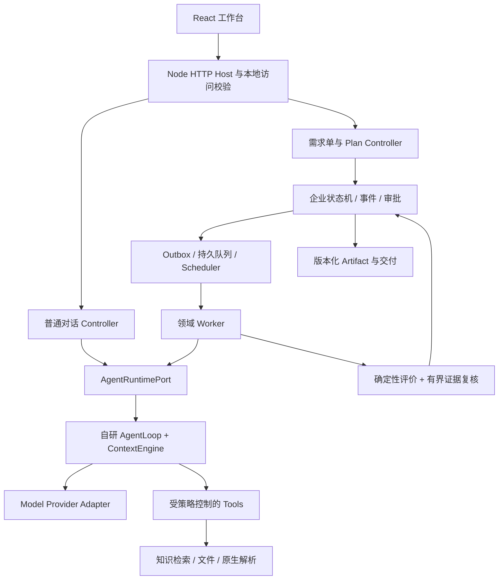

**Packx：面向 AI Agent / 后端工程师面试的架构与代码导读**

核对日期：2026-09-20。代码基线：`codex/context-and-task-reliability`，`5842ae9`。本文依据当前源码、接口、主要测试和架构决策，覆盖主要生产执行链路；历史实验、当前实现和本次重新运行的验证分别说明。后续代码变化时，应重新核对本文中的默认值和实现边界。

**1．先把项目讲成一个具体产品**

Packx 当前面向包装企业的售前、跟单人员，把客户对话、附件和选定资料整理为带来源、确认状态、版本、缺失项和下一步动作的需求单。核心产物是 `requirement-brief.v1`，可以生成 JSON、Markdown、HTML 交付内容。

例如客户说：“做一批咖啡包装袋，发香港，月底要货。”模型可以协助识别待核对字段和寻找资料，但这句话不能直接变成已确认的尺寸、膜厚、数量、报价或合规结论。系统要把不确定内容保留为候选，提示补充信息，由人确认事实，再审批具体交付版本。

最值得展开的工程问题是：如何让概率性模型参与业务，同时让权限、事实、状态、恢复和完成条件仍由程序控制。自研的是最小 Agent Harness，即模型调用外围的执行控制；没有训练自己的基础大模型。

当前形态是**本地优先的模块化单体**：React 浏览器界面、Node HTTP Host、本地文件和 SQLite、受控原生解析子进程。主要目标不是证明高并发 SaaS，而是先跑通可恢复、可追溯的包装业务闭环。

代码仍保留 `Blackx`、`industry: "print"`、`ProposalRunEngine`、`manufacturing` 等历史命名。产品当前只开放包装行业；旧家具案例不能当成当前支持范围。`src/print` 的印刷方案与回归资产仍存在，但不等于完成了生产级印前、PDF/X 或刀模系统。

入口：[package.json](/Users/black/Documents/VSCodeProject/SmallBlack/package.json)、[server/index.ts](/Users/black/Documents/VSCodeProject/SmallBlack/server/index.ts)、[包装范围 ADR](/Users/black/Documents/VSCodeProject/SmallBlack/docs/adr/0010-packaging-product-focus.md)。

**2．三层架构分别拥有哪种决定权**

| 层 | 当前主要位置 | 负责什么 | 面试时强调的边界 |
| --- | --- | --- | --- |
| Agent Core | `src/agent` | 模型与工具循环、消息、Context、Compact、Hook、Skill、预算、通用工具约束 | 不决定包装字段是否完整，也不批准交付物 |
| Enterprise | `src/enterprise`、`server/enterprise`、`server/workers` | Run/Stage、事件、Fact 版本、Artifact、Approval、队列、恢复、Plan、审计 | 决定何时执行、何时停下、什么证据允许推进业务 |
| Domain | `src/manufacturing`、`server/manufacturing`、`src/print` | 包装字段、Schema、规范化、确定性评价、来源适用规则、领域 Tool/Skill | 把领域规则传给通用流程，不向 Core 塞包装条件分支 |
| Host / Adapter | `server/runtime`、`server/anthropic`、`server/knowledge`、`native` | 文件、数据库、Provider、原生进程、检索等实际实现 | 注入具体能力，处理平台差异和资源权限 |
| UI | `src/App.tsx`、`src/components`、`src/runtime/conversationClient.ts` | 对话、Plan、事实确认、证据、文件审批、结果和监控 | 展示服务端状态，前端按钮不是权限依据 |

`src` 不全是前端代码，其中也有 Core、企业状态机和领域纯逻辑；`server` 主要承载实际 I/O 和装配。区分目录用途比背“三层架构”更重要。

仓库还保留了早期的 [domain/engine](/Users/black/Documents/VSCodeProject/SmallBlack/src/domain/engine.ts) 和 [conversationRuntime](/Users/black/Documents/VSCodeProject/SmallBlack/src/runtime/conversationRuntime.ts)，主要用于原始 intake/fixture 与回归路径。当前面试主链应以 `server/index.ts` 实际装配的 Host、Enterprise 引擎与 Agent Runtime 为准；目录中存在某个旧实现，不等于主产品仍由它驱动。



现在的领域接入是代码中的静态注册和策略注入，尚不是可热插拔的通用 Domain SDK 或插件市场。`AgentRuntimePort` 当前主要提供 `health()`、`executeTurn()`；恢复通过 session、resume 参数和持久化状态完成，没有必要虚构额外的公开 `start/resume` 方法。

入口：[Runtime 契约](/Users/black/Documents/VSCodeProject/SmallBlack/src/runtime/contracts.ts)、[Core 契约](/Users/black/Documents/VSCodeProject/SmallBlack/src/agent/contracts.ts)、[Runtime 装配](/Users/black/Documents/VSCodeProject/SmallBlack/server/runtime/createRuntime.ts)。

**3．从一次客户请求把全链路讲通**

普通聊天和正式需求单是两个入口。发送聊天消息会进入对话 Runtime；用户发起需求单后，才建立对应的企业 Run、输入快照和后台执行工作。聊天结束不能直接宣告业务完成。

1. 浏览器获取本地会话访问 token，提交消息、附件或需求单操作。Host 校验来源与请求身份，不能由请求自由指定别人的 tenant/workspace。
2. 需求单 Controller 固定包装领域，读取对话原文、附件摘要、所选证据版本；如果来自 Plan，还要检查对应版本确已完成、来源没有变化。
3. 企业引擎记录输入 Fact 和执行请求事件。执行请求与 Outbox 意图一起持久化，随后 Dispatcher 将确定性 jobId 放入队列。
4. Scheduler 领取租约，运行 `RequirementBriefWorker`。Worker 决定工具白名单、只读策略、结构化输出要求和预算。
5. Runtime 加载 Session，通过 ContextEngine 组织任务上下文；Agent 在边界内调用源文、文档、知识工具，返回候选内容。
6. Worker 校验并规范化候选字段。模型产生的字段强制保留为 `model_output / unverified`，不会因模型写了 verified 就升级。
7. 程序基于已经持久化的事实重新组装 RequirementBrief，计算缺失项与下一步动作；保存不可覆盖的 Artifact 版本和评价证据。
8. 有界证据复核检查候选与原始需求、源文是否一致。涉及事实、证据不足或范围变化时，交还给用户处理。
9. 用户明确确认事实后，系统生成反映最新事实版本的交付候选；只有通过评价的具体 Artifact Version 才能进入审批。
10. 审批与版本绑定。Worker 验证审批、事实版本和来源仍有效后，才能把业务阶段推进至完成；交付接口也检查当前状态。

一定要分清四种“完成”：模型完成一轮、Runtime 完成一次调用、队列 job 完成、业务 Run 完成。前三者均可能发生在“仍需补充字段或等待人工审批”的场景。

入口：[需求单 API](/Users/black/Documents/VSCodeProject/SmallBlack/server/manufacturing/requirementBriefApi.ts:57)、[通用工作区 API](/Users/black/Documents/VSCodeProject/SmallBlack/server/enterprise/proposalWorkspaceApi.ts:153)、[需求单 Worker](/Users/black/Documents/VSCodeProject/SmallBlack/server/manufacturing/requirementBriefWorker.ts:115)。

**4．业务数据模型为什么比聊天记录重要**

| 对象 | 含义 | 解决的问题 |
| --- | --- | --- |
| Run / Stage | 一次业务执行及其阶段 | 明确业务状态和合法转换 |
| Fact | 某个字段的一版值、状态、来源 | 区分模型建议、源文值和人工确认 |
| Artifact Version | 某次交付的不可变内容及依赖 | 能回看、重现、比较每一版 |
| Evaluation | 对具体候选的检查结果 | 完成条件有程序可检验证据 |
| Approval | 对具体版本的审批 | 旧审批不能覆盖新内容 |
| Event | 已发生的业务变化 | 审计、重放、状态恢复 |
| Session | Agent 的持久会话 | 继续阶段内的模型/工具执行 |
| ContextSnapshot | 某次模型输入或归档内容 | 核查模型当时看到了什么 |
| Execution Ledger | 写工具的执行账本 | 重试时避免重复副作用 |

Fact 包含 key、version、value、status、sourceType、sourceRef。业务事实允许 `suggested / unverified / verified / rejected`；需求单内容中的事实 Schema 对状态另有约束，不能把 rejected 当成正常已确认字段输出。

模型输出和检索命中都只能提供候选。只有受信企业来源或明确人工确认才能生成 verified 状态。人工确认是新的事实版本，不是直接涂改旧记录；对知识来源的追溯还会沿“值未改变的人工确认”回查原始证据，避免确认动作抹掉来源。

例如数量 v1 为 10,000，Artifact v1 记录自己依赖数量 v1。后来允许修改的阶段中，数量更新为 v2：旧 Artifact 变 stale，旧审批被 supersede，必须重新验证。外部资料撤回也能触发依赖复核。当前是围绕事实快照和当前 Artifact 的失效逻辑，不能宣称已有任意复杂依赖 DAG 的通用级联引擎；通过阶段也不开放任意普通字段修改。

`ProposalRunEngine` 通过事件 reducer 重放状态。命令有 `commandId` 去重；`expectedVersion` 与当前 aggregateVersion 比较，避免两个基于旧状态的写入同时成功。这是乐观并发控制：发现版本冲突后，应读新状态再决定，而不是覆盖。

Run 的显式状态包含 created、running、waiting_approval、revision_required、cancelled、completed。Stage 还有 evaluating、needs_input、passed、retryable_failed 等状态。不要用一个 isDone 布尔变量承担这些语义。

入口：[企业契约](/Users/black/Documents/VSCodeProject/SmallBlack/src/enterprise/contracts.ts)、[状态机与事件重放](/Users/black/Documents/VSCodeProject/SmallBlack/src/enterprise/proposalRunEngine.ts:320)、[Artifact 文件存储](/Users/black/Documents/VSCodeProject/SmallBlack/server/artifacts/fileArtifactStore.ts)。

**5．Agent Loop 的实际实现**

可以把 `AgentLoop.run()` 讲成以下循环：

```text
编译稳定指令、Skill、任务上下文与会话工作区
→ 检查输入 Token 和预算，必要时 Compact
→ Provider.generate()
→ 如果是最终文本，结束本次 Runtime 调用
→ 如果有 Tool Call：白名单 → 输入校验 → 策略/审批 → 幂等账本 → 执行
→ 保存工具结果和检查点
→ 继续调用模型，直到完成、暂停、失败或预算耗尽
```

当前同一批工具按顺序执行，没有自动并行执行任意工具。默认 Core 执行片最多 32 次迭代、64 次工具执行；领域和 Plan 会进一步降低预算。达到执行片边界会返回可续跑状态，由外层持久队列决定是否再执行一片，不能理解成无限 while 循环。

Tool 定义包含名称、输入 Schema、运行时 validate、read/write/publish 风险、幂等属性、超时、最大结果大小、可选幂等键和来源复核函数。TypeScript 类型不等于运行时校验，所以模型输入仍必须实际检查。当前通用 Tool 契约没有统一的 outputSchema 字段；输出还依靠具体工具、沙箱结果合同以及下游结构化校验，不能把规范目标说成全部实现。

写工具比读工具多几道门：Host 策略、approval port、稳定幂等键、Execution Store、Audit。请求模型“谨慎写文件”没有授权效力。Skill 提供阶段内指令；Hook 提供生命周期扩展；两者都不能自行取得 Workflow 审批权。

工具注册与工具暴露是两步：注册表中存在实现，仍需要被当前请求的 allowedTools 允许。普通对话、Plan 规划、Plan 子任务和需求单 Worker 各有自己的范围。新增 Tool 时要在正确层定义实现，检查各入口是否应暴露，并验证端到端 Context/Runtime 路径；只完成注册可能留下“能找到工具但执行阶段不允许”的集成缺口。

Provider 适配器将通用消息转成 Anthropic-compatible 协议：system 独立处理，tool result 对应 tool_use_id，相邻同角色消息合并；图片只从已验证的附件引用加载。需要协议续传的 thinking/signature 等数据放在 opaque providerState，仅在匹配模型时回放，领域层不解释厂商消息。

结构化输出同时带 JSON Schema 请求参数和文本要求，但兼容端点仍可能不遵守，因此 Host 继续校验实际响应。Provider 对 context_window_exceeded、max_tokens、refusal、pause_turn 分类，不把截断 JSON 当成成功答案。底层 client 使用 fetch 和流解析；本身没有无限自动重试，重试由 Runtime/Worker 的边界控制。

防循环在 Host Hook 实现：规范化工具名与输入，忽略随机 callId，记录近期动作，识别连续重复、短周期循环和连续失败。重复动作在第三轮相应调用执行前拦截；连续三次工具失败也会停。它检查的是行为序列，不能判断任务语义是否真正进步，合理重复也可能需要用户开启新回合或调整任务。

入口：[AgentLoop](/Users/black/Documents/VSCodeProject/SmallBlack/src/agent/loop.ts:158)、[Runtime 适配](/Users/black/Documents/VSCodeProject/SmallBlack/server/runtime/agentRuntime.ts:96)、[Model Provider](/Users/black/Documents/VSCodeProject/SmallBlack/server/runtime/anthropicModelProvider.ts:156)、[LoopGuard](/Users/black/Documents/VSCodeProject/SmallBlack/server/runtime/loopGuard.ts)。

**6．上下文工程：原始对话、任务事实、模型工作区分开保存**

最新 `agent-session.v2` 有两条不同职责的记录：`transcript` 保存用户原话和正式助手回复；`messages` 是用于模型下一轮推理、可以被压缩的工作区。二者在同一 Session revision 下保存。Compact 改变模型工作区，不应改写用户原话。旧 v1 会话迁移无法恢复曾经已经丢掉的原文，因此用 legacy_partial 明示历史不完整。

每次执行时，`buildTaskContext()` 从 Host 当前状态构建结构化任务上下文，包括目标原文、事实值/版本/状态/来源、待确认变更、阶段、完成记录、Artifact/Approval 引用、附件和选中证据。近期助手内容只作为未验证工作笔记。上下文带绑定摘要；模型调用、续跑和保存前重新核对绑定，来源变了就拒绝继续使用旧快照。

这解决两个常见问题：摘要把“用户要求不要做什么”丢了；旧 summary 仍说数量是 v1，而事实已经变成 v2。权威状态重新从持久化事实构造，摘要不拥有覆盖权。普通聊天里的新表述也不会自动成为人工确认的 Fact。

当前输入预算取应用上限和模型窗口扣除输出、安全余量后的较小值。默认应用输入上限 100,000 tokens、窗口配置 131,072、输出预留 4,096、安全余量 8,192；这些是应用策略，不是对某个模型真实容量的证明。约在预算 70% 触发压缩，目标约 45%。

Token 计数涵盖消息、工具定义、输出 Schema 和图片，而不只是用户文字。Provider 有 countTokens 时使用其接口；已配置的计数接口失败会报错，不悄悄声称精确计数成功。Provider 根本没有计数能力时才使用 UTF-8 字节估算等保守启发式。

Compact 的关键顺序和约束是：大内容外置为引用，清理已有归档的旧工具正文，保留稳定策略和当前任务上下文，再保留近期完整消息单元，必要时对移出的内容做有预算的摘要。assistant 工具调用和对应 tool result 成组保留/删除；不制造孤立 tool result。必须保留的上下文本身超限时，明确失败，不截断安全策略和事实来强行请求模型。

被移走的源消息和大工具输出有 ContextSnapshot 可回查。摘要标记 unverified，不是权威事实；无法在预算内覆盖全部源文时标记 incomplete 和引用。恢复引用前还要检查源文件 hash、证据版本、撤回/过期和权限。写操作回执从 Execution Ledger 重建，不能只指望模型记得“已经写过”。

边界：任务快照长度也有限；transcript/snapshot 长期保留会增加磁盘占用；当前没有证明任意真实模型经过长链压缩仍完全保留语义。固定 Eval 证明的是指定约束、版本、引用与协议配对没有丢失。

入口：[ContextEngine](/Users/black/Documents/VSCodeProject/SmallBlack/src/agent/context.ts:57)、[任务上下文](/Users/black/Documents/VSCodeProject/SmallBlack/server/enterprise/taskContext.ts:20)、[摘要实现](/Users/black/Documents/VSCodeProject/SmallBlack/src/agent/summarizer.ts)、[Session 存储](/Users/black/Documents/VSCodeProject/SmallBlack/server/runtime/fileAgentStateStore.ts)、[上下文 ADR](/Users/black/Documents/VSCodeProject/SmallBlack/docs/adr/0024-separated-dialogue-and-versioned-task-context.md)。

**7．长任务恢复：Event、Outbox、租约、Checkpoint 各解决一个窗口**

先区分两种丢失：业务已经要求执行，但任务没投进队列；任务已经产生副作用，但本地还没记住结果。它们不能靠同一个 retry 解决。

Outbox 把“业务执行请求”和“待投递消息”放入同一次 EventStore 持久化。Dispatcher 先按确定性 jobId 入队，再标记投递。若入队后进程崩溃，下次会再次投递，但队列按 jobId 去重。当前默认事件文件同时保存事件与 Outbox，用文件锁、临时文件、fsync、rename 更新；不是跨所有文件和 SQLite 的一个大事务。

队列状态有 queued、leased、completed、dead_letter、cancelled。领取工作时拿到 leaseId、workerId、过期时间。执行中续租；提交前再次验证/续租，避免仅靠定时器而遗漏事件循环阻塞。旧 Worker 即使晚返回，租约不再有效也不能提交新结果，这就是 fencing。

当前每个 Host Scheduler 同时执行一个 job，默认轮询 250ms、租约 135 秒、心跳约 45 秒。队列支持有上限的重试、指数退避、暂停续片、取消和死信重投。取消通过 AbortSignal 停止后续工作；它不能回滚已经发生的文件变化，也不能保证远端 Provider 不计费。

Worker 把 Runtime 返回结果保存为检查点，再按可去重的 commandId 提交 Artifact、Evaluation 和审批关口。崩溃后先读已完成结果/检查点，尽量不重做昂贵调用。超过单片迭代上限时保存 session/context handle，重新排队续跑；外层还有总片数限制。

写工具的账本按 tenant、workspace、tool、idempotencyKey 唯一，另存 inputDigest：

| 已有账本状态 | 再收到相同操作时 |
| --- | --- |
| 相同 key、不同 inputDigest | 拒绝冲突，防止用旧批准/旧键执行新内容 |
| 相同 key、相同输入、succeeded | 返回已保存结果，不再次执行 |
| started 或 unknown | 视为结果不确定，阻止自动重做，要求核对 |
| 没有记录 | 先 claim 为 started，再实际执行并完成记录 |

典型崩溃推演：外部写操作已成功，进程在账本 complete 前退出。重新执行可能产生重复副作用，所以系统把它当成 unknown，而不是盲目重试。代价是需要人工或确定性 reconcile；这是用可用性换取避免重复操作。

**不能宣称端到端 exactly-once。** 对受控本地状态和可幂等操作，可以通过去重与 fencing 获得接近只生效一次的业务效果；模型响应返回到本地检查点持久化之间仍有重复调用/计费窗口，远端副作用也取决于对方是否支持幂等。模型记忆不是恢复依据。

入口：[业务状态机](/Users/black/Documents/VSCodeProject/SmallBlack/src/enterprise/proposalRunEngine.ts)、[Outbox](/Users/black/Documents/VSCodeProject/SmallBlack/server/workers/stageJobOutbox.ts:51)、[Scheduler](/Users/black/Documents/VSCodeProject/SmallBlack/server/workers/stageJobScheduler.ts:59)、[队列状态机](/Users/black/Documents/VSCodeProject/SmallBlack/src/enterprise/stageJobQueue.ts)、[默认事件存储](/Users/black/Documents/VSCodeProject/SmallBlack/server/enterprise/fileEventStore.ts)。

**8．存储布局与一致性边界**

| 数据 | 当前实现 | 应怎样解释 |
| --- | --- | --- |
| 企业 Event + Outbox | 本地 JSON 文件 | 逻辑追加事件，物理上锁后重写整个文档；不是大型日志数据库 |
| Artifact | tenant/workspace/run/artifact/version 下的 JSON 文件 | 同版本同内容可去重，同版本不同内容拒绝 |
| Session、Context、Trace、账本、Audit | 分 scope 的本地文件 | 不同职责分别保存；不能假定跨文件提交全原子 |
| Stage Queue | 默认文件，可配置 SQLite | SQLite 实现仍是事务保护的队列 JSON 文档，不是每个 job 一行的高并发领取表 |
| Plan | SQLite plan_events | 追加完整状态事件，revision CAS、命令摘要去重 |
| Knowledge | SQLite 表 + 不可变源内容文件 | 文档版本、块、选择记录、事件与可重建索引分离 |
| 附件与解析缓存 | scope 内的文件和 Artifact | hash、解析器版本和来源绑定 |
| Cron、任务名、模型设置 | 按用途使用文件或 SQLite | 不能笼统说“全部存在同一数据库” |

优点是本机可运行、部署依赖少、恢复路径可测试；代价是同步 SQLite 和整文档锁在数据增长时会成为瓶颈，没有跨全部存储的事务，也没有云端复制、高可用和水平扩容证明。

迁移路线应由证据驱动：出现多进程共享或查询/写入压力后，把对应 Port 换成事务数据库/对象存储实现；保留原有命令、版本、租约、Artifact 和恢复合同，复用 contract tests。现在没必要仅为了面试把项目说成微服务或向量数据库集群。

入口：[SQLite 队列](/Users/black/Documents/VSCodeProject/SmallBlack/server/enterprise/sqliteStageJobQueue.ts)、[Plan 存储](/Users/black/Documents/VSCodeProject/SmallBlack/server/enterprise/agentPlanStore.ts)、[知识存储](/Users/black/Documents/VSCodeProject/SmallBlack/server/knowledge/store.ts:28)。

**9．包装需求单的确定性实现**

七个必填字段是 product_type、quantity、dimensions、target_market、target_delivery、delivery_location、artwork_status。可选包装字段包括材料结构、厚度、印刷工艺、表面处理、封口方式、阀门需求。模型不能自行扩展任意生产字段进入权威需求单。

Worker 对模型候选做 JSON 解析、已知别名规范化、字段白名单、值类型和来源校验。已有 verified 事实不会被模型候选覆盖。知识来源中的数值必须能对应确切参数、单位和来源；研究论文中的材料参数不能直接成为某供应商产品的参数。附件来源还要核对真实读取和位置。

最终 RequirementBrief 由持久化事实重新生成：缺少必填项则 `nextAction=clarify`；字段齐但仍有未确认事实则 `confirm_facts`；事实均满足验证要求才是 `ready_for_approval`。当前实现检查的是输出中所有事实的状态，不能说“只要必填已确认，可选未确认完全不影响”。

确定性 Evaluator 校验 Schema、额外字段、重复字段、合法值、来源权限、事实版本、缺失项和 nextAction 一致性。这里有两个不同结果：

- `passed`：这份草稿的结构和内部逻辑合法。
- `approvalEligible`：它已经满足业务审批前置条件。

因此，一份诚实地列出“还缺数量和尺寸”的草稿可以 passed，但 approvalEligible=false。这种设计允许展示有用的中间结果，同时不降低审批标准。交付的格式渲染也是确定性的，不依赖模型再次自由改写字段。

入口：[需求单字段与评价](/Users/black/Documents/VSCodeProject/SmallBlack/src/manufacturing/requirementBrief.ts)、[需求单 Worker](/Users/black/Documents/VSCodeProject/SmallBlack/server/manufacturing/requirementBriefWorker.ts)、[交付格式](/Users/black/Documents/VSCodeProject/SmallBlack/src/manufacturing/requirementDelivery.ts)。

**10．独立证据复核为什么仍然不能取代规则和人**

规则能检查“字段存在、状态合法、版本一致”，却不容易发现“客户原话要求 A，但总结遗漏了 A”。所以当前增加了有边界的 EvidenceReviewWorkflow：把原始用户要求、候选 Artifact、选定源文、规则结果和版本摘要交给独立复核调用，要求报告问题。

问题分为 omission、unsupported、contradiction、insufficient_evidence、scope_change；每条带 JSON 位置和输入中存在的 evidenceRef。Host 校验引用，并根据问题类别决定继续、有限修订、请求输入或重新确认 Plan。模型不能发出审批结论，也不能修改权威事实。

自动修订仅允许领域策略白名单内的展示字段，如 title、customerGoal、assumptions 的指定位置；最多修订一次，产生新 Artifact 版本，然后再次进行规则检查和证据复核。涉及事实冲突或任务范围改变时，不进行自由自我修复。

一次边界最多两次复核加一次修订；各次 Runtime 配置一轮迭代、24,000 输入 Token、60 秒，业务工具列表为空，并拒绝发生工具调用的结果。Runtime 本身有内部上下文读取能力，因此更准确的表述是“复核不允许工具执行”，而不是声称运行时绝对没有任何内部 Tool 定义。

调用意图、输入摘要、原始结果、报告和版本分别持久化。若一次昂贵复核可能已经发出却没有完整结果，不自动无限重付费；要求重新核对。提交前再次检查租约、取消状态、事实版本与来源有效性。

这是一道附加质量检查，实际模型仍可能漏报或误报。离线 fixture 可以证明修订范围、失败处理和持久化协议；真实语义质量、成本收益需要另一组 Online Eval。

入口：[复核流程](/Users/black/Documents/VSCodeProject/SmallBlack/server/enterprise/evidenceReviewWorkflow.ts:28)、[复核数据结构](/Users/black/Documents/VSCodeProject/SmallBlack/src/enterprise/evidenceReview.ts)、[包装修订策略](/Users/black/Documents/VSCodeProject/SmallBlack/server/manufacturing/requirementEvidencePolicy.ts)。

**11．Plan 与子 Agent：确认、隔离、预算和停止条件**

Plan 先生成结构化计划，每项包含目标与工具范围，状态进入 awaiting_confirmation。用户确认时，Host 同时核对版本、revision、对话快照和来源；过期计划不能被确认后继续执行。确认的是“允许执行这个计划”，并不等于确认事实、批准文件写入或批准最终交付。

当前最多 4 个子任务，**顺序执行**。每个子任务拥有独立 Session，只看到共享的原始任务上下文和自己的目标，不把兄弟子任务的全部输出串成聊天历史。没有递归委派、任意后台调度或 Agent Swarm。

| 限制 | 当前值 | 计量单位 |
| --- | ---: | --- |
| 每个计划最多任务 | 4 | 子任务 |
| 每版执行调用预算 | 16 | Runtime executeTurn 调用，含 planner/续片 |
| 跨版本总预算 | 32 | 同上，不是生成模型请求次数 |
| 最多版本 | 4 | 包含重新规划 |
| 每次 Runtime 限制 | 4 / 8 / 12,000 / 60 秒 | 迭代 / 工具执行 / 输入 Token / 超时 |
| 连续失败上限 | 3 | 跨相应尝试保留的失败计数 |

计数在实际调用前持久化，崩溃、取消、暂停和重新规划不会随便把任务总预算归零。一片最多有多次 generate，Compact 还可能产生额外调用，所以不能把 32 当成完整模型 API 上限或固定花费上限。

子任务返回 summary、evidence、limitations、assessment。无完成证据或 assessment 要求 replan 时停止后续子任务。重新规划由用户触发，保留旧版本和有界未验证摘要，再次进入确认关口；没有自动反复重规划循环。当前证据字段仍需要后续源文与业务验证，字符串非空并不证明内容真实。

Plan 状态写入 SQLite 事件表。确认后的 queued 状态就是持久化投递意图，确定性 jobId 弥补写状态与入队之间的崩溃窗口；generation 阻止被替代的旧执行结果覆盖新状态。完成结果可显式导入需求单，但导入内容仍是未验证来源。

入口：[Plan Workflow](/Users/black/Documents/VSCodeProject/SmallBlack/server/enterprise/agentPlanWorkflow.ts:32)、[Plan 限制和 Schema](/Users/black/Documents/VSCodeProject/SmallBlack/src/enterprise/agentPlan.ts:44)、[交接需求单](/Users/black/Documents/VSCodeProject/SmallBlack/server/manufacturing/planRequirementSource.ts)、[Plan UI](/Users/black/Documents/VSCodeProject/SmallBlack/src/components/PlanPanel.tsx)。

**12．RAG 的实际链路：原文、检索、证据、事实四步分开**

知识层复用已有权限、队列、Context、Fact、Artifact 和 Approval，没有单独造另一套业务状态。`KnowledgeStore` 用 Node 内置 SQLite，开启 WAL；原始资料、文档版本、结构化块、索引和用户选择分别存储。

导入时记录 manifest、来源、contentHash、版本、地区/日期、解析器与模型版本，以及保存/索引/再分发权限。这三种权限分别检查。原文版本不可静默覆盖；索引可重建。需要人工审核或 OCR 的资料不会直接冒充已完整解析的技术数据。

JATS 研究资料按章节、段落、表格处理。表格块保留表头、单位、脚注与条件，避免只检索到一个数而不知道测量环境；XML 不伪造 PDF 页码。实验的完整句子分块和 overlap 对照，有独立数据快照，尚未自动替换已有业务研究分块。

实际查询步骤：

1. 在 SQLite 读取候选块前按 tenant/workspace、允许公开的资料、生命周期、日期、地区、型号等限制候选集。公开可见还要求相应再分发权限。
2. 领域策略展开别名、中英文术语。关键词路径使用字段加权 IDF，正文权重高，标题/表格公共上下文权重低；这不是完整 BM25 实现。
3. 向量路径把 query 向量与全部合格块向量做归一化点积，即精确余弦检索，复杂度约 O(Nd)。没有 ANN、HNSW、FAISS 或 pgvector 生产实现。
4. 混合模式通过 RRF 融合两个排序：某条结果的得分是各榜单 `1 / (60 + 排名)` 之和，排名从 1 开始。这样不用把关键词分和余弦分硬凑成同一标度。
5. 默认路径有表格多样化；可选重排路径取融合后的 Top 20，以本地 Cross-Encoder 联合读取 query 和 passage，重新排序，默认给出 5 条、上限 8 条。
6. embedding/rerank 是异步调用，因此返回前再次检查来源是否已撤回或失效；用户选择证据时另外保存选择版本和适用条件。

未配置学习模型时，默认 `LexicalEmbedding` 是 256 维散列词特征基线，不是语义大模型。显式配置本地 E5 后，使用固定版本的 multilingual-e5-small、384 维向量、query/passage 前缀、mean pooling 与 L2 归一化。文件 hash 和模型签名参与索引兼容检查；模型空间不匹配时提示重建，不混用不同模型的向量。

长文本采用有边界的窗口处理，避免模型静默截断；本地模型文件已准备后运行不访问远端下载。还有受配置限制的本地 Ollama 适配。重排可选、可撤回；已启用但执行失败时显式 unavailable，不把“重排失败”伪装成“成功完成重排”。Cross-Encoder 分数是相关性 logit，不是事实正确率。

模型通过 knowledge_search、knowledge_selected、knowledge_read 使用证据。继续读取要带来源版本/hash，表格按完整记录返回。Fact 指向来源；资料过期/撤回时，当前需求单、审批和恢复上下文需要重新核对。一次命中不会自动将 Fact 设为 verified。

参数比较 Tool 让模型传 evidenceId 与 parameterIndex，由 Host 读取原始参数，不能直接相信模型传来的数字。只有类型、方法、单位、适用条件可比较时才比较；例如厚度支持明确数值的 mm、mil 到微米转换，不用 parseFloat 把范围或“≤”抹掉。方法、温湿度、压力或气体条件不同要明确不可比较。

产品目录是另一路 `packaging_find_products`。当前随代码登记的 6 条供应商产品系列只是 metadata leads，通过咖啡形态/名称等确定性过滤，参数列表为空并返回供应商追问。研究论文、产品系列简介和型号 TDS 的证据效力不同，不能凭“500 克咖啡袋”补出尺寸、OTR、报价或认证。

入口：[KnowledgeStore](/Users/black/Documents/VSCodeProject/SmallBlack/server/knowledge/store.ts:187)、[关键词排序](/Users/black/Documents/VSCodeProject/SmallBlack/server/knowledge/ranking.ts)、[E5 适配](/Users/black/Documents/VSCodeProject/SmallBlack/server/knowledge/onnxEmbedding.ts)、[知识 Tool](/Users/black/Documents/VSCodeProject/SmallBlack/server/knowledge/service.ts)、[参数比较](/Users/black/Documents/VSCodeProject/SmallBlack/server/manufacturing/knowledgeComparison.ts)、[产品目录](/Users/black/Documents/VSCodeProject/SmallBlack/server/manufacturing/coffeeProductDirectory.ts)。

**13．工具、文件和原生沙箱的权限边界**

本地 Host 绑定 127.0.0.1，用每次启动生成的随机 token、Host/Origin 检查和固定本地身份限制 API。tenant/workspace 会进入文件路径、查询和执行上下文，已有跨 scope 拒绝测试；这还不是云端企业账号、组织 RBAC、SSO 或完整多租户 SaaS。

文件工具执行在 Host 中。列表和读取受路径规则约束；写入和删除生成独立审批，绑定 actor、session、目标路径、操作、内容摘要/原文件状态、幂等键和时效。用户批准后执行前再次核查目标和父目录，防止批准 A 后实际写 B。自然语言“可以了”不能代替具体审批记录。

实现还检查符号链接、硬链接、特殊文件、隐藏/敏感路径；读取用 O_NOFOLLOW 等约束并 fstat。修改前保存 before-image，写入用临时文件和受控替换，新文件有 no-clobber 保护。默认 workspace 路径主要提供工作位置，不应将它误说成覆盖所有本地读取的操作系统 jail。

原生文档解析走另一条隔离链：Host 固定执行文件和 argv，`shell: false`，输入只读副本、独立临时目录、环境白名单、网络 deny-all、输出校验。macOS Seatbelt 限制文件与网络；C ToolSupervisor 加入 CPU/文件大小/文件描述符限制、进程组终止、资源观测和 Host 意外退出时清理。它不是 Linux cgroup，也不是把整个 Node Host 都放进沙箱；内存/进程数还有采样监督的边界。

沙箱不可用时拒绝执行，不自动降级到不受限的 shell。当前一般网络 allowlist 代理并未实现；不能说所有域名白名单功能都已生产可用。

原生解析器使用 Swift PDFKit、ImageIO 和 Office XML 处理：PDF 提取已有文本，图片检查基本属性，DOCX 读取段落/表格/脚注，XLSX 读取原始单元格及缓存公式值。没有扫描 PDF OCR、完整 Office 排版还原或 Excel 公式重算；模型对选定图片的视觉分析是另一个 Provider 能力。

当前解析版本为 1.2.0，输入上限 10 MiB，原生全文预算约一百万 Swift 字符，PDF 页数和 XLSX 工作表数量上限均为 1,000，具体格式还有其他边界。Agent 的 document_read 仍按约 14,000 字符完整行分页，携带 cursor/hash，不能把一次工具返回当作整份资料。Office ZIP 还限制文件项数量、解压大小并拒绝路径穿越/加密和不安全 XML。README 有旧限制描述，面试以当前源码为准，不背旧的 8,000/24,000 字符上限。

入口：[LocalAccess](/Users/black/Documents/VSCodeProject/SmallBlack/server/localAccess.ts)、[本地文件实现](/Users/black/Documents/VSCodeProject/SmallBlack/server/runtime/localFileAccess.ts)、[沙箱执行器](/Users/black/Documents/VSCodeProject/SmallBlack/server/runtime/macOsSeatbeltSandboxedToolExecutor.ts)、[解析服务](/Users/black/Documents/VSCodeProject/SmallBlack/server/runtime/assetInspection.ts)、[Swift 解析器](/Users/black/Documents/VSCodeProject/SmallBlack/native/AssetInspector.swift)、[进程监督](/Users/black/Documents/VSCodeProject/SmallBlack/native/ToolSupervisor.c)。

**14．前端、流式显示和 API 状态如何配合**

React App 通过专门的 conversationClient 调用 Host。UI 包括聊天、Plan、知识证据、事实核对、文件、交付预览和模型监控；行业范围和审批条件仍由服务端验证。

对话 POST 等待权威最终结果，另有 activity SSE 展示临时文字和工具活动。客户端用 fetch 读取 SSE，便于携带认证 header；服务器有节流、心跳和背压处理，客户端断线后重连，并有轮询补偿。中途显示的 partialText 不是正式回复、更不是已提交 Artifact。

正式聊天展示 transcript，不能把 Compact summary 伪装成原始用户消息。UI 根据服务端 revision 避免较旧异步响应覆盖新状态。后台工作、Plan、业务阶段都有各自状态，前端不能只看“HTTP 返回成功”就全部画成完成。

Markdown 通过明确的 React 节点渲染，不直接插入任意 HTML；链接协议限制为 HTTP/HTTPS，外部图片不会默默加载。这是在降低源文和模型输出进入界面时的风险，不能据此推断所有 prompt injection 都已经解决。

入口：[App](/Users/black/Documents/VSCodeProject/SmallBlack/src/App.tsx)、[HTTP 客户端](/Users/black/Documents/VSCodeProject/SmallBlack/src/runtime/conversationClient.ts)、[SSE 读取](/Users/black/Documents/VSCodeProject/SmallBlack/src/runtime/eventStream.ts)、[活动状态](/Users/black/Documents/VSCodeProject/SmallBlack/server/runtime/runtimeActivity.ts)、[Markdown 渲染](/Users/black/Documents/VSCodeProject/SmallBlack/src/components/Markdown.tsx)。

**15．定时任务、可观测性、备份与本地交付**

后台任务和 Cron 复用 StageJobQueue。Cron 用时区和 occurrence 的确定性 ID 处理重复投递，先入队再确认调度发生；当前有最小调度间隔和最大次数限制。Background Worker 调用既有对话执行路径，它本身不等于一个独立子 Agent。是否允许某类写操作取决于 Host 工具策略：本地文件有具体人工审批，部分已允许的自动化操作使用 Host policy，不应泛称“所有 write 都弹同一种审批卡”。

可观测性分三种材料：Event 是业务发生记录；Trace/Context 是执行和输入证据；ModelTelemetry 是数值调用指标。把它们混成 console.log，会既难以恢复又容易泄露内容。

ModelTelemetry 包装 count/generate 调用，记录用途、模型、状态、耗时、input/output/cache usage 等有限字段，每个 run 保留有限条数；普通指标记录不保存 Prompt、全文输出和 Secret。业务源文和上下文快照仍属于受 scope 管理的敏感持久化内容，不能误说整个系统完全不存任何文本。缓存指标未知时用 unknown/null，不能将未知当作零命中。

本地数据目录有独占操作锁，防止 Host 和维护命令同时改状态；仅在确认原进程不存在时恢复遗留锁。备份列出文件集合、大小和 SHA，检查 SQLite，恢复到新目录并用 incomplete marker 标明未完成状态。它是停止并协调 Host 后的受控备份，不是运行中多存储一致的分布式快照。

模型配置文件用限制权限保存，浏览器只看到是否已配置 key，不回传 secret；这不是企业级加密 Secret Vault。环境变量和 UI 配置有明确优先级与重启边界。

发布脚本按允许清单打包前端、Host 源码/脚本、原生组件等，排除本地数据、环境秘密和无关文件，并生成 hash manifest。通过启动脚本运行本地 Host，仍有 Node 24 和依赖准备要求；不是仅部署 dist 就具有后端能力，也不是已经签名分发的 Electron/Tauri 一体化应用。

入口：[Cron Scheduler](/Users/black/Documents/VSCodeProject/SmallBlack/server/workers/cronScheduler.ts)、[模型指标](/Users/black/Documents/VSCodeProject/SmallBlack/server/runtime/modelTelemetry.ts)、[本地数据管理](/Users/black/Documents/VSCodeProject/SmallBlack/server/localData.ts)、[备份恢复](/Users/black/Documents/VSCodeProject/SmallBlack/server/localBackup.ts)、[发布脚本](/Users/black/Documents/VSCodeProject/SmallBlack/scripts/build-release.mjs)。

**16．测试和 Eval 应怎样对面试官报告**

2026-09-20 本次重新运行：

| 命令 | 结果 | 证明范围 |
| --- | --- | --- |
| `npm run check` | 69 个测试文件通过；441 tests passed、21 skipped；TypeScript 和 Vite 构建通过 | 当前离线测试和编译范围；不包含被跳过的验证 |
| `npm run eval:context` | 固定场景完成 3 次压缩；指定约束、当前事实版本、引用和原始对话均保留 | 确定性 fixture 的上下文保留能力 |
| `npm run eval:loop-safety` | 重复工具执行 12→2；AB 循环 12→5；连续失败 12→3；正常场景维持 4 次工具执行 | 防循环停止行为及一个正常场景无回归 |
| `npm run eval:plan` | 确认前执行数为 0；两个独立子上下文；阻塞时后续任务为 0，重规划重新确认 | 隔离、确认、检查点和成本增加的工程合同 |

本次没有运行付费模型调用、Online Eval、浏览器人工验收或独立 `test:native`，也未重新跑完整真实 RAG benchmark。没有读取用户当前业务库来验证最新文档数量。不要把历史报告和本次结果混算，也不要把重复被多个命令运行的同一批测试相加。

为什么先用 Fake：可以确定性模拟模型超限、工具失败、取消、来源撤回、崩溃和重复请求；成本低且可稳定回归。它证明的是执行协议与状态机，不证明模型理解力。测试重点是“坏事情发生后是否还守住边界”，不是只测试一次 happy path。

本次 context fixture 中，指定约束保留从 0/4 到 4/4，引用完整性从 0/2 到 2/2，工作上下文估算从 34,313 tokens 压到 4,355。该计数来自同一字节估算器，Fake 摘要不代表真实语义质量或真实计费。新版还有额外生成/计数开销，不能只报缩小比例。

Plan 隔离 fixture 中，单 Agent baseline 为 1 次模型调用，Plan 为 3 次；证明隔离和确认需要额外调用，没有证明速度或答案质量提升。

历史 RAG 实验可作项目经历，但必须带日期和基线：2026-09-18 的冻结研究语料 80 题中 72 题可回答，同一 raw Top 20 加本地重排后 Recall@5 从 84.72% 到 87.50%，MRR@5 从 0.7118 到 0.7660，完整证据覆盖从 56/72 到 60/72。已有带表格多样化的 hybrid 实际是 59/72，所以相对既有路径只净增 1 题；Recall@5 还略降，不能只报更好看的那组基线。

同份历史实验的完整查询 P50/P95 约从已有 hybrid 的 64.8/76.1ms 增至重排的 511.6/1002.5ms；这是单机单轮固定顺序测量。题集中 64 题已被观察过，新增题是两组来源的 8 对双语题，标注仍需人工审核；无答案识别仍弱，条件密集中文问题也有退步。这支持“可选重排、保留回退、继续按业务证据评价”，不支持“重排普遍更好”或“工业选型已验证”。

入口：[上下文 Eval](/Users/black/Documents/VSCodeProject/SmallBlack/eval/context.ts)、[循环 Eval](/Users/black/Documents/VSCodeProject/SmallBlack/eval/loopSafety.ts)、[Plan Eval](/Users/black/Documents/VSCodeProject/SmallBlack/eval/planSubagents.ts)、[历史 RAG 对照](/Users/black/Documents/VSCodeProject/SmallBlack/docs/knowledge/overlap-rerank.md)。

**17．设计取舍、当前不足和下一步的回答方式**

| 面试追问 | 用当前项目能够支持的解释 |
| --- | --- |
| 为什么自研 Core？ | 希望控制执行片、幂等账本、上下文来源和业务恢复边界；Core 保持最小，模型和平台能力继续使用 Provider。代价是协议适配、恢复与安全测试由自己维护；没有证据证明比通用框架全面更强。 |
| 为什么不用微服务？ | 当前是本地首个业务闭环，单体减少部署和跨服务一致性问题；已有 Port 为可证实的扩展需求留边界。 |
| 为什么不用向量数据库？ | 当前规模允许 SQLite 加精确余弦，减少服务依赖；扫描复杂度和同步存储会成为规模瓶颈，达到检索延迟或共享部署要求时再迁移。 |
| 为什么 Workflow 加 Agent？ | 程序擅长状态/权限/版本，模型擅长非结构化理解和阶段内工具选择；把两种决定权分开。 |
| 为什么不让 Reviewer 自动改到满意？ | 防止质量不确定却不断花费，或自我修改越过事实/权限边界；只允许一次受限展示修订，其余请求人工。 |
| 为什么子任务顺序执行？ | 当前先验证隔离、确认与恢复；多任务是否独立、并行资源成本和聚合质量还需固定对照。 |

当前真实边界包括：本地身份尚未升级为云端企业认证；事件/队列有整文档存储瓶颈；存储之间没有万能事务；Agent Loop 和 Host/UI 入口已较大；通用 Tool 输出合同还不完全统一；资料权限和上下文隔离不能保证模型永不受恶意源文影响；原生沙箱主要面向 macOS；供应商型号 TDS 覆盖很薄；真实用户效果、真实模型长任务质量与商业收益未在本次证明。

如果面试官问下一步，不要只说“加更多 Agent”。可以回答：先冻结真实售前任务与通过标准，补足授权技术资料和人工源文标注，评估字段遗漏、误确认、证据支持率、完成时间、人工介入次数与成本；根据实际失败再完善恢复、数据保留策略和认证；只有出现规模证据才调整存储和并发。涉及修改来源/任务目标的变更，继续保留版本与确认链。

**18．可以直接练习的口述与追问**

60–90 秒项目介绍：

> Packx 是面向包装企业售前和跟单的 Agent 应用，目标是把客户对话、附件和选定资料转成有来源、确认状态和版本的需求单。我在这个项目中重点关注模型执行与业务控制的边界：底层是自研的最小 Agent Core，负责模型、工具、上下文和会话；企业层负责持久任务、状态机、事实、交付物、审批和恢复；包装层提供字段、Schema 和评价规则。模型只能提出候选，是否确认事实、进入下一阶段和批准交付由 Host 决定。长任务通过事件、Outbox、租约、检查点和写操作幂等账本恢复；RAG 的结果保留来源与适用条件，不直接升级成权威事实。目前主要完成本地闭环和离线可靠性验证，真实业务质量和规模化效果仍要用目标用户任务验证。

上段的“我重点关注”可以改为你真实负责的设计、实现、验证范围；只有确实承担相应工作时才说“我独立设计并实现全部模块”。不要从仓库代码自动推断个人贡献。

面试时优先准备以下追问，每题按照“具体问题 → 机制 → 一个失败例子 → 边界/证据”回答：

1. **用户确认过的数量为什么还需要版本？** 确认的是某版值，Artifact 依赖它。输入变更使旧结果 stale，旧批准不能覆盖新输入。
2. **模型说已经完成为何不能直接完成 Run？** 它只结束 Runtime；字段、评价、来源新鲜度、审批和合法状态转换仍要程序验证。
3. **重试为什么不会重复写文件？** 稳定幂等键和输入摘要去重，成功重放结果；结果不确定阻止自动重做；另有准确绑定输入的文件审批。
4. **什么情况下仍可能重复付费？** Provider 已返回、结果检查点尚未落盘时崩溃。不能承诺网络副作用端到端 exactly-once。
5. **旧 Worker 恢复后为什么不能覆盖新结果？** 租约 token 和有效期在提交边界再校验，Plan 另有 generation/version fencing。
6. **Compact 会不会忘掉客户要求？** 原始 transcript 单独保存，权威任务上下文从状态重建，摘要未验证且可回溯。固定回归验证保留，真实语义仍须 Online Eval。
7. **长工具结果如何处理？** 外置内容、保留引用和来源 hash，需要时分页读取；协议消息成组裁剪，摘要不替代原文。
8. **为什么知识命中不等于事实？** 相关性只说明可能有关；型号、地区、时间、测试方法和条件还要一致，而且需要明确确认。
9. **向量检索是不是 BM25 加向量数据库？** 当前是字段 IDF + SQLite 中的精确余弦 + RRF，可选本地 Cross-Encoder；准确说出实际算法。
10. **Reranker 的收益有多大？** 同候选池净增 4/72，相对已有 hybrid 只净增 1/72，还增加延迟且有失败案例；说清基线和历史实验范围。
11. **Plan 是多 Agent 并行吗？** 有独立 Session 的有界子任务，但当前顺序执行；确认前不执行，重规划需要新确认，预算跨版本保留。
12. **结构化输出为什么还要校验？** JSON Schema 约束形状，不能保证来源真实、字段齐全、状态权限合法或业务语义一致；兼容 Provider 也可能不遵守 Schema。
13. **如何证明安全而不只是 Prompt？** Host 白名单、实际输入校验、审批记录、账本、文件检查、受控原生沙箱与负面测试共同约束；源文不能改权限。
14. **测试 441 个意味着生产可用吗？** 意味着本次离线检查通过，有 21 个 skipped。模型质量、原生集成、真实用户流程和负载是独立证据。
15. **项目最有价值的取舍是什么？** 用显式事实和审批保存业务确定性，用有边界的 Agent 处理非结构化工作；同时承认本地部署和资料覆盖的现实限制。

推荐复习顺序：先把第 1–4 部分讲成一条完整产品链路；再重点掌握第 5–7 部分的 Loop、Context、恢复；然后练第 9–12 部分的领域落地、Plan 和 RAG；最后用第 16–18 部分训练指标口径、失败推演和技术取舍。阅读源码时从 Worker 的调用往两边追，比只按目录逐个背类名更容易形成可回答的理解。
