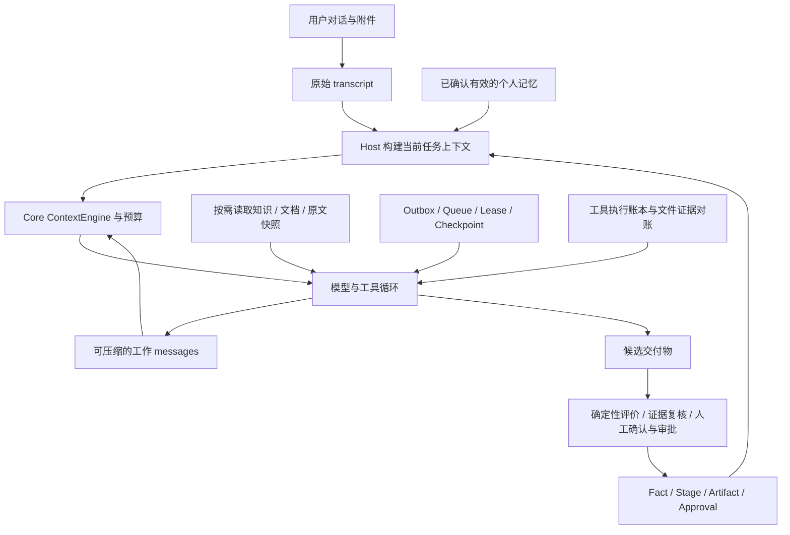

# Packx 面试资料：从项目主线到实现追问

核查日期：2026-09-22。对象：AI Agent／AI 应用／后端工程岗位。依据为当前工作树，HEAD 为 `4df7f4d0b86fdd047cb051d76cc35db84b1e07f8`，**包含开始整理前已有的未提交错误处理修复及测试**。不能将本套材料全部归为该提交已合入的能力。

## 读法与目录

每题先练“回答”，再展开“深挖”。口述遵循：具体业务问题 → 机制与数据 → 一种失败 → 验证 → 当前限制。无需一次背完所有实现细节；要能从主张沿代码追到失败边界。

| 专题 | 题号 | 重点 |
| --- | --- | --- |
| [01 架构与业务闭环](01-architecture.md) | A01–A16 | 产品、自研 Core、Workflow、Fact／Artifact／Approval、事件与并发 |
| [02 上下文与压缩](02-context-and-compaction.md) | C01–C24 | transcript／messages／taskContext、预算、消息组、摘要覆盖、引用与失效 |
| [03 个人记忆](03-personal-memory.md) | M01–M18 | 确认、版本、召回、historyBinding、遗忘、隔离与事务 |
| [04 错误处理与恢复](04-errors-and-recovery.md) | E01–E26 | 错误传播、取消、幂等、unknown、对账、队列、双重故障与缺口 |
| [05 Plan、工具、RAG 与评测](05-plan-tools-and-evaluation.md) | P01–P20 | 防循环、顺序子任务、Reviewer、来源约束、指标与安全 |
| [06 场景推演与模拟面试](06-scenarios-and-mock.md) | S01–S12 | 故障时间线、反问、白板题、个人贡献与复习安排 |
| [代码索引与本次验证](evidence-and-validation.md) | 按机制查找 | 当前数字、原始报告、测试入口、历史口径与未验证项 |

共 116 道主问题，附连续追问与场景答案。全部“回答”以项目机制为主体；若转为“我设计／实现”，请先确认符合你的实际贡献，不能由仓库推断个人经历。

## 两分钟项目介绍

> Packx 面向包装企业售前和跟单，把客户对话、附件和选定资料整理成有来源、确认状态和版本的需求单。难点不只是生成文字，而是客户反复修改要求、资料很长、工具可能部分成功、任务中途被打断时，系统还能知道什么是真的、什么已经做过、什么需要重新确认。
>
> 系统分成三层：最小 Agent Core 负责模型和工具循环、上下文、会话和压缩；Enterprise Layer 负责业务事实、版本化交付物、审批、任务调度和恢复；包装 Domain Pack 负责字段、资料适用条件和评价规则。模型可以决定阶段内怎样探索，Host 决定权限、预算、状态转换和完成标准。
>
> 上下文方面，原始对话单独保存，模型工作历史允许压缩，当前任务状态由 Host 从存储重建。跨会话只注入用户明确确认的个人偏好，修改或撤回后让旧工作上下文和快照失效。执行方面，用检查点、租约、幂等账本和文件结果对账处理重试与崩溃；结果不确定时停止，不能换个 ID 再执行。
>
> 目前主要证据是本地闭环和离线故障测试。本次复跑 572 项通过、21 项条件跳过，类型检查、构建及五组专题离线评测通过。它们证明机制和状态边界，真实模型语义质量、业务收益和多 Host 规模还需要独立验证。

## 先建立一张概念图

核心不变量：摘要不是事实；偏好不是权限；HTTP 成功不是任务完成；取消不是回滚；可重试不是允许重复副作用；有引用不是语义已证实。

## 必会的 12 个问题

1. A03：为什么把 RunEngine 与 Runtime 分开？
2. A08：为什么修改一个 Fact 会使 Artifact 和 Approval 失效？
3. C02：为什么要分开 transcript、messages 和 taskContext？
4. C11：工具调用与结果为什么成组裁剪？
5. C18：摘要依赖的原文失效后怎么处理？
6. M10：撤回个人记忆后，如何阻止旧摘要再次带回来？
7. E03：为什么不能只看 HTTP 状态重试？
8. E10：写成功、记账失败后怎么办？
9. E14：租约过期但旧 Worker 还在运行怎么办？
10. P03：如何停止重复工具调用？
11. P08：为什么 Reviewer 不能直接修改事实或批准交付？
12. P17：Fake Eval 到底证明了什么，没证明什么？

## 可以说与不能直接说

| 有依据的表述 | 应避免的表述 |
| --- | --- |
| 有当前用户、同工作区、显式确认的跨任务个人记忆 | 自动学习所有客户和组织经验 |
| 长上下文有归档、引用、重建与固定保留测试 | 压缩完全无损，模型永不忘记 |
| 工具账本去重，文件操作可基于证据对账 | 所有外部操作 exactly-once、任意失败自动回滚 |
| 子任务 Session 隔离，当前顺序执行 | 已支持任意 DAG、并行 Agent Swarm |
| 业务状态与权限由 Host 校验 | 用强 Prompt 已解决所有幻觉和注入 |
| 新增故障测试覆盖明确列举的窗口 | 572 项测试意味着生产可靠性达到某个百分比 |
| 本地首个业务闭环，有租户作用域检查 | 已证明生产多租户、多机高并发与容灾 |
| 记录 Provider 缓存 usage | 已实现并验证新的 Prompt Cache 优化 |

本次只整理文档并验证现有实现。没有运行真实模型、付费评测、提交／推送，也未改写用户业务数据。完整证据见 [验证记录](evidence-and-validation.md)。
