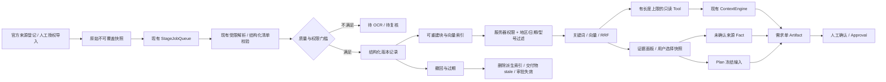

# 包装行业数据与证据检索：可复现首个切片

本切片面向咖啡袋需求核对，接入现有 Packx 界面、受控 Tool、Plan 与需求单。当前提供合成业务闭环，以及 **5 篇获准使用的真实研究全文 + 本地 E5 三路实验**，详见 [真实实验报告](real-experiment.md)。供应商在售型号资料、30–50 份覆盖目标、真实员工验收与专家黄金标注尚未完成。

**2026-09-18 业务优先更新：** 已接通 [6 条供应商产品系列目录](product-database.md) 和 `packaging_find_products`，普通会话、Plan、需求单均可读取，目录可选择并保存来源。当前业务库共 11 个文档记录 / 574 块，其中供应商技术全文仍为 0 份。停止用论文数量扩充业务库，额外两篇只在隔离实验中。[Overlap 与 Top-20 本地重排对照](overlap-rerank.md) 已完成，保留 0 overlap，本机混合检索已开启可回退的本地重排；研究实验效果不能充当工业选材验收。

## 运行

分块策略现有独立的 [Chunking 对照实验](chunking.md)：固定真实语料、本地模型和三路检索，对比七种切法，同时报告 Top-5 与同一上下文预算内的证据覆盖。实验库与业务库隔离，结果不会自动替换 Agent 当前使用的分块。

针对截断问题的 [句子完整性与上下文补齐实验（v2）](sentence-experiment.md) 进一步比较完整句子、超长句关联、命中后补齐原句/原段落及组合。完整句子软目标 500 字符在本轮混合检索中为 50/56，并通过 19 个已知切点回放；此结果仍属于已观察、待人审的小语料对照。

本机真实资料已接入默认业务库，Agent 读取和重启验证见 [业务连接说明](connected.md)。`npm run knowledge:connect` 可在停止 Host 后重复验证实际导入、普通会话工具读取和来源持久化；评测库与业务库分别保存。

检索优化见 [查询策略、消融与回归报告](optimization.md)：在相同语料/模型/原标注下比较双语术语、字段 IDF 和表格结果预算。最新一轮实现 [来源绑定的参数比较与细分追问](comparison.md)，以固定 40 例和真实 64 题回归验证；界面和 `packaging_compare_evidence` 使用同一服务端规则。`knowledge_search` 与证据面板均返回逐字段缺口；相关命中不等于支持答案。旧实验结果继续保留，不用新分数覆盖历史失败。

使用仓库 README 的 Node 24.14.0 和锁定依赖，无需新增数据库服务或模型 Key；本地真实模型路径另见 [实验复现](real-experiment.md)：

```bash
npm run demo:knowledge
npm run eval:knowledge
npm run test -- server/knowledge/knowledge.test.ts server/manufacturing/knowledgeApi.test.ts
```

本地 E5 模型和真实索引准备完毕后，`npm run eval:knowledge-optimize` 跑开发消融，`npm run eval:knowledge-optimize -- --all` 跑完整回归；详见新报告的复现说明。研究导入在真实本地模型启用时选用混合路径；普通启动仍可使用不需要模型的关键词路径。

`demo:knowledge` 创建临时隔离数据，导入两份明确标识的合成咖啡袋资料，搜索、选择证据，通过真实 Tool/ContextEngine 生成版本化需求单；脚本 Provider 故意返回一个无依据尺寸，Worker 应拒绝它，保留厚度为未确认。退出清理本次临时目录，无外部模型请求。

界面演示：按 README 启动 `npm run dev:fixture`，新建任务，打开右侧「证据」，展开「导入与质量状态」，导入两份合成演示资料。查询 `厚度 OTR`，在比较区分别选择左右参数并执行比较。厚度 `0.1 mm` 与 `100 µm` 可以按相同条件比较，OTR 因条件不同且逐项条件不完整而要求复核。可展开原文表格，核对表头、单位列、脚注与位置；需要进入需求单时勾选证据并保存选择。

证据搜索本身不需要生成模型，`npm run dev` 的 fake 模式也能操作。Plan 和 UI 中的需求单生成沿用现有模型模式限制；无需 Key 的端到端生成证据由 `demo:knowledge` 和集成测试给出，不能把普通 fake 模式描述为通用推理。

## 真实资料入口

人工查阅 [来源登记与覆盖矩阵](sources.md)，获得许可后使用 `examples/knowledge/coffee-synthetic.json` 的完整 Schema 制作清单。该示例自身是合成资料，不可改标题冒充供应商文档。

- `documentId` 是文档身份，`family` 用于文档家族/评测分组，`model` 是具体产品。相同文档 ID 不允许换厂商或型号；同型号的不同修订保留为不同 contentHash/versionId，不自动替代订单适用版本。
- `provenance` 分为 public_source、user_authorized、synthetic。`visibility=public` 必须有明确再分发权；默认 workspace。清单中的许可是操作者的授权声明，须指向真实许可证据，不能由模型决定。
- `publishedAt/effectiveAt/expiresAt` 使用完整 UTC 时间或 null；未知就保留 null，并在证据中提示。检索日期是订单适用日期，不能据此重新启用当前已撤回、过期或失去授权的资料。
- 每个 block 保留实际页码或章节锚点/段落位置，未知页码不得填写；表格保留 headers、units、rows、footnotes、conditions。单 block 文本上限 4,000 字符，最多 500 blocks；单清单 1 MB。超限必须拆分有明确定位的块或进入待处理。复合单位保留在原始表头中，不根据名称猜测单位。
- `parameters` 的 name、originalValue、originalUnit、method、conditions、scope、authority、verification 必须显式填写。空方法/条件无法证明可比较。归一化只支持精确数值厚度的 mm/µm/um/μm/mil → µm，不转换不等号、区间或未知复合单位。
- `human_reviewed` 只描述抽取复核，**不等于订单 Fact verified**。供应商宣传、第三方测试、证书、人工确认和研究论文分别标记；研究样品不可直接进入订单生产字段。
- 当前无价格抽取；价格、保质期、认证和生产尺寸保持缺口，不输出可执行报价或合规承诺。

界面支持粘贴/读取本地 JSON 清单。已上传附件可填 attachmentId 调用现有受限解析器；页文本保存在解析缓存，来源附件不覆盖。自动解析仅进入 needs_review/needs_ocr，不伪装成表格识别成功。长页未纳入清单的完整文本仍在原附件/缓存中，须人工划分；完成复核后导入新清单版本。

## 架构与数据流



数据库布局与取舍见 [ADR-0018](../adr/0018-packaging-evidence-retrieval.md)。业务数据库、Agent Core 与原有 Runtime Provider 未替换。新增数据位于 `BLACKX_DATA_ROOT/knowledge/`：

| 数据 | 位置 / 权威性 |
| --- | --- |
| 结构化原始清单快照 | `raw/<tenant>/<workspace>/knowledge/<versionId>/v1.json`，不可覆盖，内容哈希校验 |
| 原始附件字节 | 既有 attachment store；下载器返回的字节必须进入授权的原始资料存储，不能直接当作解析结果 |
| 文档版本/状态/许可元数据 | `knowledge.sqlite/documents` |
| 块、关键词、向量、模型空间与索引版本 | `knowledge.sqlite/chunks`，可重建；不作为事实权威来源 |
| 证据选择版本 | `knowledge.sqlite/selections`，CAS 与请求幂等 |
| 导入/索引/查询/选择/撤回事件 | `knowledge.sqlite/knowledge_events`，不记录完整问题和正文，记录问题哈希、过滤条件、命中、耗时、用量 |

Schema 版本使用 SQLite `user_version=1`，首次创建是增量新增；未来版本拒绝打开。`documents` 与 chunks 发布在事务中完成。文件快照先写、元数据后提交：崩溃最多遗留未引用快照；reconcile 重新投递未完成记录，索引按版本原子替换。

## 本地模型路径与预算

默认 `lexical-hash-v1` 是 256 维确定性词项特征向量，别名词表哈希进入签名。FakeEmbedding 仅用于失败/维度契约测试。**两者均非神经语义模型**。

若操作者已合法安装本地 Ollama 和固定模型，可在 Host 环境设置：

```bash
export PACKX_EMBEDDING_CONFIG='{"url":"http://127.0.0.1:11434/","model":"bge-m3:approved-local-tag","digest":"sha256:REPLACE_WITH_64_HEX_DIGEST","dimensions":1024,"license":"MIT; record exact model artifact origin"}'
```

这是配置形状示例，含占位符时会拒绝启动。使用本地 `/api/tags` 中的真实 digest，记录所下载权重/量化来源与版本；标签单独不能固定模型空间。适配器不自动拉取模型，禁止远程 URL，校验返回维度、有限数值、模型名和 digest，关闭静默截断，保留实际返回的 token/模型耗时；费用未知记 null。先重建索引，再运行相同语料评测。混合模型空间返回 `index_rebuild_required`。

[BGE-M3 模型卡](https://huggingface.co/BAAI/bge-m3)标明 MIT、1024 维和多语言能力；这里只作为候选模型，未下载或验证权重。Ollama 协议按 [embed](https://docs.ollama.com/api/embed) 与 [tags](https://docs.ollama.com/api/tags) 文档实现。此 Ollama/BGE 候选组合尚未运行；已执行的真实模型实验为固定 E5 ONNX 路径，见 [独立报告](real-experiment.md)。

费用估算采用公式：`授权块数 × 平均 token/块 × 单位 embedding 费用 + 查询次数 × token/查询 × 费用 + 生成 token 费用`。本地模式没有供应商 API 账单，但硬件、耗电、下载流量与人工标注成本仍需记录；不得写“总成本为零”。没有配置价格、硬件耗电或真实请求时保留 null。

## 故障处理、重建与备份

| 状态 / 问题 | 处理 |
| --- | --- |
| imported / parsed 长时间停留 | 查看导入任务失败码；现有队列指数退避，最多 3 次失败后 dead_letter；排除原因再点重试 |
| needs_review / needs_ocr | 不进入索引；人工复核/外部 OCR，按新内容哈希重新导入；禁止改状态冒充成功 |
| cancelled | 取消的版本不再索引；需要恢复时提交明确的新资料版本，不能偷偷复活旧任务 |
| withdrawn / expired | 拒绝关键词、向量、直接引用读取；清理 chunks；保留审核记录并使关联交付物复核 |
| 模型/索引版本不匹配 | 界面点击重建索引；每文档 indexRevision 增加，复用现有队列，不能混用旧向量 |
| Worker 崩溃 | 等待租约过期，队列恢复；重新执行只发布完整索引。已发布但未 ack 的任务可幂等重复 |
| 原始哈希不匹配 / 未知 Schema | 停止，恢复备份或调查篡改；不重新算哈希掩盖损坏 |
| 引用不存在 / 证据不支持值 | 不写入该候选字段，返回缺口或要求重新选资料 |
| evidence_fact_requires_review | 已确认字段仍追溯到旧证据；清空选择不能解除来源依赖。按真实来源重新录入/拒绝该字段，再人工确认；旧版本和审计保留 |

下载器只接受逐 URL 审核的 grant（许可引用、robots 检查、有效期），HTTPS、固定 DNS 公网 IPv4、禁止重定向、15 秒、10 MiB 和压缩响应限制；没有内置允许清单，也没有向模型开放下载能力。robots 未核实则不自动抓取。此函数只覆盖传输边界，不是批量采集授权或已部署采集器。

沿用 [本地备份恢复](../local-operations.md)：停止 Host 后执行 `npm run state -- backup <新目录>` 和 verify，知识目录随整个标准数据根目录备份，SQLite WAL 一并保存。恢复到新目录检查哈希/完整性，使用对应代码版本。索引可以重建，原始快照、选择记录和审计不可由模型重建。权限撤回后的原始资料保留期限需按具体许可执行；当前没有自动删除受限原文的承诺。

## 首期验收和后续真实验证门槛

已运行的验证见 [证据清单](evidence.md)。下一轮真实验收目标为：30–50 份具有明确存储/索引许可的真实资料，逐型号与表格人工复核；按文档家族/版本划分开发集和冻结测试集，至少 50–100 条人工审核标签。指标目标须在数据集冻结前另行制定，本次报告只列实际结果，不把目标写成成绩。

评测脚本保留 66 条合成问题以及 8 条未审核的真实来源发现问题；后者不参与打分。合成模板存在近似结构，因此冻结分组不构成真实泛化证明。未使用 LLM Judge。已执行真实 E5 三路和拆问实验；专家标签、供应商语料、PG 实库与员工场景仍待验证。
