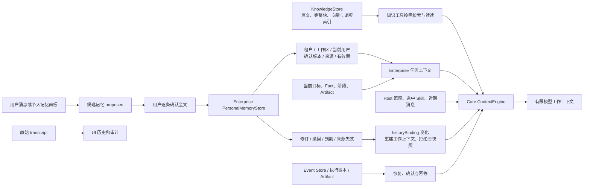

# Packx 记忆系统：实现、边界与导图

更新：2026-09-21。跨会话范围按用户确认限定为**当前用户的个人偏好与笔记**，同一工作区内使用。[ADR-0026](adr/0026-confirmed-personal-memory-and-context-dependency.md) 记录状态契约和迁移；[上下文管理](context-management.md) 说明压缩预算；[可靠性与恢复](reliability-recovery.md) 说明执行账本。

故障边界已补充到 [逐节点恢复审计](failure-handling-audit.md)：个人记忆状态和命令事件在同一 SQLite 事务内，确认／遗忘的最后审计写入失败会回滚，本次通过真实 SQLite 故障注入与重开连接验证。成功遗忘没有自动 undo，已保存的聊天／Artifact／备份也不会随之抹除。`memory_propose` 的业务事务与通用 Tool 执行账本分别提交，尚未接入文件工具那样的结果对账；出现未知结果时先查询记忆面板并保留原幂等身份，不能靠重做或删除账本恢复。存储不可读时明确停止，不静默遗漏个人记忆继续执行。

## 使用与可见范围

在任意任务的「工作区 → 记忆」中填写主题、正文和可选有效期，先生成候选，再点击「确认用于其他任务」。也可以在普通对话明确说“请长期记住……”，模型有 `memory_propose` 工具提出候选；仍须到面板确认。工具只能提出，不能确认、撤回或提升业务事实。模型正确理解并调用工具的语义效果尚未单独评测，手动面板无需模型。

另一个任务自动获得同一 `tenantId/workspaceId/actorId` 的有效确认项。修订待确认时旧版本继续有效；拒绝修订保留旧版；同主题冲突要求修改原条目；点击撤回后停止召回并清空记录版本正文。当前本地 Host 从已认证会话指定唯一 owner，不接受客户端或模型传入的 actor。多用户服务端 RBAC、客户档案和组织共享仍未实现。

订单的尺寸、材料、数量、价格等继续走 Fact 确认。比如“这单不要 PVC”不会自动变成长期偏好。个人记忆保持软上下文，不能授予工具权限、修改 Skill、确认订单参数或覆盖当前请求。不同主题之间的任意自然语言矛盾尚未自动识别，明确请求与权威业务状态优先。

## 能力—入口—验证—限制

| 能力 | 代码入口 | 验证证据 | 剩余限制 |
| --- | --- | --- | --- |
| 候选、确认、修订、撤回 | `server/enterprise/personalMemoryStore.ts`、`personalMemoryService.ts`、`src/components/MemoryPanel.tsx` | `personalMemory.test.ts`；Product Smoke 的真实 HTTP API | 显式确认；不自动学习经验 |
| 跨任务召回与隔离 | Host `server/index.ts` Context Provider、SQLite 复合主体键 | 有效个人项跨任务/重启召回；其他 actor/tenant/workspace 无记录 | 本地 owner；非生产级多用户授权体系 |
| 来源与有效期 | 来源任务/用户消息摘要、版本、expiresAt | 来源删除、到期、错误输入、损坏存储失败路径 | 不是供应商真实性或合法性证明 |
| Plan/子任务/需求单复用 | `conversationTaskContext`、Host `readTaskContext` | Plan 确认时只变记忆、不变会话 revision 也会拒绝；原 Plan/M2 回归 | 记忆变化后可能需要重新生成计划 |
| 撤回后旧派生上下文失效 | `taskContext.historyBinding`、Session、Snapshot、`contextRead.ts` | 重启后输入无旧偏好；UI 仍保留完整回复；旧 Snapshot 回读拒绝 | 用户原话/明确 Artifact/备份不随偏好撤回删除 |
| 重试、暂停和副作用边界 | 事务命令去重、revision CAS、Runtime checkpoint/执行账本 | 重复确认/撤回不重复；旧命令不复活撤回项；模型中途变化先停工具 | 不逆转已发生操作；旧暂停 Turn 需新请求 |
| 长期知识 RAG | `server/knowledge/store.ts`、`service.ts`、领域检索工具 | [包装扩充报告](knowledge/expansion-2026-09-21.md) | 知识检索不等于个人偏好或正确业务事实 |
| 原始对话与工作上下文分离 | `src/agent/state.ts`、`fileAgentStateStore.ts`、`ContextEngine` | 上下文专项和完整回归 | 丢失的旧历史不能模型补造 |

## 存储与预算

- 关系存储：已有 SQLite 模式，个人记录与元数据事件保存在 `personal-memory.sqlite`；Session、Snapshot、Artifact 和执行账本沿用现有受控存储。没有额外 KV/Redis 服务。
- 知识向量：仍是 KnowledgeStore SQLite 中的可重建向量与词项索引；知识 embedding/reranker 沿用固定模型。个人记忆没有另外向量化。
- 个人记忆应用上限：最多 16 条确认项，每条 600 字符，主题 60 字符，每项 32 版，同时最多 64 个未撤回项。少量记录确定性加载，确认但到期/来源失效的项不召回；达到上限明确报错，需要用户撤回不用的项。
- 合并后的任务数据仍受 64,000 字符及 ContextEngine Token 预算限制；工具定义、模型输出预留等遵守原预算，不静默裁切硬约束。新记忆不触发单独提炼或 embedding 调用。
- `context.rebuilt` 仅记录原因和消息数；确认等事件只含 ID、版本、摘要。完整记忆在受控状态/模型快照中，不写普通日志。输入有常见 Secret 格式拒绝，但这不等于完整敏感数据分类器。

## 恢复、遗忘和迁移

跨任务记忆不是复制另一任务的聊天记录。Host 只召回已确认有效条目，Core 不知道用户或包装业务。候选写入不改变当前有效召回；确认新版本、撤回、到期和来源失效改变依赖 binding。执行中在下一个检查点停止，防止继续用旧输入执行；暂停 Turn 的旧 binding 不能原样恢复。

新一轮在依赖变化后重建模型工作历史，当前用户输入、Host 当前事实状态和执行账本继续保留。旧派生助手笔记不从 transcript 重新注入；过期依赖的压缩快照及其嵌套来源拒绝读取。配置该机制后，`context_read` 的 transcript 通道只回读用户原话，完整助手回复仍在 UI。

“忘记”是**停止自动使用并撤回记忆记录**。原始用户文字、正式回复、显式业务 Artifact、SQLite WAL 和备份并不承诺物理擦除。当前没有跨存储清除协调器；不能声称全系统所有痕迹已删除。当前任务原话可能本身就包含该偏好，这仍是当前用户提供的输入。

旧数据不自动提炼、不批量删除。首次启用时为现有 Session 添加可选依赖绑定并重建工作历史；已有 transcript、Fact、Artifact 和幂等账本保留。旧暂停步骤可能需要重新发起，旧无绑定 Snapshot 对启用记忆的模型回读不可用。不存在从残缺历史补造个人偏好的迁移。

## 固定评测与解读

运行 `npm run eval:memory -- --write`，结果见 [personal-memory-eval.json](evidence/personal-memory-eval.json)。它使用真实 SQLite、Session、ContextEngine 和 Runtime，但生成是确定性 Fake：冻结无记忆条件后，测试另一任务在确认/修订/遗忘后的输入、重启和完整 UI transcript。每轮保留 4 条固定约束，版本替换和撤回均通过；4 次主生成，记忆额外提炼/embedding 调用为 0，付费为 0。Token 为 UTF-8/协议启发式估算，耗时是本机机制耗时，不能作为真实模型延迟或召回语义准确率。

真实模型对偏好提炼、遵循、矛盾处理和恶意内容的语义质量为 **NOT_EVALUATED**。后续先授权固定模型/数据/消费上限再评测；当数量和性能证据需要时才增加个人语义检索、选择性失效或经验候选。Prompt Cache 仍只记录已有统计，没有新增缓存优化。

## 面试介绍

我在 Packx 的 Enterprise Layer 实现了个人跨会话记忆：只有用户明确确认的偏好才能进入其他任务，记录有主体、来源、版本、有效期和幂等操作。它和订单 Fact、RAG 资料、原始聊天分开管理。为解决“删掉记忆后旧摘要又带回来”的问题，Core 增加了通用工作历史依赖 binding；依赖变化就重建工作上下文、拒绝旧快照，完整 UI 对话和执行账本继续保留。离线机制评测验证了跨任务、修订、撤回和重启，四轮固定输入都保留了四条约束，没有新增记忆提炼模型调用；这些是机制证据，真实模型如何理解和遵循偏好仍需单独评测。

## 本轮完整验证

`npm run check:local` 通过：73 个测试文件，476 项通过、21 项按配置跳过；另行本机 Native 30 项通过（存在重叠，不相加）。Plan、Loop Guard、上下文、恢复、M1/M2、个人记忆和产品固定场景均通过。随后补充的 `memory_propose` 真实 Host 工具链回归及再次构建也通过。浏览器在隔离 Fixture 中实际操作了候选、确认 v1、新建任务看到同条记忆、修订候选保留旧版、确认 v2、撤回后有效数归零。详见 [交付验证记录](evidence/personal-memory-delivery-validation.json)。
