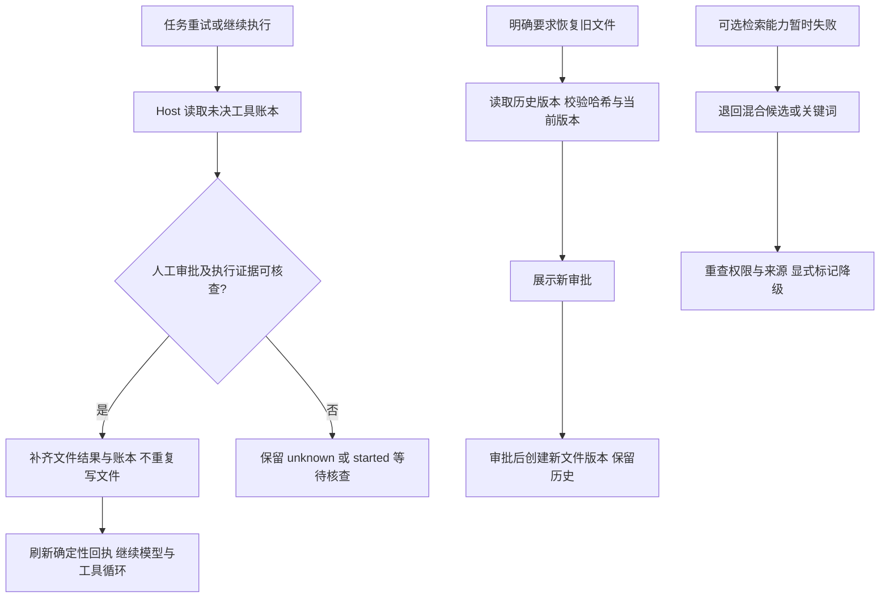

# 可靠性恢复：结果对账、文件补偿与检索降级

日期：2026-09-21。决策见 [ADR-0025](adr/0025-evidence-bound-recovery-and-explicit-degradation.md)。本次复用执行账本、文件审批、不可变文件版本、Runtime Adapter 和 KnowledgeStore，补齐已有幂等、超时与有界重试之后的恢复路径。

## 当前闭环

自动对账在下一次 Runtime 执行片的模型调用前运行，覆盖正常继续和现有调度器触发的重试。它不是独立扫描器，不会自动恢复用户已取消的任务，也不会把整个业务阶段标记完成。

## 未决文件操作的自动对账

- 文件操作已记录 `applied`、但执行账本仍是 `started/unknown`：读取绑定同一 tenant、workspace、run、actor、工具、输入摘要、幂等键与审批的结果及不可变版本，修复账本。即使文件后来又被合法修改，历史成功结果仍可核查；不重放旧操作。
- 磁盘写入或删除已完成、文件回执还未保存：操作前先持久化计划结果和原文备份。恢复时校验目录身份、批准的目标内容、磁盘后置条件、原文备份及版本顺序；只有全部吻合才补齐文件结果和账本，不再次修改用户文件。
- 缺少证据、文件被外部改动、备份篡改、作用域不符、任务删除、来源不可读或对账超时：保留未决状态，禁止靠推测认定成功或自动重复副作用。

每片最多核查 32 条，每条不超过工具原超时且最多 5 秒，同时受执行片总超时约束。Core 存储只提供通用 compare-and-swap 状态转换，Enterprise Host 判断业务证据。账本保留原状态、失败码和结果摘要；`tool.reconciled` 记录关联身份、状态、耗时和证据引用，普通日志不记录完整业务正文。

首批无法核查的记录可能占满本片限额；本次没有独立对账队列或人工处置控制台。多 Host 并发和外部进程写入不属于本次原子性保证：磁盘后置条件只能证明当前批准目标可验证，不能证明每一个外部历史动作。

## 文件恢复是新的补偿操作

`file_write` 现在接受 `sourceVersion`，与 `content` 二选一。Host 从同一任务、同一路径的不可变版本读取原文并校验哈希，再展示已有的文件写入审批和差异。批准后创建新版本，记录 `restoredFromVersion`，保留原版本和原审批。删除后也可以恢复，但仍需新的审批。

绝对路径继续绑定读取到的 `expectedSha256`；目标不存在时使用 `null`。旧会话相对路径使用 `expectedVersion`。审批期间目标被修改会拒绝执行，要求重新读取与审批。模型不需要重新生成或复制旧正文；不能通过这个入口覆盖受保护的 Fact、内部账本或已批准交付物。

这不是跨工具事务回滚：后续模型失败不会自动撤销先前独立成功的文件操作。外部发送、发布、生产提交仍需各自的权威状态查询与补偿 API，当前不能自动恢复。

## 检索降级与超时

| 故障 | 当前行为 | 保持的边界 |
| --- | --- | --- |
| 重排执行失败或超时 | 返回原检索候选，标记 `rerank_unavailable`、实际策略及失败用量未知 | 不伪装重排成功；重新检查权限和来源 |
| hybrid 查询的临时 embedding 不可用 | 退回关键词，标记 `embedding_unavailable`；不再调用重排 | 返回候选及缺口，不升级为确认事实 |
| 显式 vector 查询失败 | 失败 | 不擅自改变用户指定的查询模式 |
| 向量维度、模型/索引完整性、重排输出契约错误 | 失败或 `unavailable` | 不把坏数据解释成暂时服务故障 |
| 用户取消或来源撤回 | 取消，或移除失效来源后返回可读候选/无证据 | 不返回撤回内容，不把取消当恢复成功 |

`KnowledgeStore` 默认采用上述降级，Host 可指定 `strict` 用于比较或严格调用方；没有新增用户设置。现有 Tool 总等待上限为 35 秒，embedding 等待最多 30 秒，重排最多 25 秒且受剩余总预算约束，保留 1 秒用于权限复核与返回。`abortable` 阻止不配合取消的异步调用无限占用等待，并处理已取消 Promise 的拒绝；不能抢占同步 CPU 工作或立即停止已经开始的原生推理。

降级不增加生成模型调用，不自动切换付费 Provider，也不引入新缓存。界面、Tool 输出和审计均标记降级；未完成调用的 Token/用量保留 `null`。降级后的业务检索质量未验证，必须与“服务还能返回可核查候选”分开判断。

## 能力、代码与证据

| 能力 | 代码入口 | 验证证据 | 剩余限制 |
| --- | --- | --- | --- |
| 未决操作自动对账 | [agentRuntime.ts](../server/runtime/agentRuntime.ts)、[conversationFiles.ts](../server/runtime/conversationFiles.ts)、[state.ts](../src/agent/state.ts)、[fileAgentStateStore.ts](../server/runtime/fileAgentStateStore.ts) | [executionRecovery.test.ts](../server/runtime/executionRecovery.test.ts)：持久化重建、两种崩溃窗口、重复恢复、取消、隔离和版本冲突 | 只接入文件操作；证据不足保留未决 |
| 经审批恢复历史文件 | [conversationFiles.ts](../server/runtime/conversationFiles.ts)、[ConversationFiles.tsx](../src/components/ConversationFiles.tsx) | 同一测试中的 Runtime → Tool → 新审批 → 新版本，以及删除后恢复、并发修改拒绝 | 不是跨任务全量回滚；新增提示未做浏览器视觉验收 |
| 检索故障后继续服务 | [store.ts](../server/knowledge/store.ts)、[service.ts](../server/knowledge/service.ts)、[KnowledgePanel.tsx](../src/components/KnowledgePanel.tsx) | [recovery.test.ts](../server/knowledge/recovery.test.ts)：两类故障、权限复核、撤回、取消、完整性错误、不配合取消的调用 | Fake 验证控制流；真实降级检索质量待评测 |
| 超时及恢复可观测性 | [loop.ts](../src/agent/loop.ts)、[contracts.ts](../src/runtime/contracts.ts)、执行账本与 Trace | 取消后无模型调用或晚提交；恢复事件、历史失败摘要与固定报告 | 没有独立对账控制台；不是硬件级强制中止 |

## 固定对照与回归

运行 `npm run eval:recovery -- --write` 生成 [完整报告](evidence/reliability-recovery.json)。参照提交是 `5842ae982e2ae34f80ba5feee3eca331ea582b34`。Baseline 为同一固定输入关闭恢复器、检索使用 strict 的行为对照，**不是旧提交检出的重放**。

| 固定故障 | Baseline | 本次方案 |
| --- | --- | --- |
| 文件已提交、账本 started | 未决 1，未获得继续所需回执 | 未决 0，继续所需回执可用 |
| 文件已提交、账本 unknown | 未决 1，未获得继续所需回执 | 未决 0，继续所需回执可用 |
| 重排失败 | unavailable，候选 0 | 显式降级，候选 1 |
| hybrid 的 embedding 临时失败 | failed，候选 0 | 显式关键词降级，候选 1 |

每个文件场景实际物理写入均为 1 次、重复写入均为 0；每次执行模型调用均为 1 次，对账本身没有新增模型调用。两类检索比较均只尝试 1 次 embedding；重排失败场景只尝试 1 次重排，embedding 失败场景重排为 0，生成模型调用均为 0。候选数量是单条固定语料的结果，不能解释为召回率。

报告记录本机文件系统与 Fake 耗时，不代表生产模型延迟。真实 Token 未测量，语义质量为 `NOT_EVALUATED`，付费调用为 0；`--online` 明确拒绝执行。

2026-09-21 实际验证：

- 新增两组恢复测试，共 19 项。
- `npm run check`：71 个测试文件通过，460 项通过、21 项按条件跳过；应用、服务端与评测 TypeScript 检查及 Vite 构建通过。
- `npm run test:native`：3 个测试文件、30 项通过；与上述测试有重叠，不能直接相加。
- `eval:offline`、`eval:m1`、`eval:m2`、`eval:plan`、`eval:loop-safety`、`eval:context`、`eval:recovery` 通过。
- `eval:product`：本地 HTTP 固定 Provider 回归通过，包括 Plan、文件审批、原文备份、历史隔离、知识权限、来源撤回、SSE、遥测及需求审批导出；自评/replan 检查点由 `eval:plan` 验证。不代表浏览器实测或真实模型质量。

新增字段为可选，旧格式按原行为读取。旧记录缺少执行证据时不补造证据，不做全库删除或迁移。验证只操作隔离的临时数据；未重启正在使用的 Host，运行中进程需重启才能加载代码。

## 面试表述

Packx 的幂等账本除了阻止重复执行，还能在下一次执行前对文件操作做有证据的恢复：Host 根据原审批、输入摘要、不可变备份和磁盘状态修复未决记录，然后把确定性结果交回 Runtime。需要撤销文件内容时，用历史版本发起新的审批并生成新版本。检索中的可选向量或重排能力暂时失败时，返回标记降级的可核查候选，同时重新检查权限与来源。两类离线崩溃样例中，未决数都从 1 变为 0，文件实际写入仍各为 1 次；这些证明恢复机制，真实模型效果、多 Host 一致性及外部发送补偿仍未验证或未实现。
