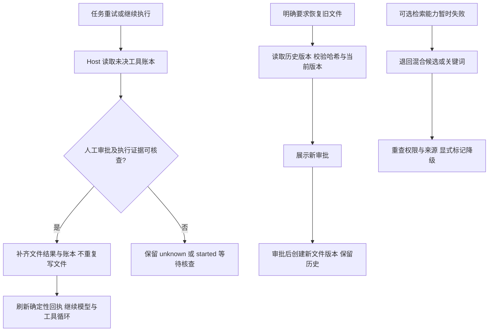

# 错误处理与可靠性恢复

日期：2026-09-21。决策见 [ADR-0025](adr/0025-evidence-bound-recovery-and-explicit-degradation.md)。本次复用执行账本、文件审批、不可变文件版本、Runtime Adapter 和 KnowledgeStore，补齐已有幂等、超时与有界重试之后的恢复路径。

2026-09-21 追加：[逐节点故障、回滚与恢复审计](failure-handling-audit.md) 按 40 个节点核对当前调用链，记录事务边界、已实现处理、人工处置、验证证据和未闭合缺口。下文是文件恢复与检索降级的专项机制，不代表全任务都能 rollback；特别是索引总超时、非文件工具未决结果对账、跨存储提交、残留锁及关停仍有限制。Outbox 有退避但没有总尝试次数上限，不能把 Job 的有界重试扩大解释为全链路保证。

审计同时修复了后台把 paused 当 completed、后台丢失 Runtime 错误分类／retryable、Plan 把输入读取故障误当会话删除三个问题。新后台任务沿用队列默认 32 slices，旧任务保留原预算，处理步骤及本次新增 10 项回归见审计文档；下面的专项历史测试数量保持其原验证范围。

后续独立测试团队完成了 [Harness 错误处理测试闭环](harness-error-handling-tests.md)：新增 86 项测试，修复 Provider 错误体／Token Count 校验、次级报告与遥测异常遮蔽、Runtime 初始化取消／超时、死信 redrive 预算绕过和知识索引取消等待。最终全量 572 项通过，原生 30 项及本地产品回归通过。知识索引的统一自动总时限、跨存储事务与自动补写仍未实现，详见该报告的验证边界。

## 当前错误处理方法

错误发生后，Host 先保留错误类别和执行状态，再由原有 Runtime、Workflow 或队列决定停止、续执行、重试或人工处理。`retryable: true` 表示该失败允许被上层重试，不表示已自动重试，更不表示已发生的业务副作用可以再次执行。

### 分层契约与传播

| 层 | 当前表示与处理 | 代码依据 |
| --- | --- | --- |
| Provider Adapter | 外部 JSON 先按 unknown 校验；HTTP 错误保留 providerStatus，本地协议校验使用 adapterStatus。Token Count 只接受非负安全整数；无效消息不作为合法响应继续处理 | [client.ts](../server/anthropic/client.ts)、[anthropicModelProvider.ts](../server/runtime/anthropicModelProvider.ts) |
| Agent Core | 模型、上下文、预算等轮次级失败抛 AgentCoreError；工具失败通常生成结构化 tool result，记录 status／failureCode，交回模型并受 Loop Guard 限制 | [contracts.ts](../src/agent/contracts.ts)、[loop.ts](../src/agent/loop.ts) |
| Runtime Adapter | 向调用方暴露 RuntimeFailure(code, message, retryable)，cause 保留内部因果链。已有 RuntimeFailure 优先原样保留；否则识别执行片超时／取消，再沿 cause 识别 Provider 分类，随后映射 Core／State Store 错误 | [agentRuntime.ts](../server/runtime/agentRuntime.ts)、[Runtime 契约](../src/runtime/contracts.ts) |
| Conversation API／后台 Worker | RuntimeFailure 返回 `{code, message, retryable}`。Worker 保留明确 retryable；没有该字段时才按已有 HTTP／code 规则推导。普通 API 校验／存储错误并非全部使用 RuntimeFailure 结构 | [conversationApi.ts](../server/runtime/conversationApi.ts)、[backgroundConversationWorker.ts](../server/workers/backgroundConversationWorker.ts) |
| Scheduler／Queue | 根据失败分类、重试额度和租约推进 queued／dead_letter／cancelled；paused 保存 checkpoint，只有完成结果才 ACK。Workflow 的业务完成仍需 Artifact、Evaluation、Approval 等自身证据 | [stageJobScheduler.ts](../server/workers/stageJobScheduler.ts)、[stageJobQueue.ts](../src/enterprise/stageJobQueue.ts) |

不要只按 HTTP 状态决定可重试性。当前 Conversation API 对 RuntimeFailure 的映射为：authentication → 401，rate_limit → 429，两个 Loop Guard 码 → 422，invalid_output／permission_denied → 400，其余 → 502。因此 502 也可能是不可重试的上下文、预算或取消失败；同一个 invalid_output 也可能允许重试。响应体中的明确 retryable 才是传给后台调度器的属性。

### Runtime 错误分类与处置

以下覆盖当前 16 个 RuntimeFailureCode，描述现有常见构造路径。不是按 code 强行重算 retryable 的新规则；显式传入的 RuntimeFailure 保留自己的属性。降级、人工介入和副作用是否未决没有统一布尔字段，需结合 Tool 账本、业务状态和下表判断。

| 错误码 | 当前常见来源／重试属性 | 处置 |
| --- | --- | --- |
| authentication | Provider HTTP 401／403，不可重试 | 修正认证配置；不换身份绕过权限 |
| rate_limit | Provider HTTP 429，可重试 | 后台在额度内退避；前台不因此无限重发 |
| model_failure | Provider／协议／调用失败；已知 providerStatus 或 adapterStatus ≥ 500 时可重试，Core 通用模型调用异常通常也可重试 | 核查端点和协议；未知费用不能当零；没有自动切换付费 Provider |
| timeout | Runtime 执行片总时限，可重试 | 先查 checkpoint 和副作用账本，再决定续执行；超时不等于操作没有发生 |
| cancelled | 用户或调用方取消，通常不可重试 | 停止后续推进；不自动恢复 cancelled Job，不自动撤销成功操作 |
| invalid_output | 输入／输出契约问题；Provider 输出上限允许重试，refusal 和身份／参数校验拒绝通常不可重试 | 区分缺完整输出与请求错误，修正相应输入；不能只看 HTTP 400 |
| context_failure | 来源失效、缺完成证据、恢复绑定变化通常不可重试；State Store unavailable／Core 摘要失败可重试 | 修存储或重建当前上下文；不得删除硬规则、补造来源或静默关闭记忆 |
| budget_exceeded | 必留上下文／模型窗口／工具调用预算耗尽，不可重试 | 缩小任务或明确调整输入／预算，不清空保护状态盲重试 |
| repeated_actions | 同样的工具动作序列重复触发 Guard，不可重试 | 调整任务或解决循环原因；同一任务重试保留 Guard |
| consecutive_tool_failures | 连续三次工具失败触发 Guard，不可重试 | 先修工具失败原因；不能把换执行片当作重置许可 |
| permission_denied | 工具范围／策略等权限拒绝，不可重试 | 修正合法授权或请求，不用降级方式绕过 |
| max_iterations | 契约保留的失败码，属性由产生方提供 | 当前正常 Loop 达到执行片迭代上限返回 paused，不应写成“一到上限就失败” |
| session_conflict | 状态存储并发冲突通常可重试；同幂等键换输入不可重试 | 先重读最新 revision；不同业务输入需明确的新操作身份 |
| infrastructure_failure | 审批查询、账本、审计等依赖故障通常可重试；损坏的 Guard、幂等键生成失败等不可重试 | 恢复依赖后读取原状态；账本完成写入失败不能直接重做写操作 |
| runtime_unavailable | Runtime 不可用的契约码，属性由产生方提供 | 恢复运行条件；不把它当真实模型已成功或可用的证明 |
| execution_failed | 未分类 Runtime 异常的通用回退通常可重试，外显消息固定 | 检查关联 trace／内部 cause；仍受原审批、账本和队列上限约束 |

摘要错误在 Core 层可包装为 context_failure，但 Runtime 会优先识别 cause 中的 Provider 认证、限流、窗口或输出错误，因此不能断言所有摘要失败最终都返回 context_failure。授权、来源完整性、坏索引、审批和预算失败没有“降低要求后继续成功”的通用降级路径。

### 重试、暂停与恢复分别由谁执行

| 场景 | 当前方法与上限 |
| --- | --- |
| 模型上下文窗口拒绝 | Agent Loop 仅在首次 context_window_exceeded 且压缩实际移除了内容时，允许压缩后再尝试一次；不是任意模型异常通用重试 |
| Runtime 原轮重放 | 失败向调用方返回；使用原消息／幂等身份按现有 retry 入口恢复。Runtime executeTurn 重放已有正式回复时还要求 completed Trace；缺证据时停止且不再次调用模型 |
| 后台暂时失败 | Scheduler 使用 `min(30000, 250 × 2^failureCount)` 毫秒退避；Queue 只有在 retryable 且递增后的 failureCount < maxFailures 时重新入队，否则死信。当前新后台任务用户／Cron 为 5 次失败额度，Agent 请求为 10 次；不是所有工作流的统一额度 |
| 执行片暂停 | Runtime paused → Worker paused → Queue checkpoint。保存 Session／快照，sliceCount 加一且重置连续 failureCount；达到 maxSlices 进入死信。当前新后台任务使用默认 32 slices，旧任务保留已存预算 |
| 死信 redrive | 需要操作者、原因与 expectedUpdatedAt；可重置失败额度，但不清除累计失败、Guard 或 Tool 未决记录。slice 已耗尽时必须显式增加足够 additionalSlices，单次 1–32，否则 job_conflict |
| Worker 崩溃／租约丢失 | 新 Worker 通过到期租约恢复，旧 Worker 在提交边界检查租约；丢失租约不能替代新 Worker 提交 ACK／失败。恢复重用持久 Job、Session 与执行账本 |
| Outbox 重投 | 确定性 Job 身份使 enqueue／ACK 间中断后重投不创建重复任务；退避间隔封顶 30 秒，但没有全局总尝试次数上限。Cron 每次派发独立 Job，连续失败不会自动停日程 |

Plan、Job 和工具各自的身份及确认范围保持独立。Plan 输入读取暂时失败保留计划，只有明确 conversation_not_found／404 才按删除处理；Plan 确认不代替文件写入审批。

Conversation API 对已存在的回复返回 duplicate:true 时只核对会话，不查询 completed Trace；它是消息提交去重，不是上述 Runtime 完成证据复核，也不能用来宣称业务工作流已通过。

### 工具失败与副作用账本

模型看到的工具失败通常是 `{ok:false,error:{code,message}}`，执行事件另带 succeeded／failed／denied／unknown。Tool 码包括输入、allowlist、幂等、审批、沙箱、超时和执行失败等，**不等同于 RuntimeFailureCode**，Tool 记录也没有独立 retryable 字段。单次工具失败可能交回模型继续，也可能被 Guard 或基础设施异常终止；unknown 后模型仍可返回解释性最终回复，因此 Runtime completed 不等于所有工具成功或业务 Stage 已通过。

写入／发布工具先检查策略、审批和幂等，再 claim 账本。claim 持久化失败时不执行副作用。账本记录使用 started／succeeded／unknown，和工具事件状态不是同一枚举：

- 已成功且输入匹配：重放确定性回执，不重复操作。
- started／unknown：副作用未能证明，阻止重复操作；经业务证据对账后才可修复状态。
- 工具执行超时或抛错：读工具通常记 failed，可能产生副作用的写工具保守记 unknown。外层取消可能使记录保留 started；不能把它归为“从未执行”。
- complete 写入失败或执行后审计失败：轮次失败，原操作可能已成功。重试先查账本；某些执行前确定性拒绝不会执行工具，已经 claim 的非成功结果仍可能保守保留 unknown。

不能仅因为外层错误 `retryable=true`、磁盘内容看起来相同或用户重新点了按钮，就换新幂等键重做未知操作。文件对账和补偿的精确边界见下文。

### 取消、超时与双重故障

Runtime 把外部 signal 和执行片 timeout 合并，已有 abortable 覆盖 Loop 等待、初始化执行账本读取、图片解析、来源验证及恢复结果写入等待。来源 validator 同时支持同步与异步。提交前仍检查 signal、来源／事实绑定、revision 及必要的租约。知识索引同样响应传入取消信号，迟到的 Embedding 结果不会沿原调用提交索引；未传 signal 时仍无统一索引自动总时限。

这些机制终止 Host 等待并阻止相应后续提交，不能强制终止所有底层 I/O 或同步 CPU 工作。原生子进程另由沙箱／supervisor 负责超时、资源上限及进程组清理。停止按钮、SSE 断开和进程退出也不是 rollback 完成证据。

原异常出现后，Runtime 分别尝试 activity／Trace 上报。上报再次失败时，以 AggregateError 保留主因及次级异常，外层 RuntimeFailure 保留原 code／retryable。遥测 finally 持久化再次失败时，也保留模型原异常作为 cause；但模型已经成功而遥测写失败时仍向外失败，不静默当作记录成功。存储损坏时内存 cause 不保证已落盘，HTTP 响应不会直接暴露整个 cause 树。

上述保护针对 Runtime 失败上报与遥测 finally，不能泛化成任意 Hook 都不会遮蔽错误。所有裸存储异常也没有统一归为 infrastructure_failure：成功后的遥测写入错误可在模型调用边界成为 model_failure，裸 Trace 写入错误可成为 execution_failed。Provider 原因识别最多沿 cause 查看四层，不是遍历任意 AggregateError 树。

完成证据按层区分：Runtime 保存 Session 回复，再保存 completed Trace；业务工作流另检查 Artifact／版本、Evaluation 与必要的 Approval。多个存储之间没有全局事务；Runtime 原轮重放遇到回复已保存但 Trace 缺失时安全停止，已有回复保留，但没有新增自动补写服务。

## 文件恢复与检索降级闭环

自动对账在下一次 Runtime 执行片的模型调用前运行，覆盖正常继续和现有调度器触发的重试。它不是独立扫描器，不会自动恢复用户已取消的任务，也不会把整个业务阶段标记完成。

## 未决文件操作的自动对账

- 文件操作已记录 `applied`、但执行账本仍是 `started/unknown`：读取绑定同一 tenant、workspace、run、actor、工具、输入摘要、幂等键与审批的结果及不可变版本，修复账本。即使文件后来又被合法修改，历史成功结果仍可核查；不重放旧操作。
- 磁盘写入或删除已完成、文件回执还未保存：操作前先持久化计划结果和原文备份。恢复时校验目录身份、批准的目标内容、磁盘后置条件、原文备份及版本顺序；只有全部吻合才补齐文件结果和账本，不再次修改用户文件。
- 缺少证据、文件被外部改动、备份篡改、作用域不符、任务删除、来源不可读或对账超时：保留未决状态，禁止靠推测认定成功或自动重复副作用。

每片最多核查 32 条；单条 recoverToolExecution 证据核查不超过工具原超时且最多 5 秒，同时受执行片总超时约束。其后 resolve 账本写入等待受执行片总 signal 约束，不额外承诺 5 秒上限。Core 存储只提供通用 compare-and-swap 状态转换，Enterprise Host 判断业务证据。账本保留原状态、失败码和结果摘要；`tool.reconciled` 记录关联身份、状态、耗时和证据引用，普通日志不记录完整业务正文。

首批无法核查的记录可能占满本片限额；本次没有独立对账队列或人工处置控制台。多 Host 并发和外部进程写入不属于本次原子性保证：磁盘后置条件只能证明当前批准目标可验证，不能证明每一个外部历史动作。

## 文件恢复是新的补偿操作

`file_write` 现在接受 `sourceVersion`，与 `content` 二选一。Host 从同一任务、同一路径的不可变版本读取原文并校验哈希，再展示已有的文件写入审批和差异。批准后创建新版本，记录 `restoredFromVersion`，保留原版本和原审批。删除后也可以恢复，但仍需新的审批。

绝对路径继续绑定读取到的 `expectedSha256`；目标不存在时使用 `null`。旧会话相对路径使用 `expectedVersion`。审批期间目标被修改会拒绝执行，要求重新读取与审批。模型不需要重新生成或复制旧正文；不能通过这个入口覆盖受保护的 Fact、内部账本或已批准交付物。

这不是跨工具事务回滚：后续模型失败不会自动撤销先前独立成功的文件操作。外部发送、发布、生产提交仍需各自的权威状态查询与补偿 API，当前不能自动恢复。

## 检索降级与超时

| 故障 | 当前行为 | 保持的边界 |
| --- | --- | --- |
| 重排执行失败或超时 | 返回原检索候选，标记 `rerank_unavailable`、实际策略及失败用量未知 | 不伪装重排成功；重新检查权限和来源 |
| hybrid 查询的临时 embedding 不可用 | 退回关键词，标记 `embedding_unavailable`；不再调用重排 | 返回候选及缺口，不升级为确认事实 |
| 显式 vector 查询失败 | 失败 | 不擅自改变用户指定的查询模式 |
| 向量维度、模型/索引完整性、重排输出契约错误 | 失败或 `unavailable` | 不把坏数据解释成暂时服务故障 |
| 用户取消或来源撤回 | 取消，或移除失效来源后返回可读候选/无证据 | 不返回撤回内容，不把取消当恢复成功 |

`KnowledgeStore` 默认采用上述降级，Host 可指定 `strict` 用于比较或严格调用方；没有新增用户设置。现有 Tool 总等待上限为 35 秒，embedding 等待最多 30 秒，重排最多 25 秒且受剩余总预算约束，保留 1 秒用于权限复核与返回。`abortable` 阻止不配合取消的异步调用无限占用等待，并处理已取消 Promise 的拒绝；不能抢占同步 CPU 工作或立即停止已经开始的原生推理。

降级不增加生成模型调用，不自动切换付费 Provider，也不引入新缓存。界面、Tool 输出和审计均标记降级；未完成调用的 Token/用量保留 `null`。降级后的业务检索质量未验证，必须与“服务还能返回可核查候选”分开判断。

## 能力、代码与证据

| 能力 | 代码入口 | 验证证据 | 剩余限制 |
| --- | --- | --- | --- |
| 未决操作自动对账 | [agentRuntime.ts](../server/runtime/agentRuntime.ts)、[conversationFiles.ts](../server/runtime/conversationFiles.ts)、[state.ts](../src/agent/state.ts)、[fileAgentStateStore.ts](../server/runtime/fileAgentStateStore.ts) | [executionRecovery.test.ts](../server/runtime/executionRecovery.test.ts)：持久化重建、两种崩溃窗口、重复恢复、取消、隔离和版本冲突 | 只接入文件操作；证据不足保留未决 |
| 经审批恢复历史文件 | [conversationFiles.ts](../server/runtime/conversationFiles.ts)、[ConversationFiles.tsx](../src/components/ConversationFiles.tsx) | 同一测试中的 Runtime → Tool → 新审批 → 新版本，以及删除后恢复、并发修改拒绝 | 不是跨任务全量回滚；新增提示未做浏览器视觉验收 |
| 检索故障后继续服务 | [store.ts](../server/knowledge/store.ts)、[service.ts](../server/knowledge/service.ts)、[KnowledgePanel.tsx](../src/components/KnowledgePanel.tsx) | [recovery.test.ts](../server/knowledge/recovery.test.ts)：两类故障、权限复核、撤回、取消、完整性错误、不配合取消的调用 | Fake 验证控制流；真实降级检索质量待评测 |
| 超时及恢复可观测性 | [loop.ts](../src/agent/loop.ts)、[contracts.ts](../src/runtime/contracts.ts)、执行账本与 Trace | 已测初始化／恢复场景取消后无后续模型调用或回复晚提交；恢复事件、历史失败摘要与固定报告 | 不能推广为已开始的外部 I/O 没有副作用；没有独立对账控制台或硬件级强制中止 |

## 固定对照与回归

运行 `npm run eval:recovery -- --write` 生成 [完整报告](evidence/reliability-recovery.json)。参照提交是 `5842ae982e2ae34f80ba5feee3eca331ea582b34`。Baseline 为同一固定输入关闭恢复器、检索使用 strict 的行为对照，**不是旧提交检出的重放**。

| 固定故障 | Baseline | 本次方案 |
| --- | --- | --- |
| 文件已提交、账本 started | 未决 1，未获得继续所需回执 | 未决 0，继续所需回执可用 |
| 文件已提交、账本 unknown | 未决 1，未获得继续所需回执 | 未决 0，继续所需回执可用 |
| 重排失败 | unavailable，候选 0 | 显式降级，候选 1 |
| hybrid 的 embedding 临时失败 | failed，候选 0 | 显式关键词降级，候选 1 |

每个文件场景实际物理写入均为 1 次、重复写入均为 0；每次执行模型调用均为 1 次，对账本身没有新增模型调用。两类检索比较均只尝试 1 次 embedding；重排失败场景只尝试 1 次重排，embedding 失败场景重排为 0，生成模型调用均为 0。候选数量是单条固定语料的结果，不能解释为召回率。

报告记录本机文件系统与 Fake 耗时，不代表生产模型延迟。真实 Token 未测量，语义质量为 `NOT_EVALUATED`，付费调用为 0；`--online` 明确拒绝执行。

2026-09-21 实际验证：

- 新增两组恢复测试，共 19 项。
- `npm run check`：71 个测试文件通过，460 项通过、21 项按条件跳过；应用、服务端与评测 TypeScript 检查及 Vite 构建通过。
- `npm run test:native`：3 个测试文件、30 项通过；与上述测试有重叠，不能直接相加。
- `eval:offline`、`eval:m1`、`eval:m2`、`eval:plan`、`eval:loop-safety`、`eval:context`、`eval:recovery` 通过。
- `eval:product`：本地 HTTP 固定 Provider 回归通过，包括 Plan、文件审批、原文备份、历史隔离、知识权限、来源撤回、SSE、遥测及需求审批导出；自评/replan 检查点由 `eval:plan` 验证。不代表浏览器实测或真实模型质量。

新增字段为可选，旧格式按原行为读取。旧记录缺少执行证据时不补造证据，不做全库删除或迁移。验证只操作隔离的临时数据；未重启正在使用的 Host，运行中进程需重启才能加载代码。
